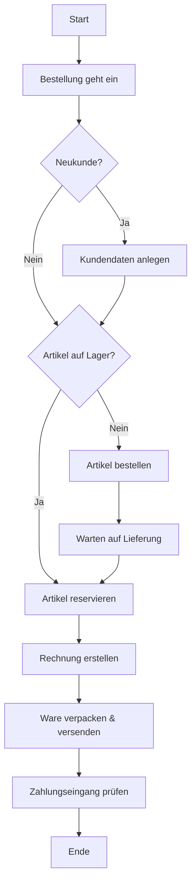

**Ablauforganisation** ist der raum-zeitliche Aspekt der Organisation. Sie beschäftigt sich mit der dynamischen Gestaltung von Arbeitsabläufen und zielt darauf ab, Aufgaben mit minimalem Aufwand zu erledigen. Dabei werden Kosten gesenkt, Bearbeitungszeiten verkürzt und Kapazitäten optimal genutzt. Im Gegensatz zur Aufbauorganisation, die die statische Struktur festlegt, beschreibt die Ablauforganisation, wie Arbeitsprozesse ablaufen.

## Definition und Grundlagen

Die Ablauforganisation gestaltet dynamische Arbeitsprozesse. Sie berücksichtigt Strukturen für Raum, Zeit, Sachmittel und Personen. Dazu gehört die systematische Planung, Steuerung und Überwachung von Arbeitsabläufen zur Effizienzsteigerung.

**Abgrenzung zur Aufbauorganisation:**

- **Aufbauorganisation**: Statische Struktur, wer für was zuständig ist (Organigramm).
- **Ablauforganisation**: Dynamische Prozesse, wie Aufgaben ablaufen (Prozessdarstellung).

## Ziele der Ablauforganisation

### Wirtschaftliche Ziele

- Minimierung von Bearbeitungs- und Durchlaufkosten.
- Reduzierung der Bearbeitungszeiten.
- Optimale Kapazitätsauslastung.
- Einhaltung von Terminen.

### Qualitative Ziele

- Reduzierung von Bearbeitungsfehlern.
- Erhöhung der Prozesstransparenz.
- Verbesserung der Arbeitsbedingungen.
- Steigerung der Flexibilität.

### Der Zielkonflikt: Das Dilemma der Ablauforganisation

Ein zentraler Aspekt ist der Zielkonflikt zwischen:

- **Maximierung der Kapazitätsauslastung**: Erfordert oft große Auftragsbestände und führt zu langen Wartezeiten.
- **Minimierung der Durchlaufzeiten**: Führt zu geringerer Auslastung und potenziell ungenutzten Ressourcen.

> **Merke**: Hohe Auslastung und kurze Durchlaufzeiten sind simultan kaum optimal zu erreichen. Dieses Dilemma erfordert strategische Entscheidungen.

## Methodische Grundlagen

### Arbeitsanalyse

Die Arbeitsanalyse zerlegt die Gesamtaufgabe systematisch in einzelne Teilaufgaben bis zur kleinsten Arbeitseinheit (Gangelemente).

**Gliederungsprinzipien der Arbeitsanalyse:**

1. **Verrichtungsorientierung**: Nach Art der Tätigkeit (z. B. bohren, fräsen, prüfen).
2. **Objektorientierung**: Nach bearbeitetem Objekt (z. B. Kunde A, Produkt B).
3. **Rangorientierung**: Nach hierarchischer Stufe (z. B. Grund-, Haupt-, Abschlussarbeiten).
4. **Phasenorientierung**: Nach zeitlicher Abfolge (z. B. Planung, Durchführung, Kontrolle).
5. **Zweckorientierung**: Nach Zweckmäßigkeit (z. B. vorbereitende, durchführende, abschließende Tätigkeiten).

### Arbeitssynthese

Die Arbeitssynthese fasst Teilaufgaben zu kohärenten Abläufen zusammen. Dabei werden drei Synthese-Dimensionen unterschieden:

1. **Personale Synthese**: Zuordnung von Arbeitselementen zu Arbeitsträgern (Aufgabenverteilung).
2. **Temporale Synthese**: Zeitliche Abstimmung der Arbeitselemente (Reihenfolge, Parallelität).
3. **Lokale Synthese**: Räumliche Anordnung der Arbeitselemente (Layout, Wegoptimierung).

Bei der Arbeitssynthese werden Arbeitsmittel zugeordnet, das Arbeitspensum sowie die Mitarbeiter festgelegt und der Arbeitsablauf definiert.

## Konzeptionelle Ausprägungen

Die Ablauforganisation lässt sich in drei Ausprägungen verstehen:

### 1. Ablauforganisation als Arbeitsorganisation
Fokus auf die Gestaltung von Arbeitsplätzen und Arbeitsabläufen im mikroökonomischen Bereich. Typische Anwendung in der Produktionsplanung und Arbeitsvorbereitung.

### 2. Ablauforganisation als Ablaufplan
Betriebswirtschaftliche Perspektive mit Fokus auf terminliche und kapazitive Planung. Erstellt detaillierte Zeit- und Kapazitätspläne für konkrete Aufträge.

### 3. Ablauforganisation als Prozessorganisation
Moderne, ganzheitliche Sichtweise mit Fokus auf geschäftsprozessorientierte Gestaltung. Betrachtet unternehmensübergreifende Wertschöpfungsketten und Kundenprozesse.

## Einflussfaktoren auf die Ablauforganisation

### Interne Faktoren

- **Produktionstyp**: Massen-, Serien-, Einzelfertigung.
- **Mitarbeiterqualifikation**: Automatisierungsgrad, Skill-Level.
- **Technologischer Stand**: IT-Systeme, Maschinenpark.
- **Unternehmenskultur**: Flexibilität, Hierarchiestrukturen.

### Externe Faktoren

- **Rechtliche Rahmenbedingungen**: Arbeitszeiten, Sicherheitsvorschriften.
- **Technologische Entwicklungen**: Industrie 4.0, Digitalisierung.
- **Marktbedingungen**: Lieferzeiten, Kundenerwartungen.
- **Wettbewerbsdruck**: Kosten- und Zeitoptimierung.

## Darstellung der Ablauforganisation

Zur Visualisierung der Ablauforganisation werden verschiedene Methoden eingesetzt:

- [Flussdiagramme](flussdiagramm): Einfache Darstellung von Prozessschritten und Entscheidungen.
- [BPMN](BPMN): Standardisierte Business Process Model and Notation.
- [eEPK](eEPK): Erweiterte Ereignisgesteuerte Prozesskette.

Diese Darstellungen machen komplexe Prozesse verständlich, helfen Schwachstellen zu identifizieren und Optimierungspotenziale aufzudecken.

## Beispiel: Bestellabwicklungsprozess

Ein klassisches Beispiel für die Anwendung der Ablauforganisation ist der Prozess einer Bestellabwicklung in einem E-Commerce-Unternehmen.

**Analyse des Beispiels:**

- **Arbeitsanalyse**: Der Prozess wird in einzelne Gangelemente zerlegt (Bestellungseingang, Kundenprüfung, Lagerprüfung etc.).
- **Arbeitssynthese**: Die Elemente werden zu einem logischen Ablauf zusammengefasst mit klaren Verantwortlichkeiten.
- **Zielkonflikt**: Schnelle Bearbeitung (kurze Durchlaufzeit) vs. hohe Lagerauslastung (Kapazitätsnutzung).

## Häufige Fehler und Tipps

### Häufige Fehler

1. **Überoptimierung**: Zu detaillierte Ablaufpläne werden in der Praxis nicht eingehalten.
2. **Vernachlässigung des Zielkonflikts**: Einseitige Optimierung einzelner Ziele.
3. **Fehlende Flexibilität**: Starre Prozesse können nicht auf Störungen reagieren.
4. **Mangelnde Mitarbeiterbeteiligung**: Top-down-Ansatz ignoriert praktisches Wissen.

### Praktische Tipps

- **Ganzheitliche Betrachtung**: Berücksichtigen Sie immer den Zielkonflikt.
- **Schrittweise Optimierung**: Beginnen Sie mit den größten Engpässen.
- **Mitarbeiter einbeziehen**: Nutzen Sie das Wissen der Ausführenden.
- **Regelmäßige Überprüfung**: Prozesse müssen kontinuierlich angepasst werden.

## Weiterführendes

Die Ablauforganisation bildet die Grundlage für fortgeschrittene Konzepte wie:

- **Prozessmanagement**: Strategische Ausrichtung von Geschäftsprozessen.
- **Business Process Reengineering**: Radikale Neugestaltung von Prozessen.
- **Prozessdigitalisierung**: Einsatz digitaler Technologien zur Prozessoptimierung.
- **Agile Methoden**: Flexible Anpassungsfähigkeit von Prozessen.

Die Kenntnis der Ablauforganisation ist für Daten- und Prozessanalytiker essenziell, da sie die Grundlage für das Verständnis, die Analyse und Optimierung von Geschäftsprozessen bildet.