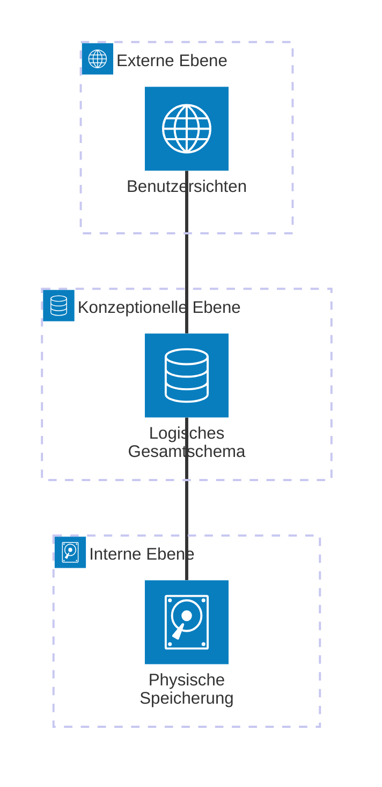

Die **ANSI-SPARC-Architektur**, auch als Drei-Schema-Architektur bekannt, ist ein zentrales Referenzmodell für den strukturellen Aufbau von Datenbanksystemen. Sie dient der Organisation der Interaktion zwischen Benutzern, der logischen Datenstruktur und der physischen Speicherung. Durch die strikte Trennung in drei Beschreibungsebenen wird das Ziel der Datenunabhängigkeit verfolgt, was eine flexible und wartungsfreundliche Verwaltung großer Datenbestände ermöglicht.

## Lernziele

Die Auseinandersetzung mit diesem Modell ermöglicht es:

- Die drei Ebenen der ANSI-SPARC-Architektur zu benennen und voneinander abzugrenzen.
- Den Unterschied zwischen physischer und logischer Datenunabhängigkeit zu erläutern.
- Die Funktion von Mappings (Transformationen) innerhalb der Schichtentrennung zu verstehen.
- Fachspezifische Rollen und Verantwortlichkeiten den jeweiligen Ebenen zuordnen.

## Kurzüberblick

Das Modell wurde 1975 von der _Standards Planning and Requirements Committee_ (SPARC) des _American National Standards Institute_ (ANSI) vorgeschlagen. Es beschreibt die interne Struktur eines Datenbankmanagementsystems (DBMS) mit dem Ziel einer konsequenten Trennung von Belangen (_Separation of Concerns_).

## Die drei Ebenen im Detail

### Externe Ebene (External Level)

Die externe Ebene bildet die Schnittstelle zu Endbenutzern und Anwendungen. Auf dieser Ebene existieren verschiedene **Benutzersichten** (_External Schemas_), die jeweils nur den für eine spezifische Aufgabe relevanten Teil der Daten abbilden. Dies reduziert die Komplexität für die Anwender und erhöht die Datensicherheit, da nicht benötigte oder sensible Informationen ausgeblendet werden können.

### Konzeptionelle Ebene (Conceptual Level)

Diese mittlere Schicht stellt die logische Gesamtsicht der Datenbank dar. Sie definiert, **welche** Daten gespeichert werden und in welchen Beziehungen diese zueinander stehen, unabhängig von der technischen Umsetzung. Hier werden Tabellenstrukturen festgelegt sowie Regeln zur [Datenqualität](datenqualitaet) und Integrität definiert. Das konzeptionelle Schema ist in der Regel das Ergebnis einer umfassenden [Normalisierung](normalisierung).

### Interne Ebene (Internal Level)

Die interne Ebene befasst sich mit der technischen Umsetzung der Speicherung (**Wie**). Sie legt fest, wie die Daten physisch auf den Datenträgern organisiert sind. Dies umfasst Aspekte wie Speicherformate, Indizes zur Performance-Optimierung und Kompressionsverfahren. Diese Ebene ist hardwarenah konzipiert und wird primär unter Leistungsaspekten optimiert.

## Datenunabhängigkeit

Das Kernmerkmal der ANSI-SPARC-Architektur ist die Entkopplung der Ebenen durch **Mappings** (Abbildungen). Das DBMS transformiert Anfragen von einer Ebene in die jeweils darunterliegende.

### Physische Datenunabhängigkeit

Anpassungen an der internen Ebene (z. B. der Wechsel von HDD- auf SSD-Speicher, die Änderung von Dateipfaden oder das Erstellen neuer Indizes) haben keinen Einfluss auf das konzeptionelle Schema. Die Anwendungen bleiben von diesen technischen Optimierungen unberührt.

### Logische Datenunabhängigkeit

Erweiterungen des konzeptionellen Schemas (z. B. neue Tabellen oder Attribute) erfordern keine Anpassung der bestehenden externen Sichten. Solange die für eine Sicht benötigten Strukturen im Gesamtschema erhalten bleiben, funktionieren die darauf aufbauenden Anwendungen weiterhin ohne Modifikationen.

## Beispiel: Personalverwaltung

Die Anwendung des Modells lässt sich am Beispiel einer Unternehmensdatenbank verdeutlichen:

1. **Externe Ebene**:
    - Sachbearbeiter greifen auf Sichten zu, die nur Name, Vorname und Abteilung anzeigen.
    - Die Lohnbuchhaltung nutzt Sichten, die zusätzlich Gehaltsdaten und Bankverbindungen enthalten.
    - Statistiker arbeiten mit anonymisierten Daten zur Altersstruktur.
2. **Konzeptionelle Ebene**: Das logische Gesamtschema verwaltet alle Felder (Name, Gehalt, Adresse, Abteilung) und deren Verknüpfungen (z. B. die Zuordnung von Mitarbeitern zu Abteilungen).
3. **Interne Ebene**: Die Daten sind als verschlüsselte Blöcke auf einem Speichersystem (z. B. RAID) abgelegt, wobei spezifische Indizes für Gehaltsauswertungen die Zugriffsgeschwindigkeit erhöhen.

## Analyse und Praxistipps

- **Vorteil der Entkopplung**: Der direkte Zugriff von Anwendungen auf die Tabellenstruktur (konzeptionelle Ebene) sollte vermieden werden. Die Nutzung von Sichten (_Views_) auf der externen Ebene sichert die logische Datenunabhängigkeit.
- **Abstraktion und Performance**: Die zusätzliche Abstraktionsschicht durch Mappings beansprucht Rechenleistung. In modernen Systemen ist dieser Overhead jedoch im Vergleich zum Gewinn an Wartbarkeit meist vernachlässigbar.
- **Strukturqualität**: Eine saubere Struktur der konzeptionellen Ebene ist Voraussetzung für effiziente externe Sichten. Eine mangelhafte Modellierung auf dieser Ebene erschwert spätere Anpassungen erheblich.

## Selbsttest

1. Aus welchem Grund wird die ANSI-SPARC-Architektur auch als Drei-Schema-Architektur bezeichnet?
2. Welches Ziel verfolgt die externe Ebene im Hinblick auf die Datensicherheit?
3. Was ist die Aufgabe eines "Mappings" zwischen den Ebenen?
4. Auf welcher Ebene erfolgt die Definition von Indizes zur Performance-Optimierung?
5. Warum beeinflusst ein Wechsel des Speichermediums die Anwendungsprogramme nicht?
