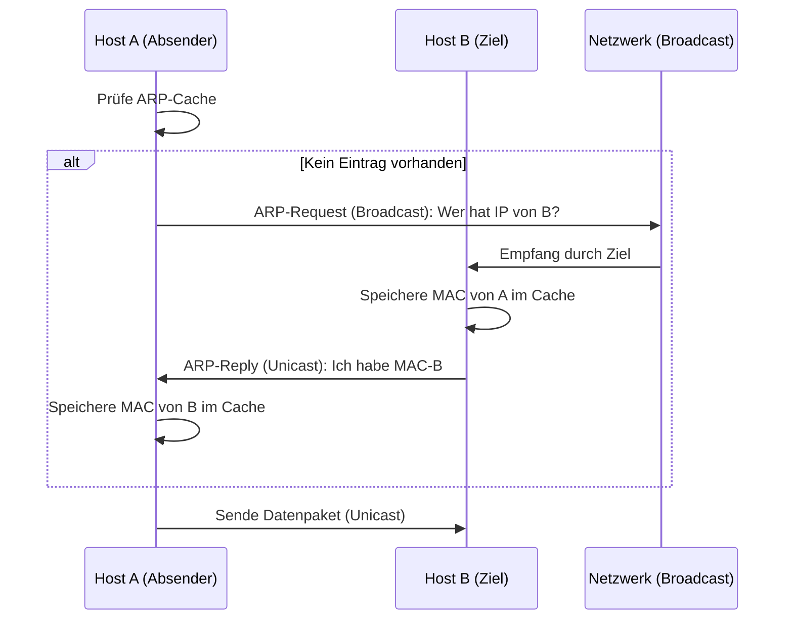

Das **Address Resolution Protocol (ARP)** ist ein Netzwerkprotokoll, das die logische Netzwerkadressierung mit der physischen Hardware-Adressierung verbindet. Es arbeitet an der Schnittstelle zwischen der Vermittlungsschicht (Layer 3) und der Sicherungsschicht (Layer 2) des [OSI-Modells](osi-modell). Da Datenpakete innerhalb eines lokalen Ethernet-Segments nur mithilfe von [MAC-Adressen](mac) zugestellt werden können, ermöglicht ARP die Ermittlung der Hardware-Adresse zu einer bekannten [IPv4-Adresse](ip).

## Lernziele
Nach der Bearbeitung dieses Artikels kann das Grundprinzip von ARP erläutert werden. Dies umfasst:

* Die Notwendigkeit der Adressauflösung im lokalen Netzwerk.
* Den Unterschied zwischen ARP-Request (Broadcast) und ARP-Reply (Unicast).
* Die Funktion des ARP-Caches zur Effizienzsteigerung.
* Sonderformen wie Proxy ARP und Gratuitous ARP.
* Sicherheitsrisiken wie ARP-Spoofing.

## Kontext und Einordnung
Im [TCP/IP-Modell](tcp-ip-modell) wird ARP der Netzzugangsschicht zugeordnet. Während die IP-Adresse der weltweiten oder netzübergreifenden Adressierung dient, ist für die Zustellung im lokalen physischen Netzwerk (z. B. Ethernet oder WLAN) die MAC-Adresse erforderlich. Ein Rechner kann ein Datenpaket erst dann in einen passenden Rahmen (Frame) verpacken, wenn die physische Zieladresse bekannt ist. ARP übernimmt diesen Schritt der Informationsbeschaffung.

## Begriffe
Zum Verständnis von ARP sind folgende Begriffe zentral:

* **ARP-Request:** Eine Suchanfrage, die als Broadcast an alle Teilnehmer im Netzwerksegment gesendet wird.
* **ARP-Reply:** Die direkte Antwort (Unicast) des Zielgeräts, welche die gesuchte MAC-Adresse enthält.
* **ARP-Cache:** Eine lokale Tabelle auf jedem Host, in der bereits aufgelöste Adresspaare für eine begrenzte Zeit gespeichert werden.
* **Broadcast:** Eine Nachricht an alle Teilnehmer eines Netzwerks (Ziel-MAC: `FF:FF:FF:FF:FF:FF`).
* **Unicast:** Eine Nachricht an einen spezifischen Empfänger.

## Funktionsweise
Wenn ein Host ein Paket an eine IP-Adresse im selben Subnetz senden möchte, prüft er zunächst den eigenen Speicher.

### Der ARP-Prozess

1. **Cache-Prüfung:** Der Absender sucht in der ARP-Tabelle nach der Ziel-IP. Bei einem Treffer wird die zugehörige MAC-Adresse verwendet.
2. **ARP-Request:** Fehlt der Eintrag, sendet der Host einen ARP-Request. Die Nachricht fragt: „Wer hat die IP-Adresse X? Bitte antworte an MAC-Adresse Y.“
3. **Verarbeitung:** Alle Geräte im Netzwerksegment empfangen den Broadcast. Nur das Gerät mit der gesuchten IP-Adresse verarbeitet die Anfrage weiter.
4. **ARP-Reply:** Der Zielhost speichert die IP-MAC-Kombination des Anfragers in seinem Cache und sendet eine direkte Antwort mit der eigenen MAC-Adresse zurück.
5. **Aktualisierung:** Der Absender trägt die Information in seinen ARP-Cache ein und versendet die Nutzdaten.

## Sonderformen
Neben dem Standardverfahren existieren spezielle Einsatzszenarien:

* **Gratuitous ARP (GARP):** Ein Host sendet unaufgefordert eine ARP-Antwort für die eigene IP-Adresse. Dies informiert andere Teilnehmer über einen Wechsel der MAC-Adresse (z. B. bei Failover-Systemen) oder dient der Erkennung von IP-Adresskonflikten.
* **Proxy ARP:** Ein Router antwortet stellvertretend mit der eigenen MAC-Adresse auf Anfragen für Hosts in anderen Subnetzen. Dies ermöglicht eine transparente Kommunikation über Netzwerkgrenzen hinweg.

## Sicherheit: ARP-Spoofing
Da ARP keine Authentifizierung vorsieht, ist es anfällig für Manipulationen. Beim **ARP-Spoofing** (oder ARP-Poisoning) sendet ein Angreifer gefälschte ARP-Antworten in das Netzwerk.

Dabei behauptet der Angreifer gegenüber einem Opfer, er besitze die MAC-Adresse des Standard-Gateways. Das Opfer sendet den Datenverkehr daraufhin an den Angreifer statt an den Router. Dies ermöglicht Man-in-the-Middle-Angriffe, bei denen Daten mitgelesen oder verändert werden können.

## Vergleich: ARP vs. NDP (IPv6)
In IPv6-Netzwerken wird die Adressauflösung vom **Neighbor Discovery Protocol (NDP)** übernommen, das auf ICMPv6 basiert.

| Merkmal | ARP (IPv4) | NDP (IPv6) |
| :--- | :--- | :--- |
| **Übertragungsart** | Broadcast | Multicast |
| **Effizienz** | Geringer (alle Teilnehmer verarbeiten Broadcasts) | Höher (nur relevante Gruppen) |
| **Protokoll** | Eigenständig auf Layer 2 | Teil von ICMPv6 |
| **Sicherheit** | Keine native Absicherung | Optional über SEAD/SEND gesichert |

## Selbsttest

1. Warum erfolgt die Antwort auf einen ARP-Request als Unicast?
2. Wie wirkt sich der ARP-Cache auf die Netzwerkauslastung aus?
3. Mit welchem Befehl lässt sich die ARP-Tabelle auf einem Betriebssystem anzeigen?
4. Welche Folgen hat der Einsatz von Gratuitous ARP bei einem IP-Adresskonflikt?
5. Warum ermöglicht das Fehlen einer Authentifizierung in ARP Angriffe wie Spoofing?
