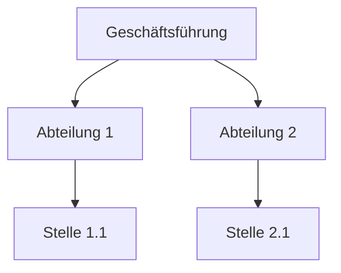
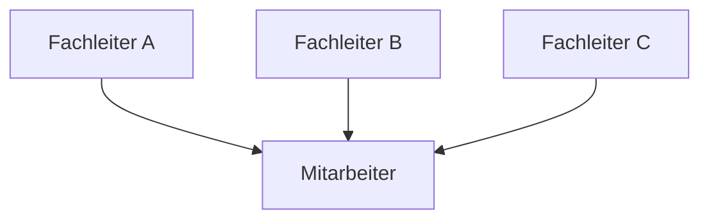
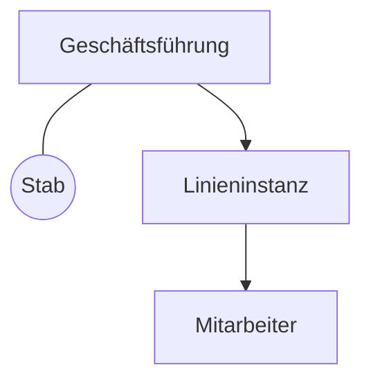
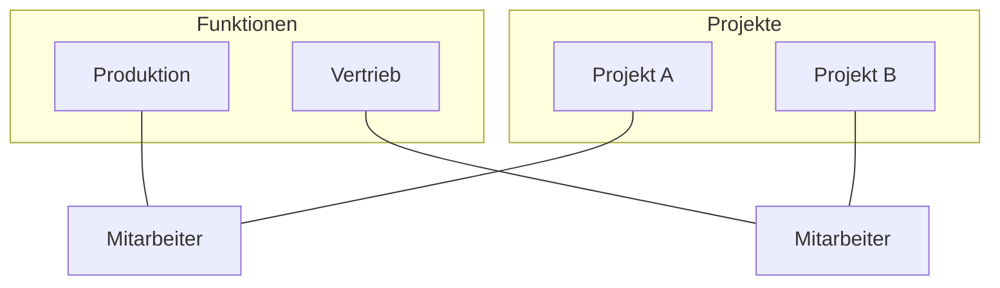

Die **Aufbauorganisation** bildet die dauerhafte Struktur eines Unternehmens. Sie legt fest, wie Aufgaben auf Stellen und Abteilungen verteilt werden, wer Führungsaufgaben übernimmt und welche Verantwortlichkeiten bestehen. Während die [Ablauforganisation](ablauforganisation) die zeitlichen und logischen Abläufe der [Geschäftsprozesse](geschaeftsprozess) regelt, schafft die Aufbauorganisation den organisatorischen Rahmen. Die Darstellung erfolgt meist in einem Organigramm.

## Methodik der Organisationsgestaltung
Die Gestaltung der Unternehmensstruktur basiert auf der methodischen Zerlegung und anschließenden Zusammenführung von Aufgaben.

### Aufgabenanalyse
In der Aufgabenanalyse wird die Gesamtaufgabe des Unternehmens systematisch in Teilaufgaben zerlegt. Die Gliederung erfolgt nach verschiedenen Merkmalen:

* **Verrichtung (Funktion):** Art der Tätigkeit (z. B. Bohren, Prüfen, Verkaufen).
* **Objekt:** Gegenstand der Tätigkeit (z. B. ein bestimmtes Produkt oder eine Kundengruppe).
* **Rang:** Bedeutung der Aufgabe (Entscheidungs- vs. Ausführungstätigkeit).
* **Phase:** Stellung im Prozess (Planung, Realisation, Kontrolle).
* **Zweck:** Unmittelbarer Beitrag zum Unternehmensziel (Primäraufgaben vs. Sekundäraufgaben).

### Aufgabensynthese
Die Aufgabensynthese führt die analysierten Teilaufgaben zu sinnvollen Einheiten zusammen. Dabei werden Stellen als kleinste organisatorische Einheiten gebildet. Mehrere Stellen mit verwandten Aufgaben werden zu Abteilungen gruppiert. Das Ergebnis wird häufig in einem Organisationshandbuch dokumentiert und bildet die Grundlage für Stellenbeschreibungen.

## Leitungssysteme
Leitungssysteme legen die Weisungsbefugnisse und Informationswege zwischen den Instanzen fest.

### Einliniensystem
Jede Stelle ist genau einer übergeordneten Instanz unterstellt. Weisungen verlaufen vertikal von oben nach unten.

* **Vorteile:** Eindeutige Kompetenzabgrenzung, klare Verantwortlichkeiten und übersichtliche Struktur.
* **Nachteile:** Lange Dienstwege durch alle Hierarchieebenen, hohe Belastung der Instanzen durch Informationsfilterung, geringe Flexibilität.

### Mehrliniensystem
Hierbei gilt das Prinzip der Mehrfachunterstellung (Funktionsmeisterprinzip). Stellen erhalten Weisungen von mehreren spezialisierten Vorgesetzten.

* **Vorteile:** Spezialisierung der Vorgesetzten, kurze Kommunikationswege, schnelle fachliche Entscheidungen.
* **Nachteile:** Gefahr von Kompetenzstreitigkeiten, Risiko widersprüchlicher Anweisungen, schwierige Fehlerzurechnung.

### Stabliniensystem
Dieses System ergänzt das Einliniensystem um Stabsstellen. Diese haben eine beratende Funktion ohne eigene Weisungsbefugnis gegenüber der Linie.

* **Vorteile:** Entlastung der Führungskräfte, Nutzung von Expertenwissen bei Erhalt der klaren Hierarchie.
* **Nachteile:** Konfliktpotenzial zwischen Stab und Linie, Stäbe üben oft informelle Macht aus, ohne die Verantwortung für Entscheidungen zu tragen.

## Mehrdimensionale Strukturen
In komplexen Unternehmen werden Strukturen oft nach mehreren Kriterien gleichzeitig gegliedert.

### Matrixorganisation
Die Matrixorganisation kombiniert zwei Gliederungsprinzipien auf derselben Hierarchieebene (z. B. Funktionen und Produkte).

Dieses Modell ermöglicht eine hohe Spezialisierung und flexible Ressourcenverteilung. Es stellt jedoch hohe Anforderungen an die Teamfähigkeit und birgt ein erhebliches Konfliktpotential durch die ständige Notwendigkeit der Abstimmung zwischen den Dimensionen.

## Gliederungsprinzipien der Abteilungsbildung
In der Praxis stehen zwei Konzepte im Vordergrund:

1. **Funktionalorganisation (Verrichtungsprinzip):** Die Spezialisierung erfolgt nach Funktionen (Einkauf, Produktion, Marketing). Dies eignet sich für Unternehmen mit einem homogenen Produktprogramm.
2. **Divisionalorganisation (Objektprinzip):** Die Gliederung erfolgt nach Sparten (Produkte, Regionen oder Kundengruppen). Dies bietet eine höhere Marktorientierung und Flexibilität bei vielfältigen Leistungen.

## Praxishinweise

* **Zuständigkeit:** Eine klare Aufbauorganisation verhindert Doppelarbeit und Kompetenzgerangel.
* **Abgrenzung:** Die Aufbauorganisation definiert die Zuständigkeit ("Wer?"), während die [Ablauforganisation](ablauforganisation) das Verfahren ("Wie? Wann?") festlegt.
* **Stabsstellen:** Die Trennung von Entscheidungsvorbereitung (Stab) und Entscheidung (Linie) muss formal sichergestellt sein, um Reibungsverluste zu minimieren.
