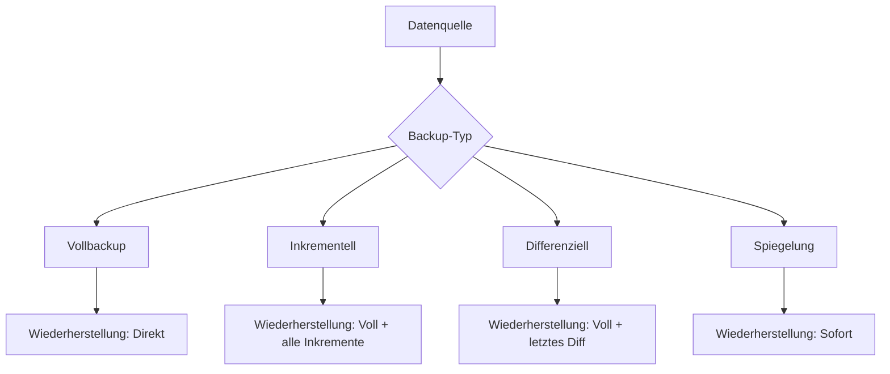
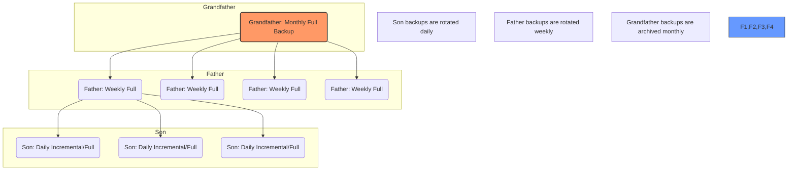

Das **Backup** (Datensicherung) bezeichnet das Kopieren von Daten auf ein separates Medium, um diese im Falle eines Datenverlustes wiederherstellen zu können. Es dient der Absicherung gegen Hardwaredefekte, Softwarefehler, menschliches Versagen oder bösartige Angriffe wie Ransomware. Im Rahmen der [Datensicherheit](datensicherheit) stellt die Datensicherung eine Kernmaßnahme dar, um die Kontinuität eines [Geschäftsprozesses](geschaeftsprozess) nach einem Schadensereignis zu gewährleisten.

## Lernziele

Nach der Bearbeitung dieses Artikels sind folgende Aspekte bekannt:

- Abgrenzung zwischen operativer Datensicherung und rechtssicherer Archivierung.
- Bedeutung der Kennzahlen RPO und RTO für die Prozessanalyse.
- Funktionsweise sowie Vor- und Nachteile verschiedener Backup-Arten.
- Methodiken der 3-2-1-Regel und des GFS-Prinzips.
- Unterscheidung zwischen Hochverfügbarkeit (RAID) und Datensicherung.

## Grundlagen der Datensicherung

### Backup vs. Archivierung

Trotz häufiger synonymer Verwendung verfolgen Backup und Archivierung unterschiedliche Zielsetzungen:

- **Backup:** Fokus auf **Verfügbarkeit**. Es dient der kurzfristigen Wiederherstellung des aktuellen Betriebszustands bei Systemausfällen. Daten werden nach einem definierten Zeitraum überschrieben.
- **Archivierung:** Fokus auf **Revisionssicherheit**. Sie dient der langfristigen, unveränderbaren Aufbewahrung von Daten zur Erfüllung gesetzlicher Anforderungen ([Compliance](compliance)). Archivierte Daten müssen über Jahre hinweg integer und auffindbar bleiben.

### Abgrenzung zum RAID-System

Ein RAID-System (Redundant Array of Independent Disks) ist kein Ersatz für ein Backup. Es dient der Hochverfügbarkeit, indem es den Betrieb bei einem physischen Defekt einzelner Datenträger ohne Unterbrechung aufrechterhält. Gegen logische Fehler wie versehentliches Löschen, Dateikorruption oder die Verschlüsselung durch Malware bietet ein RAID keinen Schutz, da diese Änderungen unmittelbar auf alle Festplatten des Verbunds übertragen werden.

## Kennzahlen: RTO und RPO

Die Planung eines Datensicherungskonzepts orientiert sich an zwei zentralen Parametern, die meist in Service Level Agreements (SLA) festgelegt werden:

- **Recovery Point Objective (RPO):** Definiert den maximal zulässigen Datenverlust als Zeitspanne. Ein RPO von vier Stunden bedeutet, dass bei einem Ausfall höchstens die Daten der letzten vier Stunden verloren gehen dürfen. Dieser Wert bestimmt die notwendige Backup-Frequenz.
- **Recovery Time Objective (RTO):** Definiert die maximal zulässige Zeitspanne für die Wiederherstellung der Systeme bis zur Wiederaufnahme des Betriebs. Dieser Wert beeinflusst die Wahl der Speichertechnologie und die Komplexität der Wiederherstellungsverfahren.

## Backup-Arten

Die Wahl der Backup-Art beeinflusst den Speicherbedarf, die Dauer der Sicherung und die Geschwindigkeit der Wiederherstellung.

| Art               | Funktionsweise                                                      | Vorteile                                                                 | Nachteile                                                            |
| :---------------- | :------------------------------------------------------------------ | :----------------------------------------------------------------------- | :------------------------------------------------------------------- |
| **Vollbackup**    | Vollständige Sicherung aller Daten eines Systems.                   | Einfachste Wiederherstellung aus einem einzigen Datensatz.               | Hoher Speicherbedarf und lange Dauer.                                |
| **Inkrementell**  | Sichert nur Änderungen seit der letzten Sicherung (beliebiger Art). | Geringer Speicherverbrauch und hohe Geschwindigkeit.                     | Komplexe Wiederherstellung (Vollbackup + alle Inkremente nötig).     |
| **Differenziell** | Sichert alle Änderungen seit dem letzten Vollbackup.                | Schneller als Vollbackup, einfachere Wiederherstellung als inkrementell. | Speicherbedarf steigt bis zum nächsten Vollbackup kontinuierlich an. |
| **Spiegelung**    | Kontinuierliche Echtzeit-Kopie der Daten.                           | Minimale Wiederherstellungszeit.                                         | Fehler und Malware-Infektionen werden sofort mitkopiert.             |

## Strategien zur Datensicherheit

### 3-2-1-Regel

Diese Strategie sichert Datenbestände gegen lokale Schadensereignisse ab:

- **3 Kopien:** Vorhalten von mindestens drei Kopien der Daten (Original plus zwei Backups).
- **2 Medien:** Speicherung auf mindestens zwei verschiedenen Medientypen (z. B. SSD und Magnetband oder [Cloud](cloud-computing)).
- **1 Offsite:** Aufbewahrung mindestens einer Kopie an einem geografisch getrennten Standort.

### GFS-Prinzip (Grandfather-Father-Son)

Das GFS-Prinzip regelt die Rotation der Sicherungsmedien für eine effiziente Langzeit-Sicherung:

- **Son (Sohn):** Tägliche Sicherung (meist inkrementell oder differenziell).
- **Father (Vater):** Wöchentliche Sicherung (Vollbackup).
- **Grandfather (Großvater):** Monatliche Sicherung (Vollbackup).

## Fehlerquellen und Empfehlungen

Eine effektive Datensicherung erfordert über die rein technische Kopie hinaus organisatorische Maßnahmen:

- **Restore-Tests:** Ein Backup gilt erst als erfolgreich, wenn die Wiederherstellung der Daten verifiziert wurde. Ungeprüfte Sicherungssätze bergen das Risiko der Unlesbarkeit im Ernstfall.
- **Logische Trennung (Air-Gap):** Backups müssen vom Quellsystem getrennt aufbewahrt werden. Dies verhindert, dass Ransomware im Infektionsfall auch die Sicherungsmedien verschlüsselt.
- **Sicherung von Archiven:** Auch Langzeitarchive unterliegen dem Risiko von Datenverlust und müssen in ein Backup-Konzept einbezogen werden, um rechtliche Risiken zu minimieren.

## Selbsttest

1. Weshalb schützt ein RAID 1 nicht vor der versehentlichen Löschung einer Datei?
2. Welcher Kennwert (RPO oder RTO) definiert die erforderliche Backup-Frequenz?
3. Welche Backup-Art erfordert bei der Wiederherstellung die meisten Einzelschritte?
4. Welchen Zweck erfüllt die geografische Trennung (Offsite) in der 3-2-1-Regel?
5. Warum ist ein Restore-Test integraler Bestandteil eines Backup-Konzepts?
