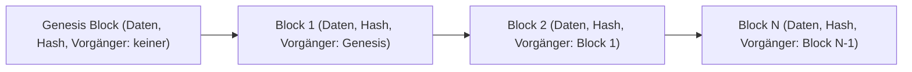

Die **Blockchain** ist ein elektronisches, chronologisches Register (Ledger), das Datensätze redundant in einem dezentralen Peer-to-Peer-Netzwerk verwaltet. Durch die kryptografische Verknüpfung der Datenblöcke ist das System manipulationsresistent. Die Technologie ermöglicht den sicheren Datenaustausch zwischen Parteien ohne zentrale Instanz.

## Lernziele

- Erläuterung der technischen Struktur (Blöcke, Hashing).
- Unterscheidung von Proof of Work und Proof of Stake.
- Beschreibung der Funktionsweise von Smart Contracts.
- Identifikation von Einsatzpotenzialen für [Datenanalyse](datenanalyse) und [Ist-Analyse](ist-analyse).

## Dezentralisierung und Transparenz
Herkömmliche IT-Systeme speichern Daten meist in zentralen Datenbanken, die von einer Administrationsinstanz kontrolliert werden. Die Blockchain nutzt hingegen den Ansatz des Distributed Ledger (verteiltes Kontobuch): Jedes Netzwerkmitglied verfügt über eine Kopie des gesamten Registers. Änderungen müssen von der Mehrheit des Netzwerks validiert werden, was nachträgliche, unbemerkte Manipulationen verhindert.

## Technische Bausteine

### Blöcke und Hashing
Ein Block bildet die kleinste Dateneinheit der Kette und besteht aus drei Kernkomponenten:

1. **Nutzdaten**: Informationen zur Transaktion (z. B. Zeitstempel, Beträge).
2. **Eigener Hash**: Ein digitaler Fingerabdruck des Blockinhalts, der mittels [Hashing](hashing) erzeugt wird.
3. **Vorheriger Hash**: Die Referenz auf den Hashwert des vorangegangenen Blocks.

Diese Verkettung erzeugt eine strikte Abhängigkeit: Verändert sich der Inhalt eines Blocks, ändert sich sein Hashwert. Da der Folgeblock diesen Wert referenziert, wird die gesamte Kette ab dem Manipulationspunkt ungültig.

### Genesis Block
Der Genesis Block ist der erste Block einer Kette. Er besitzt keinen Vorgänger und bildet die unveränderliche Basis für alle nachfolgenden Transaktionen.

*Abbildung 1: Schematische Darstellung der kryptografischen Verkettung.*

## Konsensmechanismen
Konsensmechanismen regeln, welche Blöcke als gültig in die Kette aufgenommen werden, ohne dass eine zentrale Autorität erforderlich ist.

### Proof of Work (PoW)
Teilnehmer (Miner) lösen rechenintensive mathematische Aufgaben. Wer die Lösung zuerst findet, darf den nächsten Block hinzufügen und erhält eine Belohnung. Dieses Verfahren bietet hohe Sicherheit, erfordert jedoch erheblichen Energieaufwand und begrenzt die Transaktionsgeschwindigkeit.

### Proof of Stake (PoS)
Die Auswahl der Validierer erfolgt basierend auf ihrem Anteil am System (Stake). Teilnehmer hinterlegen Sicherheiten (z. B. Anteile einer Kryptowährung). Eine höhere Einlage steigert die Wahrscheinlichkeit, für die Validierung ausgewählt zu werden. PoS ist energieeffizienter als PoW.

## Blockchain in der Praxis

### Smart Contracts
Smart Contracts sind automatisierte Programme auf der Blockchain. Sie führen Aktionen aus, sobald definierte Bedingungen erfüllt sind (Wenn-Dann-Logik). Ein Beispiel ist die automatische Freigabe von Zahlungen in [Geschäftsprozessen](geschaeftsprozess), sobald ein Wareneingang systemseitig bestätigt wurde.

### Relevanz für die Prozessanalyse
Für die Analyse von Prozessen und Daten bietet die Blockchain spezifische Vorteile:

- **Audit Trails**: Lückenlose und manipulationssichere Dokumentation jeder Transaktion.
- **Single Source of Truth**: Gemeinsame, vertrauenswürdige Datenbasis für unternehmensübergreifende Prozesse (z. B. in der Logistik).
- **Datenqualität**: Transaktionsdaten aus einer Blockchain eignen sich für das [Data Mining](data-mining), da sie valide Zeitstempel und eindeutige Identifikatoren enthalten.

## Anwendungsbeispiele

- **Lieferketten**: Lückenlose Verfolgung der Herkunft von Gütern vom Erzeuger bis zum Endverbraucher.
- **Finanzwesen**: Abwicklung internationaler Zahlungen ohne Korrespondenzbanken.
- **Identitätsmanagement**: Sichere Speicherung verifizierter digitaler Identitäten für Behördengänge oder Verträge.

## Vergleich der Eigenschaften

| Vorteile | Herausforderungen |
| :--- | :--- |
| **Transparenz**: Alle Transaktionen sind für berechtigte Teilnehmer einsehbar. | **Skalierbarkeit**: Begrenzte Kapazität für Transaktionen pro Sekunde. |
| **Sicherheit**: Hohe Resistenz gegen Manipulation und Systemausfälle. | **Speicherbedarf**: Redundante Datenspeicherung bei allen Teilnehmern. |
| **Effizienz**: Wegfall von Zwischeninstanzen reduziert Prozesskosten. | **Energieverbrauch**: Hoher Bedarf insbesondere bei PoW-Systemen. |

## Selbsttest

1. Warum führt die Änderung eines Datensatzes in einem Block dazu, dass alle Folgeblöcke ungültig werden?
2. Was charakterisiert einen Genesis Block?
3. Wie unterstützt die Blockchain die Integrität von Daten innerhalb einer Lieferkette?
4. Warum gilt Proof of Stake als ökologisch vorteilhafter gegenüber Proof of Work?
