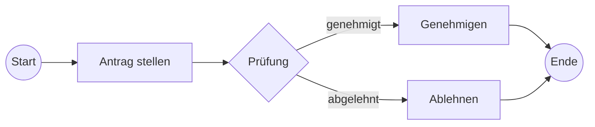

Die **BPMN** (Business Process Model and Notation) ist ein internationaler Standard (ISO/IEC 19510) für die grafische Darstellung von [Geschäftsprozessen](geschaeftsprozess). Sie stellt eine einheitliche Sprache bereit, die sowohl für Fachabteilungen als auch für die IT verständlich ist. BPMN ermöglicht die präzise Dokumentation, Analyse und technische Ausführung von Abläufen. Seit der Version 2.0 umfasst der Standard nicht nur die visuelle Notation, sondern auch ein technisches XML-Format für die [Automatisierung von Geschäftsprozessen](automatisierung-von-geschaeftsprozessen).

## Lernziele
Nach der Bearbeitung dieses Artikels können Auszubildende:

* die Kernkomponenten der BPMN (Events, Activities, Gateways) unterscheiden.
* Sequence Flows und Message Flows korrekt in Pools und Lanes einsetzen.
* die Bedeutung von BPMN für die Prozessautomatisierung und das Process Mining einordnen.
* einfache Prozessmodelle nach dem BPMN-Standard interpretieren.

## Grundlagen von BPMN 2.0
BPMN wurde entwickelt, um die Kommunikationslücke zwischen dem geschäftlichen Prozessentwurf und der technischen Implementierung zu schließen. Während frühere Versionen primär auf die visuelle Modellierung fokussiert waren, bietet BPMN 2.0 eine exakte Ausführungssemantik (*Execution Semantics*). Dies bedeutet, dass ein korrekt erstelltes Modell direkt von einer Process Engine (einem Workflow-System) interpretiert und ausgeführt werden kann.

Im Vergleich zu anderen Modellierungssprachen bietet die Notation eine hohe Detailtiefe und Flexibilität, was in einer detaillierten Analyse unter [BPMN im Vergleich zu EPK und UML](bpmn-vs-epk-vs-uml) betrachtet wird.

## Symbolik und Kernelemente
Der Standard unterteilt seine Symbole in vier Hauptkategorien, um die Lesbarkeit und Strukturierung zu gewährleisten.

### Flow Objects
Diese Elemente definieren das Verhalten des Prozesses:

* **Events (Ereignisse):** Dargestellt als Kreise. Sie markieren den Start, das Ende oder Zwischenstadien (Intermediate Events). Es wird zwischen „catching“ (reagiert auf einen Auslöser) und „throwing“ (löst eine Aktion aus) unterschieden.
* **Activities (Aktivitäten):** Dargestellt als Rechtecke mit abgerundeten Ecken. Sie repräsentieren Arbeitsschritte. Eine Activity kann ein einfacher *Task* oder ein komplexer *Sub-Process* sein.
* **Gateways (Verzweigungen):** Dargestellt als Rauten. Sie steuern den Kontrollfluss basierend auf Bedingungen (z. B. XOR für exklusive Entscheidungen oder AND für parallele Abläufe).

### Connecting Objects
Verbindungslinien definieren die Beziehung zwischen den Objekten:

* **Sequence Flow:** Eine durchgehende Linie mit Pfeilspitze. Sie zeigt die zeitliche Abfolge innerhalb eines Teilnehmers (Pools).
* **Message Flow:** Eine gestrichelte Linie mit einem offenen Kreis am Anfang und einer Pfeilspitze am Ende. Sie stellt den Nachrichtenaustausch zwischen verschiedenen Teilnehmern (Pools) dar.
* **Association:** Eine gepunktete Linie, die Informationen oder Artefakte (wie Dokumente) mit Flow Objects verknüpft.

### Swimlanes
Swimlanes dienen der Organisation von Verantwortlichkeiten:

* **Pools:** Repräsentieren eigenständige Teilnehmer, Organisationen oder Systeme (z. B. „Kunde“ oder „Unternehmen“).
* **Lanes:** Unterteilen einen Pool in spezifische Rollen, Abteilungen oder IT-Systeme innerhalb einer Organisation (z. B. „Vertrieb“ oder „Buchhaltung“).

## BPMN in der Praxis
In der professionellen Anwendung erfüllt BPMN zwei Hauptzwecke:

1. **Dokumentation und Optimierung:** Durch die Visualisierung werden Schwachstellen und Medienbrüche in bestehenden Prozessen sichtbar.
2. **Automatisierung:** Modelle dienen als direkte Vorlage für die IT-Umsetzung. Durch die XML-basierte Speicherung können Modelle zwischen verschiedenen Werkzeugen ausgetauscht werden.

Für die Datenanalyse ist BPMN insbesondere als Referenzmodell für das *Process Mining* von Bedeutung. Hierbei werden Ist-Daten aus IT-Systemen mit dem Soll-Modell der BPMN verglichen, um Abweichungen und Ineffizienzen automatisiert zu erkennen.

## Beispielprozess
Das folgende Diagramm zeigt einen einfachen Genehmigungsprozess mit einem exklusiven Gateway (XOR).

*Abbildung: Ein einfacher BPMN-Fluss mit Start-Ereignis, Aktivität, Gateway und End-Ereignis.*

## Häufige Fehler und Tipps

* **Sequence Flow über Pool-Grenzen:** Ein Sequenzfluss darf niemals einen Pool verlassen. Für die Kommunikation zwischen Pools ist zwingend ein *Message Flow* zu verwenden.
* **Gateways ohne Beschriftung:** Entscheidungen (Gateways) sollten immer klar beschriftet sein (z. B. als Frage), um die Logik des Pfades verständlich zu machen.
* **Zu hohe Komplexität:** Ein Modell sollte nicht mehr als 30 Elemente pro Ebene enthalten. Durch den Einsatz von *Sub-Prozessen* lassen sich Details übersichtlich auslagern.

## Testfragen

1. Wofür steht die Abkürzung BPMN seit der Version 2.0?
2. Welches Symbol wird verwendet, um eine Entscheidung im Prozessfluss darzustellen?
3. Aus welchem Grund darf ein Sequenzfluss keinen Pool verlassen?
4. Welchen Vorteil bietet die Ausführungssemantik von BPMN 2.0 für die IT?
5. Wie unterscheiden sich Pools und Lanes in ihrer Bedeutung?
