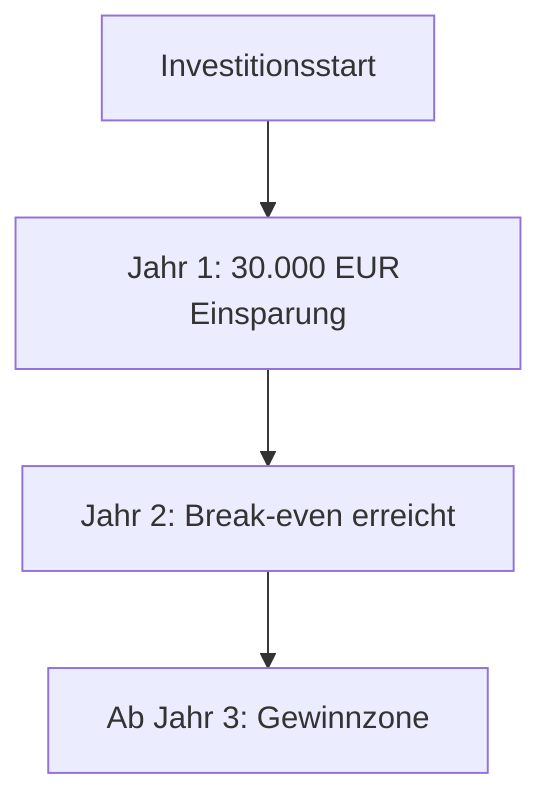

Die **Break-even-Analyse** (Gewinnschwellenanalyse) ermittelt den Punkt, an dem Erlöse und Gesamtkosten eines Produkts oder einer Investition identisch sind. Dieser Zeitpunkt oder diese Absatzmenge wird als Break-even-Point (BEP) bezeichnet. Die Analyse dient der Beurteilung der Wirtschaftlichkeit und unterstützt die Risikobewertung bei betrieblichen Entscheidungen.

## Lernziele

Die Auseinandersetzung mit der Break-even-Analyse vermittelt folgende Kompetenzen:

- Definition und Bedeutung des Break-even-Points.
- Berechnung des Deckungsbeitrags als Basis der Gewinnschwelle.
- Unterscheidung zwischen mengenbasierter und zeitbasierter Analyse.
- Durchführung einer Amortisationsrechnung für IT-Projekte.

## Definition und Zielsetzung

Die Break-even-Analyse bestimmt die Wirtschaftlichkeit eines Vorhabens. Sie identifiziert das Absatzvolumen oder den Zeitraum, ab dem ein Projekt die Verlustzone verlässt. Damit liefert sie eine wesentliche Entscheidungsgrundlage für Investitionen, Preisgestaltungen und Markteinführungen. In der [Datenanalyse](datenanalyse) wird sie eingesetzt, um Prognosen zur Rentabilität von Geschäftsprozessen abzusichern.

## Zentrale Begriffe

Für die Durchführung einer Break-even-Analyse ist die Differenzierung der [Kostenarten](kostenarten) erforderlich:

- **Fixkosten**: Kosten, die unabhängig von der Leistungsmenge anfallen (z. B. Mieten, Gehälter oder Pauschalgebühren für Software-Lizenzen).
- **Variable Kosten**: Kosten, die sich proportional zur Menge verändern (z. B. Cloud-Nutzungsgebühren nach Verbrauch).
- **Deckungsbeitrag**: Der Differenzbetrag zwischen Verkaufspreis und variablen Stückkosten, der zur Deckung der Fixkosten zur Verfügung steht.

$$ DB = p - k_v $$

## Berechnungsmethoden

Die Analyse erfolgt entweder absatzorientiert (Kostenrechnung) oder zeitlich orientiert (Investitionsrechnung).

### Mengenbasierte Analyse

Diese Methode ermittelt die kritische Absatzmenge, bei der die Fixkosten vollständig durch die Deckungsbeiträge gedeckt sind.

$$ x = \frac{K_F}{p - k_v} $$

Übersteigt die tatsächliche Absatzmenge diesen Wert, erwirtschaftet das Unternehmen einen Gewinn.

### Zeitbasierte Amortisationsrechnung

Bei IT-Projekten (z. B. der Einführung von [Cloud-Computing](cloud-computing)) steht oft die Frage im Vordergrund, wann sich eine Anfangsinvestition durch laufende Einsparungen refinanziert hat. Dieser Zeitraum wird als Amortisationsdauer bezeichnet.

$$ \text{Amortisationsdauer} = \frac{\text{Investitionskosten}}{\text{Jährliche Einsparungen}} $$

Die jährliche Einsparung ergibt sich üblicherweise aus der Differenz zwischen bisherigen und neuen Betriebskosten.

## Praxisbeispiel: IT-Investition

Ein Unternehmen migriert Server-Dienste in eine Cloud-Umgebung, um Wartungskosten zu senken.

- Investitionskosten: 60.000 EUR (Migration, Einrichtung, Schulung)
- Betriebskosten (On-Premise): 4.000 EUR pro Monat (Wartung, Strom, Personal)
- Betriebskosten (Cloud): 1.500 EUR pro Monat (Nutzungsgebühren)

Die monatliche Einsparung beträgt 2.500 EUR. Dies entspricht einer jährlichen Ersparnis von 30.000 EUR.

$$ \text{Amortisationsdauer} = \frac{60.000 \text{ EUR}}{30.000 \text{ EUR/Jahr}} = 2 \text{ Jahre} $$

Die Investition erreicht die Gewinnschwelle nach genau zwei Jahren.

## Grafische Darstellung

Im Break-even-Diagramm werden Gesamtkosten und Gesamterlöse gegenübergestellt:

- Die **Erlöskurve** beginnt im Ursprung und steigt mit jeder verkauften Einheit.
- Die **Gesamtkostenkurve** beginnt auf der Höhe der Fixkosten und verläuft flacher als die Erlöskurve.
- Der **Schnittpunkt** beider Geraden markiert den Break-even-Point. Links davon liegt die Verlustzone, rechts die Gewinnzone.

## Fehlerquellen und Hinweise

- **Unvollständige Kostenbetrachtung**: Oft werden neue variable Kosten (z. B. Gebühren für Datentransfer) vernachlässigt, was zu einer Überschätzung der Einsparung führt.
- **Statik der Analyse**: Die einfache Break-even-Analyse berücksichtigt keine Zinsfaktoren oder Preisänderungen über die Zeit. Für langfristige Projekte sind dynamische Verfahren der Investitionsrechnung geeigneter.

## Selbsttest

- Erläuterung der Auswirkung steigender Fixkosten auf den Break-even-Point.
- Vorgehensweise bei der Berechnung des Deckungsbeitrags pro Stück.
- Gründe für die Relevanz der Amortisationsdauer im IT-Management.
- Übung: Berechnung der Break-even-Menge bei Fixkosten von 10.000 EUR, einem Preis von 50 EUR und variablen Kosten von 30 EUR.
