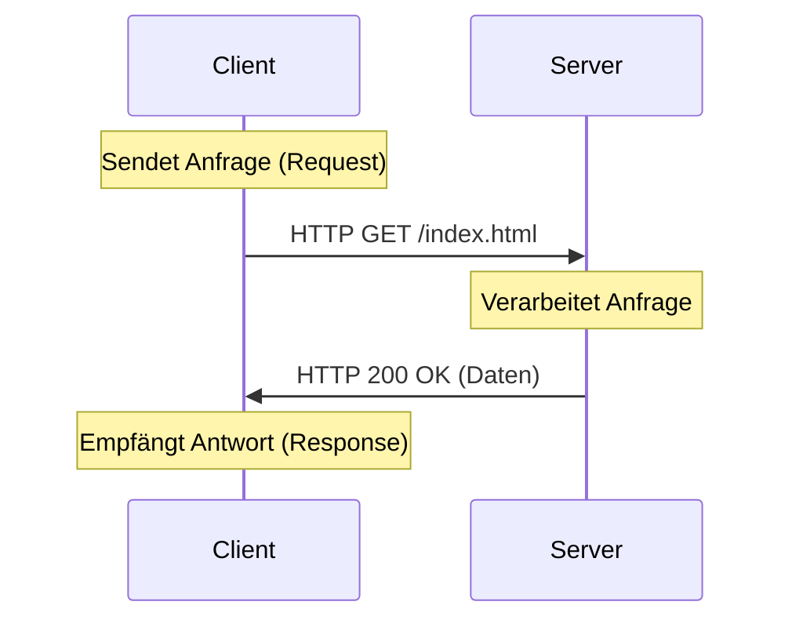

Das **Client-Server-Modell** beschreibt eine Netzwerkarchitektur, bei der Aufgaben und Ressourcen zwischen Dienstanbietern (Servern) und Dienstnutzern (Clients) aufgeteilt werden. Dieses Modell bildet das fundamentale Rückgrat moderner IT-Infrastrukturen und ermöglicht die zentrale Bereitstellung von Daten und Diensten für eine Vielzahl von Endgeräten.

## Lernziele

* Fundiertes Verständnis der Rollenverteilung zwischen Client und Server.
* Kenntnis über den Ablauf des Request-Response-Zyklus.
* Unterscheidung zwischen vertikaler und horizontaler Skalierung.
* Abgrenzung des Modells zum [Peer-to-Peer](peer-to-peer)-Konzept.
* Einordnung gängiger Netzwerkprotokolle in das Architekturmodell.

## Kurzüberblick
In einem Client-Server-Netzwerk übernimmt ein zentraler Rechner oder ein Programm die Rolle des Dienstanbieters. Ein Client hingegen ist ein Programm oder Gerät, das aktiv Dienste anfordert. Diese klare Trennung ermöglicht eine effiziente Verwaltung von Ressourcen wie Dateien, E-Mails oder Webseiten. Im Gegensatz zu dezentralen Netzwerkkonzepten liegt die Kontrolle meist bei einer zentralen Instanz, was die Administration vereinfacht, aber auch Abhängigkeiten schafft.

## Definition und Rollenverteilung
Die Kommunikation im Client-Server-Modell erfolgt nach einem fest definierten Muster, bei dem die Beteiligten spezifische Rollen einnehmen.

### Client (Dienstnutzer)
Ein Client ist ein Endgerät oder eine Software, die eine Verbindung zu einem Server herstellt, um eine Ressource oder einen Dienst zu nutzen. Clients verhalten sich aktiv, indem sie Anforderungen (*Requests*) versenden. Ein typisches Beispiel für einen Software-Client ist ein Webbrowser.

### Server (Dienstanbieter)
Ein Server ist ein Computer oder ein Programm, das permanent auf eingehende Anfragen wartet. Er verhält sich passiv und reagiert erst, wenn ein Client eine Anfrage stellt. Der Server verarbeitet diese Anfrage und sendet eine entsprechende Antwort (*Response*) zurück. Ein physischer Server (*Host*) kann dabei gleichzeitig mehrere verschiedene Server-Dienste (z. B. Webserver und Datenbank-Server) beherbergen.

### Request-Response-Zyklus
Der Austausch zwischen den Komponenten erfolgt immer als paarweise Interaktion. Der Client sendet einen Request, der Server antwortet mit einer Response.

## Skalierung
Die Skalierbarkeit beschreibt die Fähigkeit eines Systems, auf steigende Anforderungen (z. B. mehr Benutzende oder größere Datenmengen) zu reagieren, ohne die Leistungsfähigkeit zu verlieren.

### Vertikale Skalierung (Scale-Up)
Bei der vertikalen Skalierung wird ein bestehender Server durch leistungsfähigere Hardware aufgerüstet.

* **Maßnahmen:** Einbau von mehr Arbeitsspeicher (RAM), schnelleren Prozessoren (CPU) oder größeren Speichermedien.
* **Vorteil:** Keine Änderung an der Softwarearchitektur notwendig.
* **Nachteil:** Durch physikalische Grenzen der Hardware begrenzt (*Hardware-Limit*) und birgt das Risiko eines *Single Point of Failure*.

### Horizontale Skalierung (Scale-Out)
Hierbei werden zusätzliche Server zum System hinzugefügt, um die Last zu verteilen.

* **Maßnahmen:** Einsatz mehrerer identischer Server, die oft über einen [Load Balancer](load-balancing) koordiniert werden.
* **Vorteil:** Nahezu unbegrenzte Erweiterbarkeit und hohe Ausfallsicherheit durch Redundanz.
* **Nachteil:** Erhöhte Komplexität bei der Verwaltung und Synchronisation der Datenbestände.

## Vergleich mit Peer-to-Peer
Während das Client-Server-Modell auf Hierarchie und Zentralisierung setzt, ist das [Peer-to-Peer](peer-to-peer)-Modell (P2P) dezentral organisiert.

| Merkmal | Client-Server | Peer-to-Peer |
| :--- | :--- | :--- |
| **Hierarchie** | Klar getrennte Rollen | Gleichberechtigte Teilnehmende |
| **Administration** | Zentral (Administration) | Dezentral (Eigenverantwortung) |
| **Ausfallsicherheit** | Kritisch (Server-Ausfall = Totalausfall) | Hoch (viele redundante Knoten) |
| **Beispiel** | Webhosting, Firmennetzwerk | File-Sharing, Blockchain |

## Protokolle und Anwendungsbeispiele
Die Kommunikation zwischen Client und Server basiert auf standardisierten Protokollen, die den Ablauf der Datenübertragung regeln.

1. **HTTP/HTTPS:** Der Webbrowser (Client) fordert Webseiten von einem Webserver an.
2. **SMTP/IMAP:** Ein E-Mail-Programm (Client) versendet oder empfängt Nachrichten über einen E-Mail-Server.
3. **FTP:** Übertragung von Dateien zwischen einem Dateiserver und einem lokalen Rechner.
4. **SQL-Anfragen:** Eine Anwendung (Client) fragt Daten von einem Datenbankserver ab.

## Häufige Fehler und Tipps

* **Fehler:** Den Begriff "Server" ausschließlich als physische Hardware zu verstehen.
* **Tipp:** Es muss strikt zwischen Hardware-Servern (physische Maschinen) und Software-Servern (Programmen) unterschieden werden. Ein einziger Rechner kann gleichzeitig Client für einen Dienst und Server für einen anderen Dienst sein.

## Selbsttest

1. Was charakterisiert die Rollenverteilung im Request-Response-Zyklus?
2. Warum gilt horizontale Skalierung langfristig als flexibler als vertikale Skalierung?
3. In welchem Fall führt der Ausfall einer einzelnen zentralen Komponente zum Stillstand des gesamten Systems?
4. Welche Protokolle kommen typischerweise in diesem Architekturmodell zum Einsatz?
5. Welche Vorteile bietet die zentrale Administration im Vergleich zu dezentralen Modellen?
