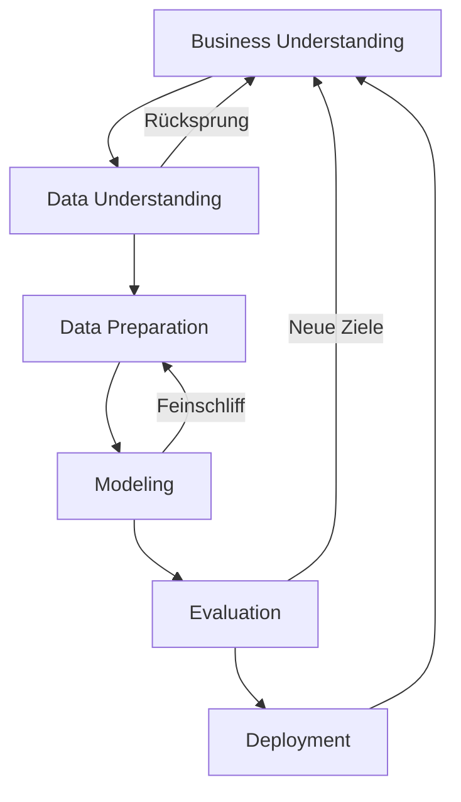

**CRISP-DM** (Cross-Industry Standard Process for Data Mining) ist ein branchenübergreifendes Vorgehensmodell zur Strukturierung von Datenanalyseprojekten. Der Standard unterteilt komplexe Vorhaben in sechs logische Phasen, um die Effizienz und die Qualität der Ergebnisse sicherzustellen.

## Lerninhalte
Dieser Artikel behandelt:

* Den strukturellen Ablauf eines Data-Mining-Projekts.
* Die sechs Phasen des Modells und deren Kernaufgaben.
* Die Bedeutung der Iterativität im Analyseprozess.
* Die Einordnung des Aufwands der Datenaufbereitung.
* Den Unterschied zur ML-spezifischen Erweiterung CRISP-ML(Q).

## Kurzüberblick
CRISP-DM wurde Ende der 1990er Jahre entwickelt, um einen branchenneutralen Standard für [Data Mining](data-mining) zu etablieren. Das Modell beschreibt einen Lebenszyklus, der durch Rückkopplungsschleifen zwischen den Phasen geprägt ist. Da Datenprojekte explorativen Charakter haben, bildet dieser Standard die Grundlage für die Reproduzierbarkeit und Vergleichbarkeit von Analyseergebnissen.

## Kontext und Einordnung
Im Gegensatz zu klassischen Softwareprojekten sind Datenprojekte oft mit Unsicherheiten bezüglich der Datenqualität und der Modellleistung verbunden. CRISP-DM trägt dem Rechnung, indem das Verständnis der Geschäftsziele und der Datenbasis priorisiert wird, bevor die technische Modellierung beginnt.

## Der iterative Prozesszyklus
Obwohl die Phasen logisch aufeinander aufbauen, ist CRISP-DM kein starres Wasserfallmodell. In der Praxis finden häufig Rücksprünge statt:

* **Datenaufbereitung & Modellierung:** Erweist sich ein Modell als unzureichend, erfolgt ein Rücksprung zur Aufbereitung, um Variablen anzupassen oder Daten neu zu transformieren.
* **Datenverständnis & Geschäftsverständnis:** Wenn die verfügbaren Daten die ursprünglichen Ziele nicht unterstützen, müssen die Geschäftsziele oder Erfolgskriterien neu definiert werden.

Dieser zyklische Charakter erlaubt es, Erkenntnisse aus späteren Phasen zur Verfeinerung früherer Schritte zu nutzen.

## Die sechs Phasen im Detail

### 1. Business Understanding (Geschäftsverständnis)
Am Anfang steht die präzise Definition der betriebswirtschaftlichen Problemstellung.

* **Kernaktivitäten:** Zieldefinition, Bewertung der Ausgangssituation (Ressourcen, Software, Hardware), Identifikation von Risiken und Festlegung messbarer Erfolgskriterien.
* **Ergebnis:** Ein Projektplan, der die technischen Analyseaufgaben aus den Geschäftszielen ableitet.

### 2. Data Understanding (Datenverständnis)
Es erfolgt die erste Sichtung und Bewertung der Datenbasis.

* **Kernaktivitäten:** Datensammlung, Beschreibung der Datenstruktur (Mengen, Formate) und erste explorative Analysen.
* **Fokus:** Prüfung der [Datenqualität](datenqualitaet) (Vollständigkeit, Korrektheit) und die Entscheidung, ob die Daten für den Projekterfolg ausreichen.

### 3. Data Preparation (Datenaufbereitung)
Die Datenaufbereitung stellt den zeitaufwendigsten Teil des Prozesses dar.

* **Kernaktivitäten:** Auswahl relevanter Datensätze, Bereinigung von Fehlern, Transformation von Variablen (z. B. Kodierung, Aggregation) und Integration verschiedener Datenquellen.
* **Zeitaufwand:** In der Praxis entfallen 50–70 % des Gesamtaufwands auf diese Phase.

### 4. Modeling (Modellierung)
Verschiedene mathematische Modelle werden ausgewählt und auf die vorbereiteten Daten angewendet.

* **Kernaktivitäten:** Auswahl der Algorithmen (z. B. Klassifikation oder Clustering), Erstellung von Testmodellen und Feinabstimmung der Parameter.
* **Validierung:** Prüfung der Modellgenauigkeit anhand von Fehlerraten oder spezifischen Kennzahlen.

### 5. Evaluation (Bewertung)
Vor dem produktiven Einsatz wird geprüft, ob das Modell die definierten Geschäftsziele erreicht.

* **Kernaktivitäten:** Bewertung der Ergebnisse im Kontext der Erfolgskriterien, Review des Prozesses auf systematische Fehler und Entscheidung über das weitere Vorgehen (Bereitstellung oder Korrekturschleife).

### 6. Deployment (Bereitstellung)
Die Analyseergebnisse werden in die betrieblichen Abläufe integriert.

* **Kernaktivitäten:** Erstellung der Dokumentation, Implementierung der Modelle in die Zielumgebung (z. B. [CRM-System](customer-relationship-management)) und Planung der laufenden Überwachung.

## Evolution: CRISP-ML(Q)
Für Anwendungen des [maschinellen Lernens](maschinelles-lernen) wurde der Standard zu **CRISP-ML(Q)** weiterentwickelt. Da sich ML-Modelle im Betrieb durch neue Daten verändern können (*Data Drift*), ergänzt diese Erweiterung das Modell um:

1. **Monitoring:** Kontinuierliche Überwachung der Modellleistung im Echtbetrieb.
2. **Maintenance:** Regelmäßige Aktualisierung und Neutraining der Modelle.
3. **Quality Assurance:** Fokus auf Robustheit, Reproduzierbarkeit und Fairness über den gesamten Lebenszyklus.

## Beispiel: Kündigungsprävention (Churn Prediction)
Ein Telekommunikationsunternehmen identifiziert abwanderungsgefährdete Kunden:

1. **Business Understanding:** Ziel ist die Reduktion der Abwanderungsquote um 5 %.
2. **Data Understanding:** Analyse von Verträgen, Rechnungsbeträgen und Support-Kontakten.
3. **Data Preparation:** Bereinigung der Kundendaten und Berechnung des Durchschnittsumsatzes der letzten drei Monate.
4. **Modeling:** Training eines Modells zur Vorhersage der Kündigungswahrscheinlichkeit.
5. **Evaluation:** Validierung, ob das Modell die richtigen Zielgruppen für Rückgewinnungsmaßnahmen identifiziert.
6. **Deployment:** Automatisierte Bereitstellung der Kundenlisten für das Serviceteam.

## Praxis-Hinweise

* **Qualität der Daten:** Ein Modell ist nur so präzise wie die zugrundeliegenden Daten (*Garbage In, Garbage Out*).
* **Fachliche Einbindung:** Ohne tiefes Verständnis der Geschäftsprozesse liefern technisch korrekte Modelle keinen betrieblichen Mehrwert.
* **Flexibilität:** CRISP-DM ist kein linearer Prozess. Der Erfolg hängt von der Bereitschaft ab, Phasen bei Bedarf mehrfach zu durchlaufen.

## Wissensprüfung

1. Warum beansprucht die Phase "Data Preparation" den größten Teil der Projektzeit?
2. Worin unterscheidet sich der iterative Ansatz von CRISP-DM von einem sequenziellen Modell?
3. Welche Phase bildet die Brücke zwischen technischem Modell und betrieblichem Nutzen?
4. Welche zusätzlichen Schritte führt CRISP-ML(Q) für den Dauerbetrieb von Modellen ein?
