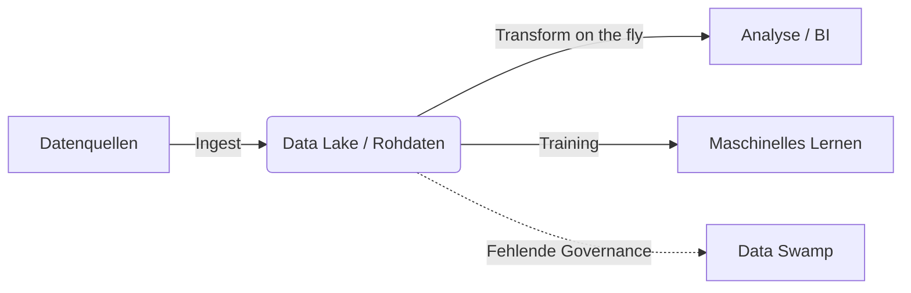

Ein **Data Lake** ist ein zentraler Speicherort, der große Mengen an strukturierten, semi-strukturierten und unstrukturierten Rohdaten in ihrem ursprünglichen Format aufnimmt. Im Gegensatz zu strukturbasierten Speichersystemen wie dem [Data Warehouse](data-warehouse) verzichtet ein Data Lake beim Einlagern der Daten auf eine vorherige Transformation. Er dient als Grundlage für umfassende [Big-Data](big-data)-Analysen, Visualisierungen und das [maschinelle Lernen](maschinelles-lernen).

## Fachliche Schwerpunkte
Die Auseinandersetzung mit dem Thema umfasst folgende Aspekte:

*   Kernkonzept und Funktionsweise eines Data Lakes.
*   Unterscheidung zwischen Schema-on-Read und Schema-on-Write.
*   Abgrenzung zum klassischen Data Warehouse.
*   Risiken wie der „Data Swamp“ und entsprechende Vermeidungsstrategien.
*   Moderne Architekturentwicklungen wie das Data Lakehouse.

## Konzept und Funktionsweise
Ein Data Lake speichert Daten unabhängig von ihrer Quelle „as-is“ (im Rohformat). Eine Strukturierung für den jeweiligen Anwendungszweck erfolgt erst beim Zugriff auf die Daten. Diese Flexibilität erlaubt die Sammlung von Daten, deren konkreter Nutzen zum Zeitpunkt der Speicherung noch nicht feststehen muss.

## Kontext und Einordnung
In traditionellen Systemen dominiert der [ETL](etl)-Prozess (Extract, Transform, Load). Dabei werden Daten bereinigt und transformiert, bevor die Speicherung im Zielsystem erfolgt (**Schema-on-Write**).
Ein Data Lake nutzt stattdessen meist das **ELT-Verfahren** (Extract, Load, Transform). Die Daten werden extrahiert und direkt geladen; die Transformation findet erst bei Bedarf während der Analyse statt. Dieses Prinzip wird als **Schema-on-Read** bezeichnet.

### Vergleich: Data Lake vs. Data Warehouse
| Merkmal | Data Lake | Data Warehouse |
| :--- | :--- | :--- |
| **Datenformat** | Rohdaten (Strukturiert bis unstrukturiert) | Strukturierte Daten (Bereinigt) |
| **Schema** | Schema-on-Read | Schema-on-Write |
| **Flexibilität** | Hoch (Skalierbare Datenmengen) | Begrenzt (Vordefiniertes Modell) |
| **Nutzergruppe** | Data Scientists, Analysten | Business-Analysten, Management |

## Begriffe und Definitionen

*   **Rohdaten (Native Format):** Daten in ihrer ursprünglichen Form (z. B. Logs, Bilder, JSON-Dateien), ohne Informationsreduktion durch Vorverarbeitung.
*   **Schema-on-Read:** Die Datenstruktur wird erst zum Zeitpunkt des Auslesens durch die analysierende Anwendung definiert.
*   **Data Swamp (Datensumpf):** Ein Zustand, in dem ein Data Lake durch fehlende Metadaten und mangelnde Governance unbrauchbar wird, da Informationen nicht mehr auffindbar sind.
*   **Data Lakehouse:** Eine hybride Architektur, welche die Kosteneffizienz eines Data Lakes mit den Management-Funktionen eines Data Warehouses kombiniert.

## Architektur und Datenfluss
Der typische Prozess in einer Data-Lake-Architektur umfasst drei Phasen:

1.  **Ingestion (Erfassung):** Daten aus verschiedenen Quellen (Sensoren, ERP-Systeme, Web-Logs) werden kontinuierlich in den Speicher geladen.
2.  **Storage (Speicherung):** Die Daten verbleiben in kostengünstigen Cloud-Speichern oder verteilten Dateisystemen. Dabei erfolgt eine Trennung zwischen Speicherressourcen (Storage) und Rechenleistung (Compute).
3.  **Analysis & Transformation (Auswertung):** Werkzeuge greifen auf die Rohdaten zu, wenden ein Schema an und bereiten die Ergebnisse für Berichte oder Modelle auf.

*Datenfluss von der Erfassung bis zur Nutzung unter Berücksichtigung der Governance-Risiken.*

## Anwendungsbeispiel: IoT-Überwachung
Ein Szenario für den Einsatz ist die Überwachung von Produktionsanlagen (Internet of Things):

*   **Input:** Sensoren übermitteln kontinuierlich Temperatur- und Statusdaten als unstrukturierte JSON-Streams.
*   **Speicherung:** Die Daten fließen ungefiltert in den Data Lake.
*   **Nutzung 1 (Echtzeit):** Ein Analysetool überwacht Grenzwerte und löst bei Abweichungen Meldungen aus.
*   **Nutzung 2 (Historisch):** Die Datenbestände der letzten Jahre dienen als Grundlage, um Modelle für Predictive Maintenance zu trainieren.

## Praktische Hinweise

*   **Metadaten-Management:** Ohne Dokumentation der Dateiinhalte entwickelt sich der Speicher schnell zum unkontrollierbaren Data Swamp.
*   **Daten-Governance:** Eine klare Definition von Zuständigkeiten für das Einspielen, den Zugriff und die Sicherstellung der [Datenqualität](datenqualitaet) ist erforderlich.
*   **Systemergänzung:** Ein Data Lake ersetzt ein Data Warehouse in der Regel nicht, sondern ergänzt es, beispielsweise innerhalb eines Data Lakehouses.

## Wissensüberprüfung

1. Was unterscheidet Schema-on-Read von Schema-on-Write?
2. Warum wird ELT im Kontext von Data Lakes gegenüber ETL bevorzugt?
3. Welche Folgen hat eine fehlende Metadaten-Verwaltung in einem Data Lake?
4. In welchen Szenarien bietet ein Data Lake Vorteile gegenüber einer relationalen Datenbank?
5. Welches Ziel verfolgt die Data-Lakehouse-Architektur?
