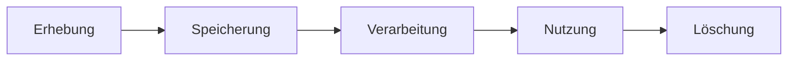

**Datensorgfalt** beschreibt den gewissenhaften Umgang mit Informationen während ihres gesamten Lebenszyklus. Der Prozess beginnt bei der Erhebung, umfasst die Speicherung, Verarbeitung sowie Nutzung und endet mit der endgültigen Löschung. Ziel ist es, Integrität, Vertraulichkeit und Verfügbarkeit von Datenbeständen zu sichern sowie gesetzliche Anforderungen und die Rechte betroffener Personen zu wahren.

## Lernziele

- Den Begriff Datensorgfalt im Kontext des Datenlebenszyklus einordnen
- Die Kernaspekte Integrität, Vertraulichkeit und Verfügbarkeit erläutern
- Methoden zur Sicherung von [Datenqualität](datenqualitaet) und [Datenschutz](datenschutz) identifizieren
- Die Bedeutung der [Datensparsamkeit](datensparsamkeit) für die Prozessanalyse bewerten

## Kurzüberblick
Datensorgfalt ist eine dauerhafte Aufgabe in der Daten- und Prozessanalyse. Sie stellt sicher, dass Daten zuverlässig als Grundlage für Entscheidungen dienen, ohne Risiken für Organisationen oder Einzelpersonen zu verursachen. Die Umsetzung erfolgt durch technische Schutzmaßnahmen, organisatorische Richtlinien und die Sensibilisierung aller beteiligten Akteure.

## Kontext und Einordnung
Im Berufsfeld der Daten- und Prozessanalyse bildet Datensorgfalt das Fundament für valide Ergebnisse. Nur gepflegte und geschützte Daten erlauben korrekte betriebliche Ableitungen. Gesetzliche Vorgaben, insbesondere die Datenschutz-Grundverordnung (DSGVO), setzen verbindliche Standards für den Umgang mit personenbezogenen Informationen.

## Begriffe und Definitionen

### Datenlebenszyklus
Der Datenlebenszyklus beschreibt die Phasen, die ein Datensatz durchläuft. Datensorgfalt ist in jedem Schritt erforderlich:

*Abbildung 1: Phasen des Datenlebenszyklus.*

### Die CIA-Schutzziele
In der Informationssicherheit und Datensorgfalt markieren drei Schutzziele (CIA-Triade) den Standard:

- **Vertraulichkeit (Confidentiality)**: Zugriff erfolgt nur durch autorisierte Personen.
- **Integrität (Integrity)**: Schutz vor unbemerkter Veränderung oder Manipulation der Daten.
- **Verfügbarkeit (Availability)**: Daten sind bei Bedarf zeitnah abrufbar.

## Vorgehen und Methoden

### Sicherstellung der Datenqualität
Eine hohe [Datenqualität](datenqualitaet) wird durch systematische Prüfprozesse erreicht:

1. **Validierung**: Überprüfung der Daten bei der Eingabe auf Plausibilität und Format (z. B. Datentypen).
2. **Bereinigung**: Identifizierung und Korrektur von Dubletten oder fehlerhaften Werten.
3. **Auditierung**: Regelmäßige Stichprobenkontrollen der Bestandsdaten auf Aktualität und Korrektheit.

### Umsetzung des Datenschutzes
Zum Schutz personenbezogener Informationen dienen technische und organisatorische Maßnahmen (TOM):

- **Zugriffskontrolle**: Nutzung von Rollen- und Berechtigungskonzepten.
- **Pseudonymisierung**: Ersetzung von Identifikationsmerkmalen durch Aliase zur Erschwerung des Personenbezugs.
- **Verschlüsselung**: Schutz der Daten bei Übertragung und Speicherung.

### Datenminimierung und Datensparsamkeit
Gemäß dem Prinzip der [Datensparsamkeit](datensparsamkeit) werden nur Daten erhoben, die für den jeweiligen Zweck notwendig sind. Dies reduziert Missbrauchsrisiken und minimiert den Verwaltungsaufwand.

## Beispiele

### Beispiel 1: Kundenregistrierung
Bei der Neuanlage eines Kundenkontos in einem Online-Shop greifen Mechanismen der Datensorgfalt:

- Pflichtfelder werden auf das korrekte Format geprüft (Validierung).
- Es werden nur für den Versand und die Abrechnung notwendige Daten abgefragt (Datenminimierung).
- Passwörter werden verschlüsselt gespeichert (Vertraulichkeit).

### Beispiel 2: Prozessanalyse in der Logistik
Bei der Untersuchung von Lieferzeiten im Unternehmen wird Datensorgfalt gewahrt:

- Unplausible Daten (z. B. Lieferdatum vor Bestelldatum) werden geprüft und korrigiert (Integrität).
- Personenbezogene Daten von Fahrpersonal werden vor der Analyse entfernt, sofern sie für die Routenoptimierung nicht relevant sind (Anonymisierung).

## Häufige Fehler und Tipps

- **Fehler**: Erhebung von Daten ohne konkreten Verwendungszweck.
  - **Lösung**: Vor der Erhebung prüfen, welcher Erkenntnisgewinn angestrebt wird.
- **Fehler**: Fehlende oder veraltete [Backups](backup), was bei Systemausfällen zu Datenverlust führt.
  - **Lösung**: Automatisierte Sicherungen einrichten und Wiederherstellungstests durchführen.
- **Fehler**: Gemeinsame Nutzung von Zugangsdaten im Team.
  - **Lösung**: Personalisierte Zugänge verwenden und regelmäßige Schulungen zur Sicherheit durchführen.

## Selbsttest

1. Definition des Begriffs Datenlebenszyklus.
2. Nennung der drei Schutzziele der CIA-Triade.
3. Begründung für die Bedeutung der Datenminimierung innerhalb der Datensorgfalt.
4. Aufzählung von zwei Maßnahmen zur technischen Sicherung der Vertraulichkeit.
5. Unterscheidung zwischen Pseudonymisierung und Anonymisierung.
