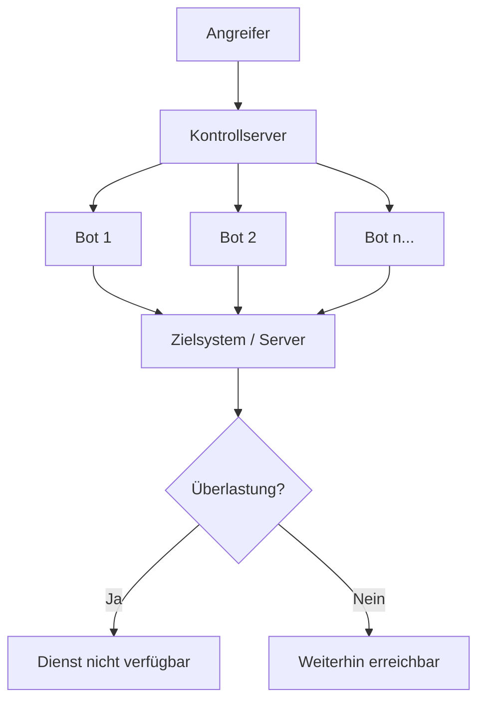

**DDoS-Angriffe** (*Distributed Denial of Service*) bezeichnen den Versuch, die Verfügbarkeit von IT-Systemen, Netzwerken oder Webdiensten durch gezielte Überlastung einzuschränken oder vollständig zu unterbinden. Im Gegensatz zu einfachen DoS-Angriffen erfolgt der Zugriff von einer Vielzahl verteilter Quellen, was die Identifikation und Blockierung der Angreifer erschwert. Diese Angriffsform bedroht die [Datensicherheit](datensicherheit), da sie direkt das Schutzziel der Verfügbarkeit verletzt.

## Lernziele
Nach diesem Artikel kannst du:

* das Grundprinzip und den Zweck von DDoS-Angriffen erklären.
* die Rolle von Botnetzen bei der Durchführung verteilter Angriffe beschreiben.
* volumetrische, protokollbasierte und anwendungsorientierte Angriffe unterscheiden.
* wichtige Abwehrstrategien und Mitigation-Dienste benennen.
* die rechtliche Situation in Deutschland einordnen.

## Funktionsweise
DDoS-Angriffe zielen darauf ab, Ressourcen wie Bandbreite, Prozessorleistung (CPU) oder Arbeitsspeicher eines Zielsystems so weit zu beanspruchen, dass legitime Nutzeranfragen nicht mehr verarbeitet werden können. Die Motivationen reichen von Erpressung über Wettbewerbsschädigung bis hin zu politischem Aktivismus (*Hacktivism*).

### Botnetze
Ein DDoS-Angriff wird in der Regel über ein Botnetz koordiniert. Ein Angreifer infiziert hierfür eine große Anzahl von Geräten mit Schadsoftware. Diese „Bots“ warten auf Befehle eines Kontrollservers (*Command-and-Control*). Auf Kommando senden tausende Geräte gleichzeitig Anfragen an das Zielsystem.

Die Koordination über viele verschiedene [IP-Adressen](ip) verhindert die Abwehr durch das einfache Sperren einzelner Adressen.

## Kategorien
Angriffe werden anhand der betroffenen Schichten des [OSI-Modells](osi-modell) unterschieden:

### Volumetrische Angriffe (Layer 3 & 4)
Diese Angriffsart sättigt die Internetanbindung oder die Bandbreite des Ziels durch eine enorme Datenmenge.

*   **Beispiele:** UDP-Flood, ICMP-Flood.
*   **Ziel:** Überlastung der Netzwerkanbindung, sodass kein legitimer Verkehr mehr durchkommt.

### Protokollbasierte Angriffe (Layer 3 & 4)
Hierbei werden Schwachstellen oder Design-Eigenschaften von Netzwerkprotokollen ausgenutzt, um Ressourcen auf Netzwerkgeräten wie Firewalls oder Load Balancern zu erschöpfen.

*   **Beispiel SYN-Flood:** Ein Angreifer sendet zahlreiche Verbindungsanfragen (SYN), bestätigt diese jedoch nie. Der Server reserviert Ressourcen für diese halboffenen Verbindungen, bis sein Speicher erschöpft ist.
*   **Ziel:** Erschöpfung der Session-Tabellen und Infrastrukturkapazitäten.

### Anwendungsorientierte Angriffe (Layer 7)
Diese spezialisierten Angriffe imitieren legitimes Nutzerverhalten und zielen auf Funktionen einer Anwendung ab, etwa Webserver-Logiken oder Datenbankabfragen.

*   **Beispiel HTTP-Flood:** Massenhafte komplexe Suchanfragen oder Seitenaufrufe zwingen den Server zur rechenintensiven Verarbeitung.
*   **Ziel:** Überlastung der CPU oder Datenbank des Anwendungsservers.

## Verstärkungstechniken
Um mit geringem Aufwand eine maximale Wirkung zu erzielen, nutzen Angreifer Techniken zur Verstärkung (*Amplification*):

1.  **Reflection:** Der Angreifer sendet Anfragen mit gefälschter Absender-IP (die IP des Opfers) an öffentliche Dienste, beispielsweise [DNS](dns)- oder NTP-Server.
2.  **Amplification:** Die Antwort dieser Dienste ist deutlich größer als die ursprüngliche Anfrage. Das Opfer wird von einer Lawine an Antwortdaten überflutet, die es nicht angefordert hat.

## Abwehrmaßnahmen
Die Abwehr erfordert eine Kombination aus proaktiven und reaktiven Maßnahmen.

### Technische Schutzmaßnahmen

*   **Rate Limiting:** Begrenzung der erlaubten Anfragen pro Zeiteinheit für einzelne Quellen.
*   **SYN-Cookies:** Verfahren zur Abwehr von SYN-Flood-Angriffen, ohne Ressourcen für halboffene Verbindungen vorhalten zu müssen.
*   **Content Delivery Networks (CDN):** Verteilung der Last über ein globales Netzwerk von Knotenpunkten.

### Spezialisierte Dienste

*   **DDoS-Mitigation (Scrubbing):** Der eingehende Datenverkehr wird über einen externen Dienstleister umgeleitet. Ein „Scrubbing Center“ filtert den schädlichen Verkehr heraus und leitet nur legitime Daten an das Ziel weiter.
*   **Cloud-basierte Abwehr:** Nutzung der Skalierbarkeit von Cloud-Anbietern, um Angriffsspitzen abzufangen.

## Bekannte Fallbeispiele

*   **Mirai-Botnetz (2016):** Ein Angriff auf den [DNS](dns)-Anbieter Dyn legte weite Teile des Internets lahm. Mirai nutzte primär unsichere IoT-Geräte wie Webcams und Router.
*   **GitHub (2018):** Ein massiver Memcached-basierter Amplification-Angriff erreichte eine Spitzenlast von 1,35 Terabit pro Sekunde (Tbit/s).
*   **Rekordwerte (2024/2025):** Moderne Botnetze erreichen Angriffsgrößen von über 5,6 Tbit/s.

## Rechtliche Einordnung
In Deutschland ist die Durchführung eines DDoS-Angriffs eine Straftat.

*   **§ 303b StGB (Computersabotage):** Wer eine Datenverarbeitung, die für einen anderen von wesentlicher Bedeutung ist, durch Eingeben oder Übermitteln von Daten erheblich stört, kann mit einer Freiheitsstrafe von bis zu fünf Jahren (in schweren Fällen bis zu zehn Jahren) bestraft werden.

## Selbsttest

1. Was unterscheidet einen DDoS-Angriff von einem herkömmlichen DoS-Angriff?
2. Warum sind IoT-Geräte oft Bestandteil von Botnetzen?
3. Welches OSI-Layer wird bei einer SYN-Flood primär angegriffen?
4. Erkläre das Prinzip der Amplification bei einem DNS-basierten Angriff.
5. Welche rechtlichen Konsequenzen drohen in Deutschland bei der Durchführung von DDoS-Attacken?
