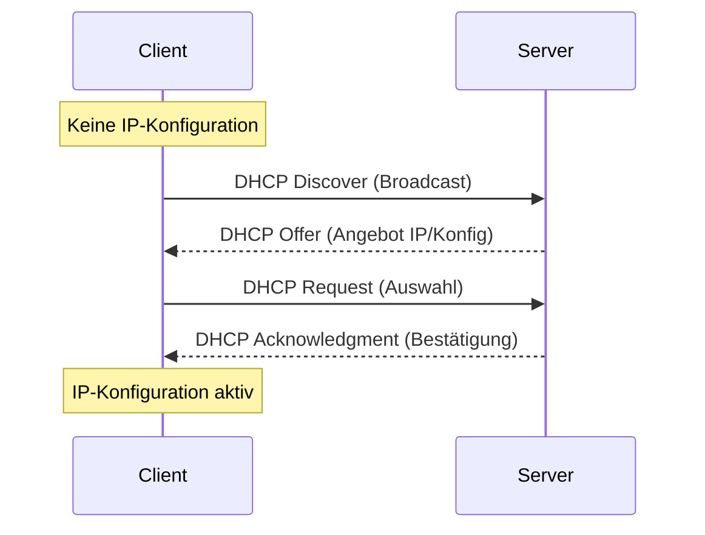

**DHCP** (*Dynamic Host Configuration Protocol*) ist ein Kommunikationsprotokoll, das die zentrale und automatisierte Verteilung von Netzwerkkonfigurationen an Clients übernimmt. Ohne dieses Protokoll müssten Parameter wie die [IP-Adresse](ip), die Subnetzmaske oder das Standard-Gateway manuell an jedem Endgerät konfiguriert werden. In größeren Umgebungen reduziert DHCP den administrativen Aufwand und minimiert die Fehleranfälligkeit durch Adresskonflikte.

## Lernziele
Dieser Artikel vermittelt Kenntnisse über:

- Den Ablauf des DORA-Prozesses und dessen vier Phasen.
- Die wichtigsten DHCP-Optionen wie Standard-Gateway und [DNS](dns).
- Den Lease-Mechanismus und dessen Bedeutung für die dynamische Adressverwaltung.
- Sicherheitsrisiken wie Rogue DHCP Server und Abwehrmaßnahmen wie DHCP-Snooping.
- Die Diagnose von Verbindungsproblemen anhand von APIPA-Adressen.

## Funktionsweise
DHCP basiert auf einem Client-Server-Modell. Ein DHCP-Server verwaltet einen Pool (Bereich) verfügbarer IP-Adressen und teilt diese den anfragenden Geräten im Netzwerk temporär zu. Das Protokoll arbeitet auf der Anwendungsschicht des [OSI-Modells](osi-modell) und nutzt UDP als Transportprotokoll (Ports 67 für den Server und 68 für den Client).

## Der DORA-Prozess
Die Zuweisung einer IP-Adresse erfolgt in einem standardisierten Ablauf aus vier Schritten, der oft mit dem Akronym **DORA** abgekürzt wird. Da der Client zu Beginn des Prozesses noch keine eigene IP-Adresse besitzt, erfolgt die Kommunikation über Broadcast-Nachrichten.

1. **DHCP Discover (D):** Der Client sendet einen Broadcast in das lokale Netzwerk, um verfügbare DHCP-Server zu lokalisieren.
2. **DHCP Offer (O):** Erreichbare Server antworten mit einem Angebot, das eine freie IP-Adresse sowie weitere Konfigurationsparameter enthält.
3. **DHCP Request (R):** Der Client wählt ein Angebot aus und fordert die Zuweisung dieser Adresse förmlich beim Server an.
4. **DHCP Acknowledgment (A):** Der Server bestätigt die Zuweisung und übermittelt die finalen Konfigurationsdaten.

*Abbildung 1: Schematischer Ablauf der IP-Zuweisung über den DORA-Prozess.*

## DHCP-Optionen und Parameter
Über DHCP werden neben der IP-Adresse zusätzliche Netzwerkinformationen, sogenannte „Optionen“, übertragen:

| Option | Bezeichnung | Funktion |
| :--- | :--- | :--- |
| 1 | Subnet Mask | Definiert die Maskierung zur Trennung von Netzwerk- und Host-Anteil. |
| 3 | Gateway | Gibt die IP-Adresse des Routers für den Zugang zu Fremdnetzen an. |
| 6 | DNS-Server | Teilt die Adressen der Nameserver zur Namensauflösung mit. |
| 51 | Lease Time | Definiert die Gültigkeitsdauer der bereitgestellten Konfiguration. |

## Der Lease-Mechanismus
Eine über DHCP zugewiesene Konfiguration wird als **Lease** (Leihgabe) vergeben. Die Dauer ist zeitlich begrenzt, um nicht mehr genutzte Adressen wieder in den Pool zurückzuführen.

- **Renewal (Erneuerung):** Nach 50 % der Lease-Zeit (T1-Timer) versucht der Client, die Lease beim ursprünglichen Server zu verlängern.
- **Rebinding (Umbindung):** Schlägt die Erneuerung fehl, versucht der Client nach 87,5 % der Zeit (T2-Timer), die Lease über einen beliebigen verfügbaren DHCP-Server zu verlängern.
- **Ablauf:** Erfolgt keine Bestätigung, verfällt die Konfiguration nach Ablauf der Lease-Zeit. Der Client muss den DORA-Prozess erneut einleiten.

## Sicherheit in DHCP-Umgebungen
Da DHCP standardmäßig keine Mechanismen zur Authentifizierung besitzt, ist es anfällig für Manipulationen:

- **Rogue DHCP Server:** Ein unautorisierter Server verteilt falsche Konfigurationen, um Datenverkehr über ein manipuliertes Gateway umzuleiten (Man-in-the-Middle-Angriff).
- **DHCP Starvation:** Ein Angreifer flutet den Server mit Anfragen unter Verwendung gefälschter MAC-Adressen, bis der Adresspool erschöpft ist (Denial-of-Service).

Zur Absicherung kann auf einem [Switch](switching) **DHCP-Snooping** aktiviert werden. Dabei werden DHCP-Antworten nur an vertrauenswürdigen (trusted) Ports zugelassen, an denen legitime Server angeschlossen sind.

## Fehlersuche mit APIPA
Wenn ein Client keine Antwort von einem DHCP-Server erhält, greift häufig ein automatisches Fallback-Verfahren: **APIPA** (*Automatic Private IP Addressing*).

- **Adressbereich:** Das Gerät weist sich selbst eine Adresse aus dem Bereich `169.254.0.1` bis `169.254.255.254` zu.
- **Bedeutung:** Eine APIPA-Adresse ist ein deutlicher Hinweis darauf, dass der DHCP-Server nicht erreichbar ist. Mögliche Ursachen sind physische Verbindungsprobleme, ein deaktivierter DHCP-Dienst oder Fehlkonfigurationen im WLAN.

## Selbsttest

1. Was verbirgt sich hinter den vier Phasen des DORA-Prozesses?
2. Weshalb ist für den ersten Schritt (Discover) eine Broadcast-Kommunikation notwendig?
3. Was geschieht mit der IP-Konfiguration eines Clients, wenn die Lease-Time ohne Erneuerung abläuft?
4. Wie schützt DHCP-Snooping ein Netzwerk vor unautorisierten DHCP-Servern?
5. Woran ist erkennbar, dass ein Endgerät das Fallback-Verfahren APIPA nutzt?
