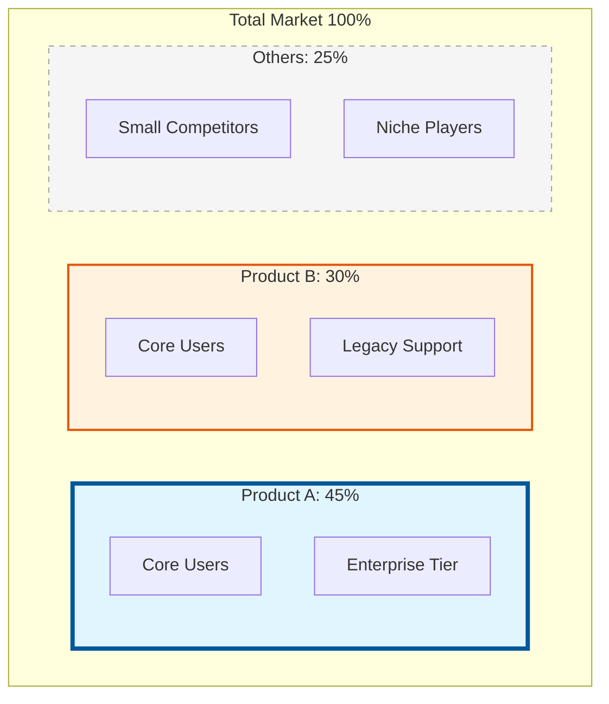
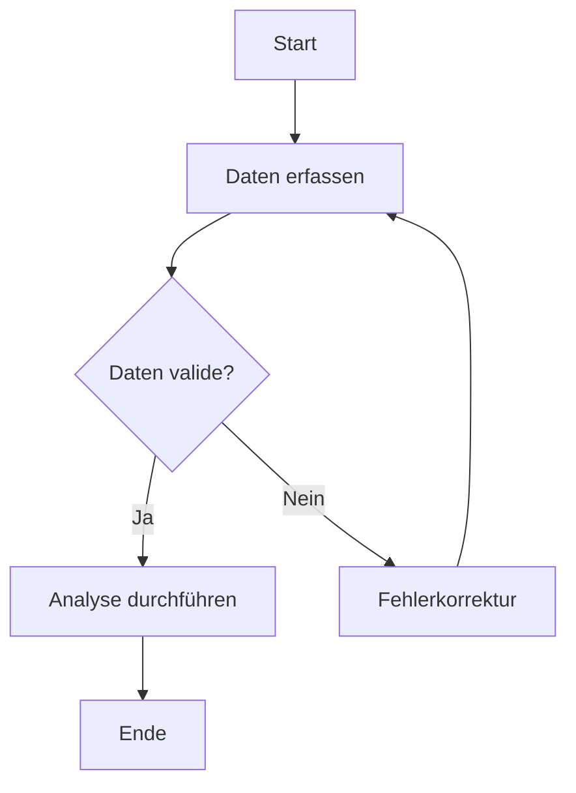

**Diagrammarten** sind grafische Darstellungen, die komplexe Datenmengen visuell aufbereiten, um quantitative oder qualitative Zusammenhänge intuitiv erfassbar zu machen. In der [Datenanalyse](datenanalyse) dienen sie der Identifikation von Trends, Mustern und Ausreißern, die in tabellarischen Ansichten oft verborgen bleiben. Die Wahl der passenden Diagrammart richtet sich nach dem Datentyp und dem jeweiligen Visualisierungsziel.

## Kategorisierung nach Visualisierungszweck

Für eine effiziente Informationsvermittlung erfolgt die Auswahl meist anhand des angestrebten Vergleichstyps:

- **Vergleiche und Rankings:** Gegenüberstellung einzelner Werte oder Kategorien (z. B. Säulen- oder Balkendiagramme).
- **Zeitverläufe und Trends:** Darstellung von Entwicklungen über ein Zeitintervall (z. B. Linien- oder Flächendiagramme).
- **Anteile (Teil-Ganzes):** Visualisierung der Zusammensetzung einer Gesamtheit (z. B. Kreisdiagramme oder gestapelte Balken).
- **Beziehungen und Korrelationen:** Untersuchung von Abhängigkeiten zwischen Variablen (z. B. Streu- oder Blasendiagramme).
- **Verteilungen:** Statistische Beschreibung der Streuung von Werten (z. B. Boxplot oder Histogramm).
- **Prozesse und Zeitplanung:** Darstellung von Abläufen und Projektfortschritten (z. B. Flussdiagramm oder Gantt-Diagramm).

## Vergleich und Ranking

### Säulendiagramm

Das Säulendiagramm stellt Datensätze vertikal dar. Es ist die Standardform für den Vergleich diskreter Kategorien oder für Zeitreihen mit wenigen Datenpunkten.

- **Vorteile:** Hohe Lesbarkeit und klare visuelle Trennung der Kategorien.
- **Nachteile:** Begrenzter Platz für Beschriftungen auf der X-Achse bei vielen Kategorien.
- **Anwendung:** Vergleich von Quartalsumsätzen oder Marktanteilen bei einer geringen Anzahl an Wettbewerbern.

### Balkendiagramm

Das Balkendiagramm ist die horizontale Variante des Säulendiagramms.

- **Vorteile:** Optimal für lange Kategoriebezeichnungen, da diese horizontal links neben den Balken stehen. Besonders für Rankings geeignet.
- **Nachteile:** Weniger intuitiv für die Darstellung chronologischer Verläufe.
- **Anwendung:** Ranking von Produkten nach Verkaufszahlen oder Umfrageergebnisse mit langen Antworttexten.

### Piktogramm

Piktogramme nutzen Symbole oder Bilder zur Mengendarstellung. Jedes Symbol repräsentiert dabei eine definierte Einheit.

> **Merke:** Symbole dürfen nur in ihrer Anzahl skaliert werden, nicht in ihrer Größe. Eine Skalierung der Bildgröße führt zu einer quadratischen Wahrnehmung von Flächenunterschieden und verzerrt somit die tatsächlichen linearen Mengenunterschiede.

## Zeitverläufe und Trends

### Liniendiagramm

Liniendiagramme verbinden einzelne Datenpunkte durch Liniensegmente. Sie eignen sich primär für kontinuierliche Daten.

- **Vorteile:** Trends und Richtungswechsel im Zeitverlauf werden sofort sichtbar. Mehrere Datenreihen lassen sich direkt vergleichen.
- **Nachteile:** Bei zu vielen Linien („Spaghetti-Chart“) leidet die Übersichtlichkeit.
- **Anwendung:** Aktienkurse, Temperaturverläufe oder monatliche Besucherzahlen in Web-Analytics.

### Flächendiagramm

Das Flächendiagramm basiert auf dem Liniendiagramm, wobei der Raum unter der Linie farbig ausgefüllt ist. Der Fokus liegt hierbei stärker auf dem Gesamtvolumen (kumulierte Werte) als auf der präzisen Änderung zwischen einzelnen Punkten.

## Anteile und Teil-Ganzes-Beziehungen

### Kreisdiagramm

Das Kreisdiagramm (Pie Chart) zeigt die prozentuale Verteilung von Anteilen an einer Gesamtheit.

- **Regel:** Nur anwenden, wenn die Summe aller Teile exakt 100 % ergibt. Zur Wahrung der Lesbarkeit sollten maximal fünf bis sieben Segmente dargestellt werden.
- **Anwendung:** Budgetverteilung oder Marktanteile einer Branche.

### Gestapeltes Balkendiagramm

In dieser Darstellung werden Teilmengen innerhalb eines Balkens übereinander oder nebeneinander geschichtet. Dies ermöglicht den Vergleich der Gesamtsummen verschiedener Gruppen bei gleichzeitiger Einsicht in deren interne Zusammensetzung.

## Beziehungen und Korrelationen

### Streudiagramm (Scatter Plot)

Das Streudiagramm bildet Datenpunkte auf einem zweidimensionalen Koordinatensystem ab, um Korrelationen zwischen zwei Variablen zu prüfen. Es dient der Identifikation von Mustern, Clustern oder Ausreißern.

- **Anwendung:** Analyse des Zusammenhangs zwischen Werbeausgaben und Umsatz.

### Blasendiagramm

Das Blasendiagramm erweitert das Streudiagramm um eine dritte Dimension: Die Größe der Blase repräsentiert einen weiteren quantitativen Wert.

- **Beispiel:** Kosten auf der X-Achse, Gewinn auf der Y-Achse und der Marktanteil als Blasengröße.

## Verteilungen

### Boxplot

Der Boxplot visualisiert die Streuung und Lage von Daten basierend auf einer statistischen Fünf-Punkte-Zusammenfassung:

$$ \{x*{min}, Q_1, \tilde{x}, Q_3, x*{max}\} $$

In dieser Darstellung entsprechen die Werte dem Minimum, dem ersten Quartil, dem Median, dem dritten Quartil und dem Maximum. Die „Box“ umschließt die mittleren 50 % der Daten. Boxplots erlauben einen schnellen Vergleich der Varianz zwischen verschiedenen Gruppen und eine klare Kennzeichnung von Ausreißern.

## Prozesse und Planung

### Flussdiagramm

Ein Flussdiagramm visualisiert die logischen Schritte eines Prozesses oder Algorithmus unter Verwendung standardisierter Symbole.

### Gantt-Diagramm

Im [Projektmanagement](projektmanagement) dient das Gantt-Diagramm zur Darstellung zeitlicher Abläufe und Abhängigkeiten von Aufgaben auf einer Zeitachse.

### Trichterdiagramm (Funnel)

Dieses Diagramm visualisiert Phasen eines Prozesses, in denen die Anzahl der Elemente stetig abnimmt, beispielsweise im Vertriebsprozess vom Interessenten zum Kunden.

### Wasserfall-Diagramm

Es zeigt, wie ein Startwert durch aufeinanderfolgende positive und negative Einflüsse zu einem Endwert führt. In Finanzanalysen wird es häufig genutzt, um Gewinn- und Verlustrechnungen transparent darzustellen.

## Spezielle Diagrammarten

- **Pareto-Diagramm:** Kombiniert absteigende Säulen mit einer Linie für die kumulierte Summe. Es unterstützt die Priorisierung nach der 80/20-Regel zur Identifikation der wichtigsten Problemursachen.
- **Radarkarte (Netzdiagramm):** Vergleicht mehrere quantitative Dimensionen, zum Beispiel Kompetenzprofile.
- **Wärmekarte (Heatmap):** Nutzt Farbintensitäten zur Darstellung von Werten in einer Matrix zur Mustererkennung in großen Datensätzen.
- **Mosaik-Plot:** Visualisiert Verhältnisse zwischen mehreren kategorialen Variablen über die Fläche von Kacheln.
- **Pegelkarte (Gauge):** Zeigt den aktuellen Stand einer [KPI](kpi) im Vergleich zu einem Zielwert.
- **Venn-Diagramm:** Stellt logische Mengenbeziehungen und Überschneidungen zwischen Gruppen dar.

## Auswahlkriterien

Vor der Erstellung eines Diagramms sind folgende Aspekte zu prüfen:

1.  **Zentrale Botschaft:** Soll ein Trend, ein Vergleich oder ein Anteil verdeutlicht werden?
2.  **Datentyp:** Handelt es sich um kontinuierliche oder kategoriale Daten?
3.  **Datenmenge:** Wenige Datenpunkte eignen sich oft für Säulen, während große Datenmengen besser in Liniendiagrammen oder Heatmaps dargestellt werden.
4.  **Skalierung:** Korrekte Achsenskalierungen verhindern eine künstliche Verzerrung von Unterschieden.
5.  **Barrierefreiheit:** Kontraste und Farbkombinationen müssen für alle Empfänger gut erkennbar sein.

## Selbsttest

1.  Welches Diagramm eignet sich am besten für ein Ranking von 20 Produkten mit langen Namen?
2.  Worin unterscheidet sich ein Säulendiagramm von einem Histogramm?
3.  Welche fünf Kennzahlen bildet ein Boxplot ab?
4.  Warum sollte bei einem Kreisdiagramm auf die Anzahl der Segmente geachtet werden?
5.  Welches Diagramm hilft dabei, die 20 % der Ursachen zu finden, die für 80 % der Fehler verantwortlich sind?

Lösungen anzeigen

1. Balkendiagramm (horizontal).
2. Das Säulendiagramm dient dem Vergleich diskrete Kategorien, während das Histogramm die Häufigkeitsverteilung kontinuierlicher Daten darstellt.
3. Minimum, 1. Quartil, Median, 3. Quartil und Maximum.
4. Zu viele Segmente beeinträchtigen die Übersichtlichkeit und erschweren den Vergleich der Verhältnisse.
5. Pareto-Diagramm.
 

