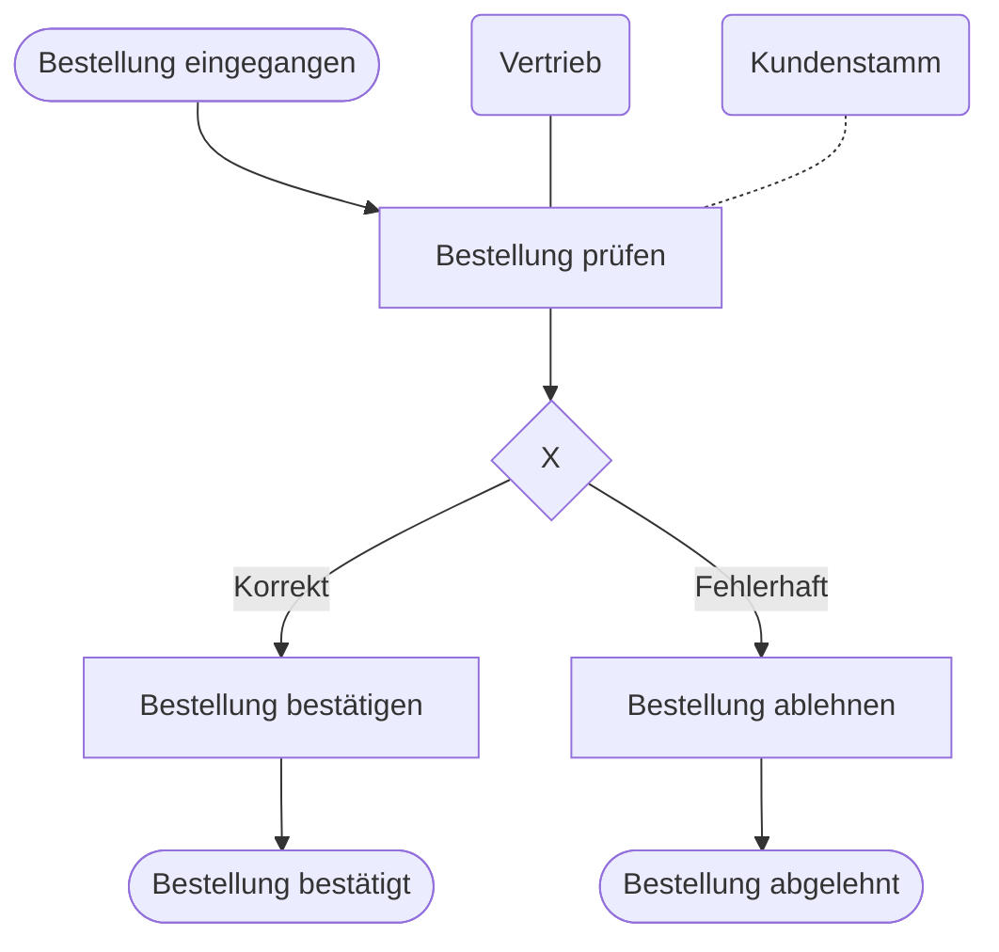

Die **erweiterte Ereignisgesteuerte Prozesskette (eEPK)** ist eine grafische Modellierungssprache zur Darstellung von Geschäftsprozessen. Sie erweitert die klassische Ereignisgesteuerte Prozesskette (EPK), indem sie neben der zeitlich-logischen Abfolge von Arbeitsschritten auch Organisationseinheiten, Datenträger und Anwendungssysteme integriert. Dies erhöht die Transparenz komplexer [Geschäftsprozesse](geschaeftsprozess) und schafft eine Grundlage für Prozessoptimierungen sowie die Einführung von Softwaresystemen.

## Grundlagen und Einordnung

Die eEPK ist ein zentraler Instrument der [Ablauforganisation](ablauforganisation). Während die einfache EPK den Kontrollfluss (zeitliche Abfolge) beschreibt, beantwortet die eEPK zusätzliche Fragen nach Verantwortlichkeiten („Wer?“), benötigten Daten („Womit?“) und den eingesetzten IT-Systemen.

## Begriffe und Definitionen

Ein eEPK-Modell besteht aus genormten grafischen Symbolen, die den Prozessfluss und die zugehörigen Ressourcen abbilden.

### Grundelemente

- **Ereignis (Event):** Beschreibt einen eingetretenen Zustand oder einen Auslöser. Ereignisse sind zeitpunktbezogen und verbrauchen keine Ressourcen.
    - _Symbol:_ Sechseck.
- **Funktion (Function):** Beschreibt einen Arbeitsschritt oder eine Tätigkeit, die Zeit beansprucht und einen Input in einen Output transformiert.
    - _Symbol:_ Rechteck mit abgerundeten Ecken.
- **Kontrollfluss:** Zeigt die logische Abfolge im Prozess durch eine gerichtete Verbindung.
    - _Symbol:_ Pfeillinie.

### Konnektoren (Logische Operatoren)

Konnektoren dienen der Verzweigung und Zusammenführung von Prozesspfaden. Die mathematischen Symbole werden wie folgt zugeordnet:

- **UND (And):** Alle nachfolgenden Pfade müssen durchlaufen werden (Parallelisierung).
  $$ \wedge $$

- **ODER (Or):** Mindestens ein Pfad oder mehrere Pfade werden durchlaufen (Inklusives Oder).
  $$ \vee $$

- **XOR (Exclusive Or):** Genau ein Pfad wird durchlaufen (Exklusive Entscheidung).
  $$ \times $$

### Erweiterungselemente der eEPK

- **Organisationseinheit:** Stellt die verantwortliche Stelle, Abteilung oder Person dar.
    - _Symbol:_ Ellipse.
- **Informationsobjekt:** Bildet Daten, Dokumente oder Informationsträger ab.
    - _Symbol:_ Rechteck (Parallelogramm).
- **Anwendungssystem:** Benennt die genutzte Software oder Hardware-Komponente.
    - _Symbol:_ Rechteck mit doppelten vertikalen Linien.

## Syntaxregeln und Modellierung

Die Erstellung eines fachlich korrekten Modells erfordert die Einhaltung strikter Syntaxregeln:

1. **Start und Ende:** Jede eEPK beginnt und endet mit mindestens einem Ereignis.
2. **Wechselprinzip:** Ereignisse und Funktionen müssen sich grundsätzlich abwechseln. Auf ein Ereignis folgt eine Funktion, auf eine Funktion folgt ein Ereignis.
3. **Entscheidungslogik:**
    - Ein Ereignis ist passiv und kann keine Entscheidung treffen. Daher darf nach einem Ereignis kein ODER- oder XOR-Konnektor folgen, der den Pfad aufspaltet.
    - Entscheidungen werden innerhalb von Funktionen getroffen; der entsprechende Konnektor folgt unmittelbar auf die Funktion.
4. **Zusammenführung:** Prozesspfade, die mit einem bestimmten Konnektortyp aufgespalten wurden, werden im Regelfall mit demselben Konnektortyp wieder zusammengeführt.

## Beispiel: Bearbeitung einer Bestellung

Das folgende Diagramm visualisiert einen vereinfachten Prozess zur Prüfung einer eingehenden Bestellung.

In diesem Prozess löst das Ereignis „Bestellung eingegangen“ die Funktion „Bestellung prüfen“ aus. Die Durchführung obliegt der Organisationseinheit „Vertrieb“, welche hierfür auf den „Kundenstamm“ zugreift. Die exklusive Entscheidung (XOR) führt entweder zum Endzustand „Bestellung bestätigt“ oder „Bestellung abgelehnt“.

## Modellierungsfehler und Best Practices

- **Fehlender Auslöser:** Das Modell beginnt mit einer Funktion. Prozesse benötigen jedoch immer einen definierten Startzustand (Ereignis).
- **Direkte Funktionsfolge:** Zwei Funktionen folgen ohne zwischengeschaltetes Ereignis aufeinander. Korrekterweise muss der Abschluss einer Tätigkeit durch ein Ereignis dokumentiert werden, bevor die nächste Funktion beginnt.
- **Logikbruch:** Ein XOR-Konnektor folgt direkt auf ein Ereignis. Da Ereignisse keine Entscheidungsinstanz darstellen, muss die Logik hinter eine prüfende Funktion verschoben werden.

## Wissensprüfung

1. Welches grafische Symbol kennzeichnet ein Ereignis in der eEPK?
2. Warum darf eine XOR-Verzweigung nicht unmittelbar auf ein Ereignis folgen?
3. Welche Informationen liefert eine eEPK im Vergleich zur einfachen EPK zusätzlich?
4. Welche drei logischen Konnektoren werden zur Prozesssteuerung eingesetzt?
5. Mit welcher Elementart muss ein eEPK-Modell zwingend abschließen?
