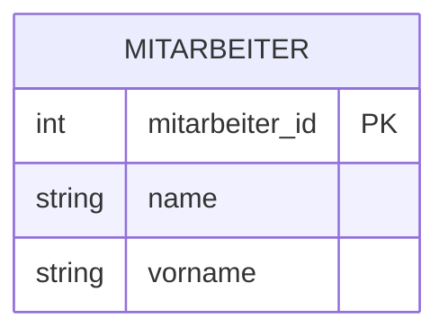
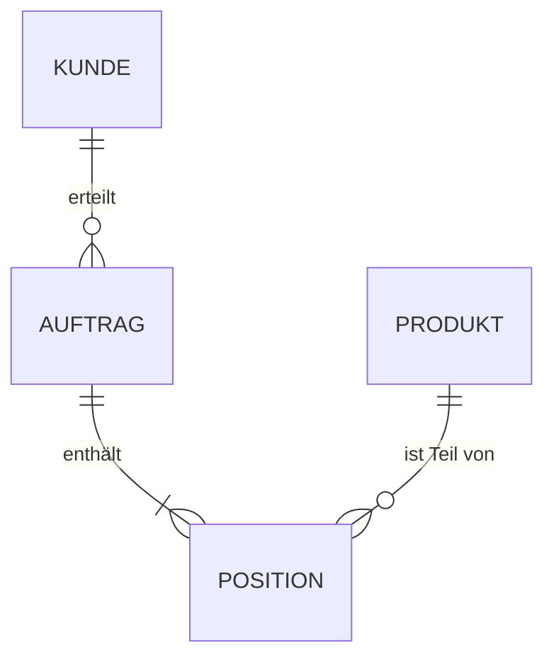

Das **Entity-Relationship-Modell (ERM)** ist ein Werkzeug für den konzeptionellen Datenbankentwurf. Es dient dazu, einen Ausschnitt der realen Welt abstrakt und fachlich korrekt darzustellen, ohne die technische Implementierung in einem spezifischen [Datenbankmanagementsystem (DBMS)](dbms) zu berücksichtigen. Die grafische Darstellung in einem Entity-Relationship-Diagramm (ERD) macht komplexe Zusammenhänge zwischen Datenobjekten für Entwickler und Fachabteilungen verständlich.

## Lernziele

* Grundelemente (Entität, Attribut, Beziehung) eines ERM identifizieren.
* Kardinalitäten (1:1, 1:n, n:m) fachlich korrekt interpretieren und festlegen.
* Zweck von Primär- und Fremdschlüsseln erklären.
* Konzeptionelles ERM in ein logisches [Relationenmodell](relationenmodell) transformieren.

## Bausteine des Modells
Das ERM nutzt standardisierte Symbole, um die Struktur der Daten zu beschreiben.

### Entität und Entitätstyp
Eine **Entität** ist ein eindeutig identifizierbares Objekt der Realität, beispielsweise ein bestimmter Mitarbeiter oder ein konkretes Produkt. Gleichartige Entitäten werden zu einem **Entitätstyp** zusammengefasst (z. B. „Mitarbeiter“). In Diagrammen werden Entitätstypen als Rechtecke dargestellt.

### Attribut und Primärschlüssel
**Attribute** beschreiben die Eigenschaften eines Entitätstyps (z. B. Name, Geburtsdatum, Preis). Um eine Entität innerhalb ihres Typs eindeutig zu identifizieren, wird mindestens ein Attribut als **Primärschlüssel** (Primary Key, PK) definiert. Ein Primärschlüssel muss eindeutig sein und darf keinen leeren Wert enthalten (*Not Null*).

### Beziehung
Eine **Beziehung** verknüpft zwei oder mehr Entitätstypen und beschreibt deren fachlichen Zusammenhang (z. B. „Mitarbeiter *arbeitet in* Abteilung“). In der Chen-Notation werden Beziehungen als Rauten dargestellt, in der Krähenfuß-Notation als Linien mit spezifischen Endsymbolen.

## Kardinalitäten
Kardinalitäten legen fest, wie viele Instanzen einer Entität mit Instanzen einer anderen Entität in Beziehung stehen können. Sie bilden die Grundlage für die spätere Tabellenstruktur.

| Typ | Beschreibung | Beispiel |
| :--- | :--- | :--- |
| **1:1** | Jede Entität der einen Seite ist mit genau einer der anderen Seite verknüpft. | Person besitzt einen Reisepass. |
| **1:n** | Eine Entität der 1-Seite kann mit beliebig vielen der n-Seite verknüpft sein. | Eine Abteilung hat viele Mitarbeiter. |
| **n:m** | Mehrere Entitäten beider Seiten können miteinander verknüpft sein. | Studenten besuchen viele Kurse. |

### Grafische Darstellung
In modernen Werkzeugen dominiert die Krähenfuß-Notation. Sie zeigt die Kardinalitäten direkt an den Verbindungslinien.

## Transformation zum Relationenmodell
Für die technische Umsetzung wird das ERM in ein logisches [Relationenmodell](relationenmodell) überführt. Dabei gelten folgende Regeln für die Platzierung von Schlüsseln:

1.  **1:n-Beziehung**: Der Primärschlüssel der „1-Seite“ wird als **Fremdschlüssel** (Foreign Key, FK) in die Tabelle der „n-Seite“ aufgenommen.
2.  **n:m-Beziehung**: Diese wird über eine zusätzliche **Zwischentabelle** (Verknüpfungstabelle) aufgelöst. Die Tabelle enthält die Primärschlüssel beider beteiligten Entitätstypen als Fremdschlüssel.
3.  **1:1-Beziehung**: Der Fremdschlüssel wird in einer der beiden Tabellen platziert. Meist wird die Seite gewählt, die logisch vom anderen Objekt abhängt.

> **Merke:** Eine n:m-Beziehung kann in einem relationalen Datenbanksystem niemals direkt zwischen zwei Tabellen abgebildet werden. Es ist immer eine Hilfstabelle erforderlich.

## Praxisbeispiel: Onlineshop
In einem Onlineshop bestellen Kunden Produkte:

*   **Kunde zu Bestellung (1:n)**: Ein Kunde tätigt mehrere Bestellungen. Die `Kunden_ID` wird als Fremdschlüssel in der Tabelle `Bestellung` gespeichert.
*   **Bestellung zu Produkt (n:m)**: Eine Bestellung enthält mehrere Produkte; ein Produkt kann in vielen Bestellungen vorkommen.
*   **Umsetzung**: Die Tabelle `Bestellposition` dient als Zwischentabelle und verknüpft `Bestell_ID` mit `Produkt_ID`.

## Wichtige Entwurfsregeln

*   **Redundanz vermeiden**: Informationen werden nur einmal gespeichert, um die [Datenqualität](datenqualitaet) zu sichern und Inkonsistenzen zu verhindern.
*   **Stabile Primärschlüssel**: Natürliche Schlüssel (wie Namen) sind oft ungeeignet. Künstliche Schlüssel (IDs) sind vorzuziehen, da sie sich nicht ändern.
*   **Fachliche Abstraktion**: Im ERM werden keine technischen Details wie Datentypen oder SQL-Syntax definiert. Der Fokus liegt rein auf der logischen Struktur.

## Selbsttest

1. Warum erfordern n:m-Beziehungen eine eigene Tabelle?
2. Auf welcher Seite wird der Fremdschlüssel bei einer 1:n-Beziehung eingetragen?
3. Worin besteht der Unterschied zwischen einer Entität und einem Entitätstyp?
4. Welche Bedingungen muss ein Primärschlüssel zwingend erfüllen?
