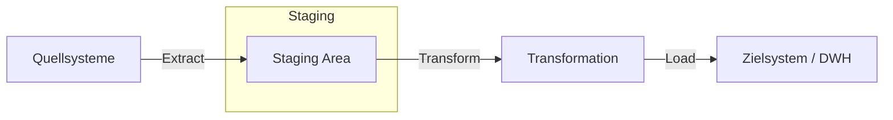

Der **ETL**-Prozess (Extract, Transform, Load) ist ein Verfahren der Datenintegration, das Daten aus unterschiedlichen, oft heterogenen Quellen zusammenführt und für analytische Zwecke aufbereitet. Dieser Prozess bildet die Grundlage für moderne Datenarchitekturen wie das [Data Warehouse](data-warehouse) und ermöglicht fundierte Entscheidungen auf Basis konsistenter Datenbestände.

## Lernziele
Nach diesem Artikel können die folgenden Punkte erläutert werden:

* Definition und Zweck des ETL-Verfahrens.
* Die drei Kernphasen: Extraktion, Transformation und Laden.
* Der Unterschied zwischen initialer und inkrementeller Beladung.
* Die Abgrenzung zwischen ETL und ELT.
* Typische Anwendungsbereiche in der Datenanalyse.

## Kurzüberblick
In der Informationstechnik liegen Daten oft verteilt in verschiedenen Systemen vor, beispielsweise in [CRM-Systemen](customer-relationship-management), ERP-Software oder über externe Schnittstellen. Um diese Daten gemeinsam analysieren zu können, müssen sie in ein einheitliches Format gebracht und an einem zentralen Ort gespeichert werden. ETL beschreibt den Weg vom Auslesen der Rohdaten über die Bereinigung bis hin zur finalen Speicherung im Zielsystem.

## Die Phasen des ETL-Prozesses
Der Prozess folgt einem sequentiellen Ablauf. Um die Quellsysteme nicht unnötig zu belasten, werden die Daten häufig in einer sogenannten *Staging Area* (einem Zwischenspeicher) verarbeitet.

### Extraktion (Extract)
In der ersten Phase werden die benötigten Informationen aus den Quellsystemen ausgelesen. Da diese Systeme unterschiedliche Formate wie SQL-Datenbanken, CSV-Dateien oder JSON-Schnittstellen nutzen, ist eine gezielte Auswahl notwendig. Es wird zwischen verschiedenen Arten unterschieden:

* **Periodische Extraktion:** Daten werden in festen Zeitintervallen (z. B. jede Nacht) abgerufen.
* **Ereignisgesteuerte Extraktion:** Der Prozess startet bei einem definierten Ereignis (z. B. dem Abschluss eines Verkaufs).
* **Anfragegesteuerte Extraktion:** Daten werden nur bei manuellem Bedarf angefordert.

### Transformation (Transform)
Die Transformation stellt den komplexesten Teil des Prozesses dar. Hier werden die Rohdaten in ein Format überführt, das für das Zielsystem geeignet ist. Diese Phase unterteilt sich in mehrere Schritte:

1. **Bereinigung (Cleaning):** Korrektur fehlerhafter Werte, Entfernen von Duplikaten und Behandlung fehlender Informationen (Null-Werten).
2. **Harmonisierung:** Vereinheitlichung unterschiedlicher Schreibweisen oder Einheiten (z. B. Umrechnung von Währungen oder Standardisierung von Datumsformaten).
3. **Aggregation:** Zusammenfassung von Einzeldaten zu Kennzahlen (z. B. Summe der Tagesumsätze), um die Performance im Zielsystem zu erhöhen.
4. **Anreicherung:** Ergänzung der Daten durch zusätzliche Informationen aus weiteren Quellen.

### Laden (Load)
Im letzten Schritt werden die aufbereiteten Daten in das Zielsystem geschrieben. Dabei kommen zwei grundlegende Strategien zum Einsatz:

* **Initiales Laden:** Das Zielsystem wird einmalig vollständig mit allen historischen Daten befüllt.
* **Inkrementelles Laden (Delta-Load):** Es werden nur Daten übertragen, die sich seit dem letzten Lauf geändert haben oder neu hinzugekommen sind. Dies schont die Systemressourcen.

## Abgrenzung zu ELT
Mit der Entwicklung von Cloud-Technologien und [Big Data](big-data) hat sich die Variante **ELT** (Extract, Load, Transform) etabliert. Während bei ETL die Transformation auf einem separaten Server stattfindet, werden bei ELT die Rohdaten direkt in das Zielsystem geladen. Die Transformation erfolgt erst dort unter Nutzung der Rechenkapazität moderner Cloud-Datenbanken.

## Praxisbeispiel
Ein Einzelhandelsunternehmen analysiert seine Verkaufszahlen:

1. **Extract:** Die Daten stammen aus einer SQL-Datenbank (Filiale A) und einer CSV-Datei (Filiale B).
2. **Transform:** Preise in Filiale A liegen in EUR vor, in Filiale B in USD. Alle Werte werden in EUR umgerechnet. Dubletten werden entfernt.
3. **Load:** Die bereinigten Daten werden jede Nacht inkrementell in das zentrale Analyse-System übertragen.

## Strategien für den Betrieb

* **Skalierbarkeit:** Bei wachsenden Datenmengen sollte inkrementelles Laden dem vollständigen Laden vorgezogen werden, um die Laufzeiten zu begrenzen.
* **Datenqualität:** Durch automatisierte Validierungsregeln während der Transformation lassen sich Fehlberechnungen in späteren Analysen vermeiden (siehe auch [Datenqualität](datenqualitaet)).
* **Systemlast:** Um den laufenden Betrieb der Quellsysteme nicht zu beeinträchtigen, sollten ETL-Läufe in Zeiten geringer Systemlast (z. B. nachts) durchgeführt werden.

## Selbsttest

1. Welche drei Kernphasen bilden den ETL-Prozess?
2. Welchen Zweck erfüllt die *Staging Area*?
3. Warum ist eine Harmonisierung der Daten notwendig?
4. Worin unterscheidet sich ELT grundlegend von ETL?
5. Was ist der Vorteil des inkrementellen Ladens gegenüber dem initialen Laden?
