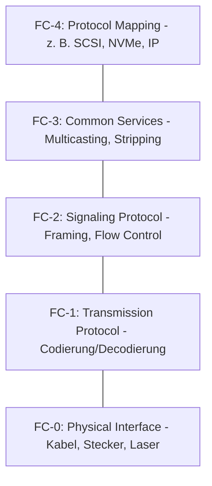

**Fibre Channel** (FC) ist ein spezialisiertes Hochgeschwindigkeits-Netzwerkprotokoll für die Datenübertragung in Rechenzentren. Es dient primär dazu, Server mit externen [Speicherlösungen](speicherloesungen) in einem Storage Area Network (SAN) zu verbinden. FC zeichnet sich durch geringe Verzögerungszeiten (Latenzen) und hohe Zuverlässigkeit aus. Im Gegensatz zu paketorientierten Protokollen ist FC auf den effizienten Transport von Datenblöcken optimiert. Eine hardwarebasierte Flusskontrolle garantiert dabei, dass keine Datenpakete durch Überlastung verloren gehen.

## Lernziele

Nach der Bearbeitung dieses Artikels können folgende Punkte erläutert werden:

- Die grundlegende Funktion und der Einsatzzweck von Fibre Channel.
- Die Struktur des fünfstufigen FC-Referenzmodells.
- Der Unterschied zwischen den Topologien Point-to-Point, Arbitrated Loop und Switched Fabric.
- Die Abgrenzung zum herkömmlichen [Ethernet](ethernet).

## Kontext und Einordnung

In modernen Infrastrukturen müssen große Datenmengen schnell und sicher zwischen Rechenknoten und Speichersystemen – etwa Disk-Arrays oder Tape-Libraries – fließen. Während im lokalen Netzwerk (LAN) meist [Ethernet](ethernet) dominiert, wurde Fibre Channel gezielt für die Anforderungen der Speicherkommunikation entwickelt. Das Protokoll unterstützt Übertragungsraten von bis zu 128 Gbit/s und kann über Glasfaserkabel Distanzen von mehreren Kilometern überbrücken.

## Das FC-Schichtenmodell

Fibre Channel nutzt ein eigenes Referenzmodell, das zwar Ähnlichkeiten zum [OSI-Modell](osi-modell) aufweist, aber speziell auf die Hardware-Effizienz optimiert ist. Es unterteilt sich in fünf Schichten (FC-0 bis FC-4):

- **FC-0 (Physical Interface):** Bestimmt die physikalischen Medien wie Kabeltypen (Glasfaser oder Kupfer), Steckverbindungen und optische Signalparameter.
- **FC-1 (Transmission Protocol):** Regelt die Zeichenkodierung (z. B. 8b/10b oder 64b/66b) und die Fehlererkennung auf Bitebene.
- **FC-2 (Signaling Protocol):** Bildet den kern des Transports. Diese Schicht steuert das _Framing_ (Datenrahmen), die Adressierung der Knoten sowie die Flusskontrolle.
- **FC-3 (Common Services):** Stellt erweiterte Dienste bereit, etwa das Verteilen von Daten über mehrere physische Pfade (_Stripping_) oder die Unterstützung von Multicast-Gruppen.
- **FC-4 (Protocol Mapping):** Dient als Schnittstelle für Oberklassen-Protokolle. Hier wird festgelegt, wie Protokolle wie SCSI oder NVMe in die FC-Rahmen eingebettet werden.

## Topologien

Die Vernetzung erfolgt in unterschiedlichen [Netzwerktopologien](netzwerktopologie):

1.  **Point-to-Point (FC-P2P):** Eine direkte Verbindung zwischen zwei Geräten (z. B. ein Server und ein Speichersystem). Diese Variante bietet maximale Performance für ein einzelnes Paar, ist jedoch nicht skalierbar.
2.  **Arbitrated Loop (FC-AL):** Eine Ringstruktur für bis zu 126 Geräte, die sich die Bandbreite teilen. Ähnlich wie bei Token-Ring-Verfahren muss ein Teilnehmer den Zugriff auf den Ring anfordern. Diese Technik gilt heute als überholt.
3.  **Switched Fabric (FC-SW):** Der aktuelle Standard in Rechenzentren. Alle Komponenten sind mit einem zentralen FC-Switch verbunden. Dies erlaubt dedizierte Bandbreiten für jede Verbindung, hohe Ausfallsicherheit und die logische Trennung von Geräten durch _Zoning_.

## Beispiel: Durchsatzberechnung

Die Effizienz von Fibre Channel hängt maßgeblich von der Kodierung ab. Bei der 8b/10b-Kodierung (FC-1) werden 8 Bit Nutzdaten in einem 10-Bit-Symbol übertragen. Der Rest dient der Signalstabilität und Fehlererkennung.

Die Nutzrate lässt sich wie folgt berechnen:
$$ \text{Nutzrate} = \text{Bruttorate} \cdot \frac{\text{Nutzbits}}{\text{Gesamtbits}} $$

Für eine Verbindung mit 8 Gbit/s ergibt sich:
$$ 8\,\text{Gbit/s} \cdot \frac{8}{10} = 6,4\,\text{Gbit/s} $$

Neuere Standards (ab 16 Gbit/s) nutzen die effizientere 64b/66b-Kodierung, wodurch der Overhead sinkt und die effektive Datenrate steigt.

## Praxishinweise und Fehlerquellen

> **Merke:** In einer Fabric sollten Server und Speicherziele immer über **Zoning** auf dem Switch voneinander isoliert werden. Ohne Zoning versuchen alle Geräte, mit allen anderen zu kommunizieren, was die Stabilität des SAN beeinträchtigen kann.

- **Kupfer vs. Glasfaser:** Trotz des Namens "Fibre" (Faser) ist Glasfaser nicht zwingend vorgeschrieben. Für kurze Distanzen innerhalb eines Racks sind auch Kupferverbindungen spezifiziert, in der Praxis dominieren jedoch optische Systeme.
- **Biegeradien:** Da Fibre Channel meist über Glasfaser realisiert wird, führen zu enge Radien oder Knicke zu Signalverlusten oder Kabelbruch.
- **Verschmutzung:** Staub auf den Endflächen der optischen Stecker ist eine der häufigsten Ursachen für Instabilitäten in FC-Netzwerken.

## Selbsttest

1. Welche FC-Schicht ist für das Framing und die Flusskontrolle zuständig?
2. Warum ist die Topologie _Switched Fabric_ leistungsfähiger als _Arbitrated Loop_?
3. Welches Protokoll wird üblicherweise auf der Schicht FC-4 transportiert?
4. Was ist der wesentliche Vorteil von Fibre Channel gegenüber Ethernet in Speicherumgebungen?
5. Warum ist _Zoning_ in einem SAN-Switch wichtig?
