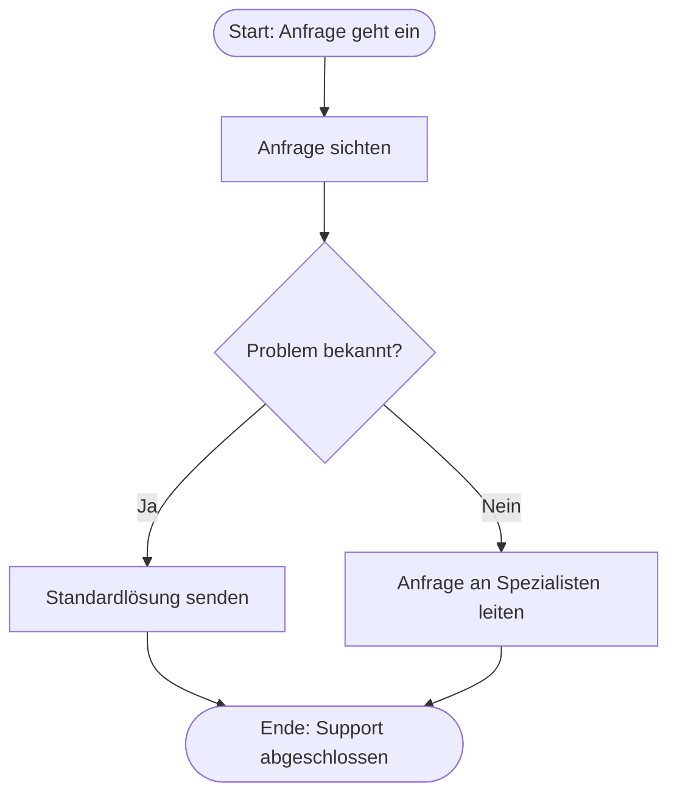

Ein **Flussdiagramm** (auch Flowchart genannt) ist eine grafische Darstellung eines Prozesses, Algorithmus oder Arbeitsablaufs. Es visualisiert Einzelschritte, Entscheidungen und Verzweigungen, um komplexe Abläufe transparent zu dokumentieren, zu planen und zu optimieren. Die Symbolik orientiert sich in Deutschland häufig an der Norm DIN 66001, was eine einheitliche Fachsprache in der Prozessmodellierung ermöglicht.

## Lernziele
Dieser Artikel vermittelt folgende Kompetenzen:

- Verständnis von Funktion und Zweck eines Flussdiagramms.
- Identifikation und Anwendung der Symbole nach DIN 66001.
- Grafische Strukturierung einfacher Prozesse.
- Abgrenzung von Flussdiagrammen zu komplexeren Notationen wie [BPMN](bpmn).

## Symbolik nach DIN 66001
Standardisierte Symbole gewährleisten eine klare Kommunikation über Fachabteilungen hinweg. Jede Form repräsentiert einen spezifischen Typ von Prozessschritt.

### Basiselemente

- **Terminator (Oval):** Markiert den Start- oder Endpunkt eines Prozesses.
- **Prozess (Rechteck):** Stellt einen einzelnen Arbeitsschritt oder eine Aufgabe dar.
- **Entscheidung (Raute):** Kennzeichnet eine Verzweigung mit mindestens zwei Pfaden (z. B. „Ja“/„Nein“).
- **Verbindung (Pfeil):** Definiert die Fließrichtung und verbindet die Elemente.

### Daten und Dokumente

- **Eingabe/Ausgabe (Parallelogramm):** Repräsentiert Datentransfer ohne spezifisches Medium.
- **Dokument (Rechteck mit Wellenlinie):** Weist auf physische oder digitale Dokumente hin, die im Prozess entstehen oder benötigt werden.
- **Datenbank (Zylinder):** Symbolisiert eine dauerhafte Datenspeicherung.

### Erweiterte Symbole

- **Unterprogramm (Rechteck mit doppelten Seitenlinien):** Verweist auf einen extern definierten Teilprozess.
- **Anmerkung (Offenes Rechteck mit gestrichelter Linie):** Bietet Platz für ergänzende Erläuterungen, ohne den Fluss zu unterbrechen.

## Vorgehen bei der Erstellung
Eine strukturierte Modellierung erhöht die Lesbarkeit und Logik des Diagramms:

1. **Grenzen definieren:** Start- und Endpunkte des Prozesses festlegen.
2. **Schritte identifizieren:** Alle beteiligten Tätigkeiten und Entscheidungen auflisten.
3. **Anordnung:** Den Prozessfluss bevorzugt von oben nach unten (Top-Down) oder von links nach rechts gestalten.
4. **Verknüpfung:** Elemente mit Pfeilen verbinden und Entscheidungsrauten eindeutig beschriften.
5. **Prüfung:** Den Ablauf auf Sackgassen oder logische Inkonsistenzen kontrollieren.

## Vergleich und Abgrenzung
Das Flussdiagramm eignet sich besonders für lineare Abläufe und Algorithmen, wie sie auch im [Programmablaufplan](programmablaufplan) vorkommen. Für komplexe Geschäftsprozesse mit vielen Beteiligten bieten sich Notationen wie [BPMN](bpmn) an, die Zuständigkeiten über Swimlanes abbilden. Im Gegensatz zum [Struktogramm](struktogramm) erlaubt das Flussdiagramm durch Pfeile eine freiere, aber auch potenziell unübersichterliche Gestaltung.

## Vor- und Nachteile
| Vorteile | Nachteile |
| :--- | :--- |
| Intuitive Verständlichkeit ohne Spezialwissen | Eingeschränkte Darstellung paralleler Prozesse |
| Schnelle Erstellung und hohe Flexibilität | Unübersichtlich bei sehr langen oder tief verzweigten Abläufen |
| Universell einsetzbar für Technik und Business | Keine native Logik für komplexe Material- oder Informationsflüsse |

## Beispiel: Support-Prozess
Eine Kundenanfrage kann wie folgt visualisiert werden:

## Häufige Fehler und Best Practices

- **Überladene Details:** Nur wesentliche Schritte abbilden. Ein zu hoher Detailgrad erschwert das schnelle Erfassen des Prozesses.
- **Fehlende Pfeilspitzen:** Die Fließrichtung muss immer eindeutig erkennbar sein, um Fehlinterpretationen zu vermeiden.
- **Vage Ausgänge:** Beschriftungen an Entscheidungen (z. B. „OK“, „Fehler“, „Wahr“) sind zwingend erforderlich.

## Selbsttest

1. Welches Symbol repräsentiert einen permanenten Datenspeicher?
2. Warum ist die eindeutige Beschriftung der Ausgänge an einer Entscheidungsraute notwendig?
3. Welche Leserichtung wird für Flussdiagramme standardmäßig empfohlen?
4. In welchem Fall ist die Verwendung von [BPMN](bpmn) vorteilhafter als ein einfaches Flussdiagramm?
