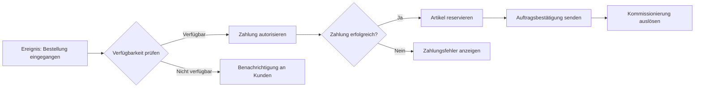

Ein **Geschäftsprozess** ist eine zielgerichtete Folge von betrieblichen Aktivitäten, die Inputs durch den Einsatz materieller und immaterieller Ressourcen in Outputs transformiert und dadurch Kundennutzen schafft. Geschäftsprozesse werden durch definierte Ereignisse ausgelöst und tragen direkt oder indirekt zur Erreichung der Unternehmensziele bei. Sie können auf verschiedenen Aggregationsebenen betrachtet werden – von der Gesamtunternehmensebene bis hin zu einzelnen Funktionalbereichen.

## Lernziele

Dieser Artikel vermittelt Kenntnisse zu:

- einem Geschäftsprozess definieren und seine wesentlichen Merkmale benennen
- zwischen Kernprozessen, unterstützenden Prozessen und Managementprozessen unterscheiden
- den prozessorientierten Ansatz und seine Bedeutung für Organisationen erklären
- Risiken bei Prozessänderungen nach Wahrscheinlichkeit und Auswirkung kategorisieren
- grundlegende Modellierungssprachen für Geschäftsprozesse zuordnen

## Kurzüberblick

Ein Geschäftsprozess umfasst den Ablauf betrieblicher Funktionen, der zu einem vom Unternehmen gewünschten Ergebnis führt – beispielsweise in Form von Umsatz oder erbrachter Dienstleistung. Kern jedes Geschäftsprozesses ist die Input-Output-Transformation: Der Prozess erhält Eingaben von vorgelagerten Prozessen, verarbeitet diese mit Hilfe von Ressourcen und liefert Ergebnisse an nachgelagerte Prozesse oder Kunden. Diese Transformation ist ereignisgesteuert: Ein auslösendes Ereignis startet den Prozess, das Ergebnis geht an einen Empfänger.

Zur strukturierten Erfassung und Kommunikation von Geschäftsprozessen werden standardisierte Modellierungssprachen wie [BPMN](bpmn) (Business Process Model and Notation) oder [eEPK](eepk) (erweiterte Ereignisgesteuerte Prozesskette) eingesetzt. Diese Notationen ermöglichen eine einheitliche Darstellung über Organisationsgrenzen hinweg.

## Kontext und Einordnung

Geschäftsprozesse stehen im Zentrum der [Ablauforganisation](ablauforganisation) und bilden die operative Basis des prozessorientierten Ansatzes. Im Gegensatz zur klassischen Aufbauorganisation, die Hierarchien und Zuständigkeiten beschreibt, fokussiert die Ablauforganisation auf die sequenzielle Abfolge von Tätigkeiten zur Wertschöpfung. Moderne Qualitätsmanagement-Standards wie ISO 9001:2015 fordern ausdrücklich einen prozessorientierten Ansatz, bei dem Organisationen ihre Aktivitäten als miteinander verknüpfte Prozesse betrachten und steuern.

Prozesse sind prinzipiell wiederkehrend – im Unterschied zu Projekten, die zeitlich begrenzt und einmalig sind. Diese Unterscheidung ist in der Praxis wichtig, da sie Auswirkungen auf Planung, Steuerung und Dokumentation hat.

## Begriffe und Definitionen

### Geschäftsprozess

Ein Geschäftsprozess ist eine Folge von Wertschöpfungsaktivitäten mit einem oder mehreren Inputs und einem Kundennutzen stiftenden Output. Alternativ wird er als Abfolge von Einzelaktivitäten definiert, mit denen festgelegte Geschäftsziele erreicht werden.

**Wesentliche Merkmale:**

- **Wertschöpfungsorientierung**: Schafft Nutzen für Kunden (intern oder extern)
- **Input-Output-Transformation**: Erhält Eingaben, liefert Ergebnisse
- **Zielausrichtung**: Dient der Erreichung konkreter Geschäftsziele
- **Ereignissteuerung**: Wird durch ein definiertes Startereignis ausgelöst

Synonyme und englische Bezeichnungen sind *Business Process* oder kurz *Prozess*. Ein Geschäftsprozess kann in Teilprozesse unterteilt werden; mehrere Geschäftsprozesse können zu einer Prozesskette zusammengefasst werden.

### Prozessorientierter Ansatz

Der prozessorientierte Ansatz ist eine Methode im Qualitätsmanagement, bei der Organisationen ihre Aktivitäten als Prozesse betrachten und systematisch steuern. ISO 9001:2015 betont diesen Ansatz und ergänzt ihn durch risikobasiertes Denken.

**Kernprinzipien:**

- Identifikation relevanter Prozesse, ihrer Abfolgen und Wechselwirkungen
- Fokus auf Input-Output-Transformation
- Kontinuierliche Verbesserung der Prozesse
- Berücksichtigung von Risiken und Chancen in allen Prozessen

## Prozessarten

In der Praxis haben sich drei Hauptkategorien von Geschäftsprozessen etabliert:

### Kernprozesse

Kernprozesse tragen direkt zum Erreichen der Geschäftsziele bei. Sie können strategischer oder operativer Natur sein und bilden in der Regel die Wertschöpfungskette des Unternehmens ab. Typische Beispiele sind Beschaffung, Produktion, Vertrieb und Kundenservice. Kernprozesse sind oft der Fokus von Optimierungsbemühungen, da hier direkter Einfluss auf den Geschäftserfolg besteht.

### Unterstützende Prozesse

Unterstützende Prozesse sind für den Ablauf der Kernprozesse essenziell, tragen aber nur mittelbar zur Erreichung der Geschäftsziele bei. Beispiele sind IT-Administration, Personalmanagement, Facility Management oder Rechnungswesen. Obwohl sie "nur" unterstützen, können unterstützende Prozesse hochkritisch sein, wenn mehrere Kernprozesse von ihnen abhängen. Ein Ausfall der IT-Infrastruktur kann beispielsweise alle Kernprozesse lahmlegen.

### Managementprozesse

Managementprozesse steuern und lenken die Organisation. Sie umfassen Planung, Steuerung, Controlling und strategische Entscheidungsprozesse. Diese Kategorie wird in der Praxis häufig ergänzend zu Kern- und Unterstützungsprozessen unterschieden, ist aber nicht zwingend durch ISO 9001:2015 gefordert.

## Risikobewertung bei Prozessänderungen

Änderungen an Geschäftsprozessen bergen Risiken, die systematisch bewertet werden müssen. Ein strukturiertes Vorgehen unterscheidet drei Dimensionen.

### Wahrscheinlichkeit des Eintretens

Die Wahrscheinlichkeit des Eintretens eines Risikos bei Prozessänderungen wird qualitativ oder quantitativ eingeschätzt. Methoden zur Ermittlung umfassen:

- Historische Datenanalyse aus ähnlichen Änderungen
- Befragung von Prozessverantwortlichen und Experten
- Strukturierte Risikoanalysen und Szenariobetrachtungen

Die Einschätzung erfolgt typischerweise auf einer Skala von "sehr gering" bis "sehr hoch".

### Auswirkungen auf das Unternehmen

Die potenziellen Konsequenzen eines eintretenden Risikos werden nach Art und Schwere bewertet. Mögliche Auswirkungen sind:

- **Finanzielle Verluste**: Direkte Kosten durch Fehlplanung, Rework oder verlorene Umsätze
- **Reputationsschäden**: Verlust von Kundenvertrauen oder negative öffentliche Wahrnehmung
- **Rechtliche Konsequenzen**: Vertragsstrafen, Regressforderungen oder Compliance-Verstöße
- **Störungen im operativen Geschäft**: Unterbrechungen von Lieferketten oder Service-Level-Verletzungen

Auch hier ist eine skalierte Bewertung (z. B. "vernachlässigbar" bis "katastrophal") üblich.

### Risikominderung und Kontrollmechanismen

Bestehende Maßnahmen zur Risikominderung werden auf ihre Wirksamkeit hin analysiert. Wichtige Aspekte sind:

- Vorhandene Kontrollen und Strategien im aktuellen Prozess
- Effektivität der Risikominderungsmaßnahmen aus der Vergangenheit
- Anpassungsbedarf der bestehenden Prozesse im Hinblick auf die geplante Änderung

Das Ziel ist eine transparente Risikoentscheidung: Risiken werden entweder akzeptiert, vermieden oder durch gezielte Maßnahmen auf ein akzeptables Niveau reduziert.

## Vorgehen bei Prozessmodellierung

Die Modellierung von Geschäftsprozessen folgt in der Praxis einem strukturierten Vorgehen.

### 1. Prozessidentifikation

Zunächst werden die relevanten Geschäftsprozesse identifiziert und abgegrenzt. Als Faustregel gilt ein Detaillierungsgrad von 5 bis 15 Prozessen pro Organisationseinheit. Zu feine Aufteilungen führen zu unnötiger Komplexität, zu grobe Prozesse bleiben zu abstrakt für praktische Zwecke.

### 2. Prozessbeschreibung

Jeder Prozess wird grundlegend beschrieben:

- Prozessziel und Beitrag zu den Unternehmenszielen
- Input (Ressourcen, Informationen, Vorprodukte)
- Output (Produkte, Dienstleistungen, Ergebnisse)
- Prozessverantwortliche und beteiligte Rollen
- Kunden (intern oder extern)

### 3. Prozessmodellierung

Die Ablaufstruktur wird in einer geeigneten Notation visualisiert. [BPMN](bpmn) hat sich als Quasi-Standard etabliert, während [eEPK](eepk) in deutschsprachigen Unternehmen weiterhin verbreitet ist. Die Modellierung sollte:

- Ereignisse (Start, Ende, Zwischenereignisse) klar kennzeichnen
- Aktivitäten in logischer Reihenfolge darstellen
- Entscheidungen und Verzweigungen explizit abbilden
- Rollen und Verantwortlichkeiten zuordnen

### 4. Validierung und Freigabe

Das Prozessmodell wird von Prozessverantwortlichen und Beteiligten auf Richtigkeit und Vollständigkeit geprüft. Erst nach erfolgreicher Validierung wird das Modell für die Nutzung freigegeben.

## Beispiele

### Beispiel 1: Bestellprozess im E-Commerce

Ein Kunde platziert eine Bestellung im Online-Shop (Ereignis: "Bestellung eingegangen").

**Input:**

- Kundendaten
- Bestellte Artikel und Mengen
- Zahlungsinformationen

**Transformation:**

1. Prüfung der Verfügbarkeit (Lagerbestand)
2. Autorisierung der Zahlung
3. Reservierung der Artikel
4. Erstellung der Lieferung

**Output:**

- Auftragsbestätigung an Kunden
- Kommissionierungsauftrag an Lager
- Lieferschein

**Risiken bei Änderungen:**

- Wahrscheinlichkeit: Mittelmäßig (z. B. bei Integration neuer Zahlungsanbieter)
- Auswirkung: Hoch (Ausfall betrifft Umsatz und Kundenzufriedenheit)
- Minderung: Ausführliche Tests, schrittweise Rollout-Planung, Rückfalloptionen

### Beispiel 2: Mitarbeiter-Onboarding als unterstützender Prozess

Ein neuer Mitarbeiter tritt ein (Ereignis: "Arbeitsvertrag unterzeichnet").

**Input:**

- Personalstammdaten
- Vertragsunterlagen
- Benötigte Arbeitsmittel (Notebook, Ausweise)

**Transformation:**

1. Anlegen von Benutzerkonten (IT, E-Mail, ERP)
2. Bereitstellung von Arbeitsplatz und Equipment
3. Einführung in Arbeitsabläufe und Systeme
4. Einweisung in relevante Sicherheitsrichtlinien

**Output:**

- Vollständig eingerichteter Arbeitsplatz
- Zugriffsrechte auf erforderliche Systeme
- Dokumentierte Schulungsbestätigung

**Risiken bei Änderungen:**

- Wahrscheinlichkeit: Gering bis mittelmäßig
- Auswirkung: Mittel (Verzögerungen bei Mitarbeiterproduktivität, rechtliche Risiken bei Datenschutz)
- Minderung: Checklisten, Standardprozesse, Eskalationspfade bei Problemen

## Häufige Fehler und Tipps

### Typische Fehler

- **Prozess und Projekt verwechseln**: Projekte sind einmalig, Prozesse wiederkehrend. Die Verwechslung führt zu falschen Steuerungsansätzen.
- **Zu feine Aufteilung**: Prozesse werden zu detailliert modelliert, was die Übersichtlichkeit und Wartbarkeit erschwert.
- **Fehlende Klärung von Verantwortlichkeiten**: Unklarheit, wer für einen Prozess zuständig ist, führt zu Verzögerungen und Qualitätsproblemen.
- **Unterschätzung unterstützender Prozesse**: Nicht-Kernprozesse werden als "nachrangig" betrachtet, obwohl ihr Ausfall kritische Auswirkungen haben kann.
- **Einseitige Fokus auf Optimierung**: Prozessverbesserungen ohne Einbeziehung der Betroffenen stoßen auf Widerstand und werden nicht nachhaltig umgesetzt.

### Praktische Tipps

- Bei Prozessmodellierung auf einen angemessenen Detaillierungsgrad achten (Faustregel: 5–15 Prozesse pro Organisationseinheit).
- Prozessverantwortliche frühzeitig einbinden – ihre Akzeptanz ist entscheidend für die spätere Nutzung.
- Unterstützende Prozesse systematisch identifizieren und deren Kritikalität bewerten.
- Risiken proaktiv betrachten: Welche Auswirkungen haben Prozessänderungen auf Abhängigkeiten?
- Nicht für jeden Prozess eine eigene Modellierungssprache wählen – Konsistenz erleichtert die Kommunikation.

## Selbsttest

1. Was unterscheidet einen Geschäftsprozess von einem Projekt?
2. Nenne drei wesentliche Merkmale eines Geschäftsprozesses.
3. Wie unterscheiden sich Kernprozesse von unterstützenden Prozessen?
4. Welche Dimensionen werden bei der Risikobewertung von Prozessänderungen betrachtet?
5. Nenne zwei gängige Modellierungssprachen für Geschäftsprozesse.
6. Warum ist die Unterscheidung zwischen Aufbauorganisation und Ablauforganisation relevant?