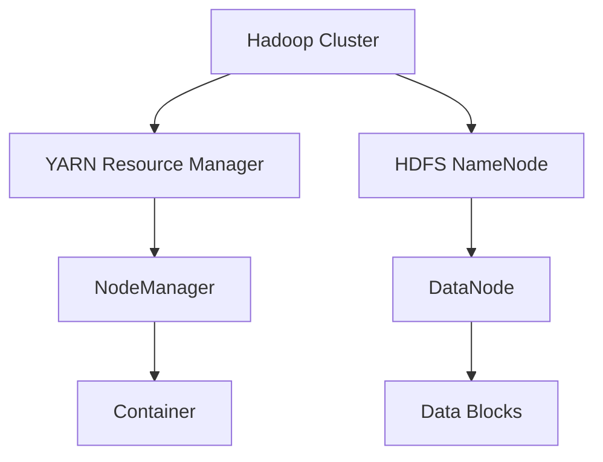

**Apache Hadoop** ist ein Framework der Apache Software Foundation für die verteilte Speicherung und Verarbeitung großer Datenmengen ([Big Data](big-data)) auf [Computerclustern](clustering). Das System bietet eine hohe Fehlertoleranz und Skalierbarkeit, indem es Daten redundant auf kostengünstiger Standard-Hardware (_Commodity Hardware_) verwaltet. Anstatt einen einzelnen Hochleistungsrechner zu nutzen, verteilt Hadoop die Last auf eine Vielzahl gewöhnlicher Rechner.

## Kernkonzepte

Der Einsatz von Hadoop umfasst folgende Schwerpunkte:

- Aufgaben der vier Kernmodule.
- Prinzipien der Datenverteilung und Replikation im HDFS.
- Rollenverteilung zwischen Master- und Worker-Knoten (NameNode/DataNode).
- Abgrenzung der Batch-Verarbeitung zu In-Memory-Verfahren.

## Architektur: Die vier Säulen

Hadoop besteht aus vier zentralen Modulen, die koordiniert zusammenarbeiten.

### Hadoop Distributed File System (HDFS)

Das HDFS bildet die Speicherschicht. Es zerlegt Dateien in Blöcke (standardmäßig 128 MB) und verteilt diese über den Cluster. Um die Verfügbarkeit sicherzustellen, wird jeder Block mehrfach repliziert. Der benötigte Gesamtspeicher ergibt sich aus der Datengröße und dem Replikationsfaktor:

$$ \text{Gesamtspeicher} = \text{Datengröße} \times \text{Replikationsfaktor} $$

### Yet Another Resource Negotiator (YARN)

YARN übernimmt das Ressourcenmanagement innerhalb des Clusters. Es verwaltet Kapazitäten wie CPU und Arbeitsspeicher (RAM) und weist diese den laufenden Anwendungen und Verarbeitungsaufgaben zu.

### Hadoop MapReduce

MapReduce ist das Programmiermodell für die parallele Verarbeitung großer Datenmengen.

- **Map-Phase:** Eingangsdaten werden gefiltert, transformiert und sortiert.
- **Reduce-Phase:** Die Zwischenergebnisse werden aggregiert und zu einem Endergebnis zusammengefasst.

### Hadoop Common

Dieses Modul enthält Bibliotheken und Dienstprogramme, welche die Kommunikation zwischen den Modulen ermöglichen und grundlegende Funktionen für den Clusterbetrieb bereitstellen.

## Funktionsweise eines Clusters

Ein Hadoop-Cluster nutzt spezialisierte Rollen für die beteiligten Knoten, um Ausfallsicherheit und Effizienz zu gewährleisten.

Die Ressourcenverwaltung (YARN) und die Datenspeicherung (HDFS) arbeiten parallel. Der **NameNode** verwaltet die Metadaten und kennt die Positionen aller Datenblöcke. Die **DataNodes** speichern die eigentlichen Daten. Bei einem Hardware-Ausfall erkennt der NameNode den Verlust und stößt die Wiederherstellung der betroffenen Blöcke auf anderen Knoten an.

## Vergleich mit Apache Spark

Hadoop MapReduce und Apache Spark werden oft kombiniert, verfolgen jedoch unterschiedliche Ansätze in der Datenverarbeitung.

| Merkmal              | Hadoop (MapReduce)                         | Apache Spark                             |
| :------------------- | :----------------------------------------- | :--------------------------------------- |
| **Verarbeitungsart** | Festplattenbasierte Batch-Verarbeitung     | In-Memory-Verarbeitung                   |
| **Geschwindigkeit**  | Moderat (häufige Schreibvorgänge auf Disk) | Sehr hoch (Nutzung des Arbeitsspeichers) |
| **Kosten**           | Gering (Standard-Festplatten)              | Höher (großer RAM-Bedarf)                |
| **Latenz**           | Hoch (nicht echtzeitfähig)                 | Niedrig (geeignet für Stream-Processing) |

## Praxisrelevante Aspekte

- **Einsatzbereich:** Hadoop ist kein Ersatz für ein relationales Datenbanksystem (RDBMS) für Transaktionen. Es ist für die [Analyse](datenanalyse) großer Datenmengen nach dem Prinzip _Write Once, Read Many_ optimiert.
- **Dateigrößen:** Das HDFS ist nicht für eine sehr große Anzahl kleiner Dateien ausgelegt. Da der NameNode alle Metadaten im RAM hält, kann eine hohe Anzahl an Dateien den Speicher des Master-Knotens überlasten.
- **Data Locality:** Um Netzwerkengpässe zu vermeiden, führt Hadoop Berechnungen bevorzugt dort aus, wo die Daten physisch gespeichert sind.

## Selbsttest

1. Welchen Vorteil bietet die Nutzung von Standard-Hardware im Hadoop-Cluster?
2. Welche Aufgabe übernimmt der NameNode im HDFS?
3. Wie reagiert das System auf den Ausfall eines DataNode?
4. In welchen Szenarien ist In-Memory-Verarbeitung (Spark) der festplattenbasierten Verarbeitung überlegen?
5. Warum stellt eine hohe Anzahl sehr kleiner Dateien ein Problem für die Architektur dar?
