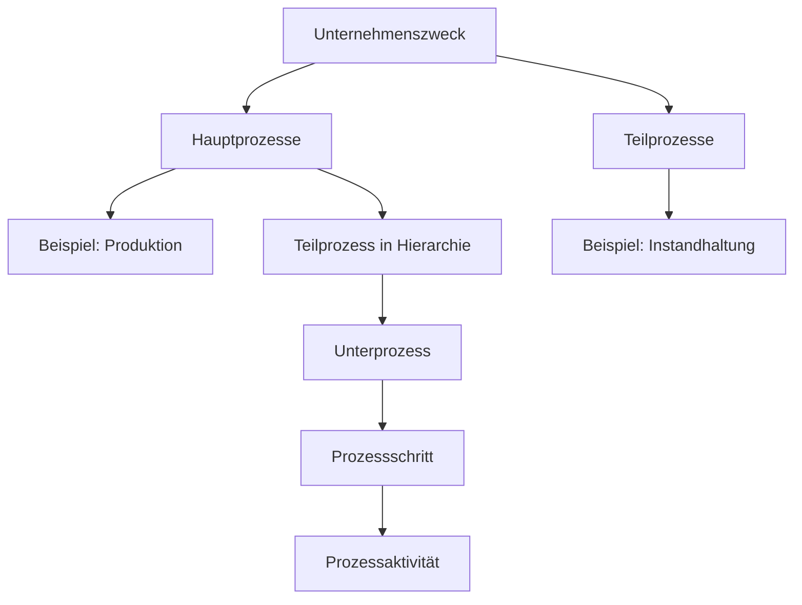

**Haupt- und Teilprozesse** bilden Grundlagen der Unternehmensorganisation und des Prozessmanagements. Hauptprozesse enthalten die wertschöpfenden Kernaktivitäten, die unmittelbar zur Kundenzufriedenheit und zum Geschäftserfolg führen. Teilprozesse übernehmen unterstützende Aufgaben, die den Ablauf der Kernprozesse gewährleisten. Gemeinsam tragen sie zur Verwirklichung des Unternehmenszwecks bei und ermöglichen eine effiziente Organisation.

## Lernziele

Dieser Artikel vermittelt Kenntnisse zu:

- Dem Unterschied zwischen Haupt- und Teilprozessen und deren Abgrenzung von der Prozesshierarchie.
- Der Rolle von Prozessen für den Unternehmenszweck und die [Wertschöpfungskette](wertschoepfungskette).
- Typischen Beispielen für Haupt- und Teilprozesse in Unternehmen.
- Der Zuordnung des prozessorientierten Ansatzes nach ISO 9001:2015 mit Management-, Kern- und Unterstützungsprozessen.
- Der Skizzierung einer Prozesshierarchie mit vier bis fünf Ebenen.

## Kurzueberblick

Hauptprozesse, oft als Kernprozesse bezeichnet, sind die wertschöpfenden Aktivitäten eines Unternehmens. Sie tragen direkt zur Kundenzufriedenheit und zum Geschäftserfolg bei und reichen typischerweise von der Kundenanfrage bis zur Lieferung. Teilprozesse, auch Unterstützungsprozesse genannt, sichern die Funktionsfähigkeit der Hauptprozesse und wirken nur indirekt an der Wertschöpfung mit. Sie decken interne Bereiche wie Wartung oder Personalwesen ab.

Die Prozesshierarchie ordnet diese Prozesse vertikal: von Hauptprozessen über Teilprozesse bis hin zu Unterprozessen, Prozessschritten und Aktivitäten. Gewöhnlich sind vier bis fünf Ebenen erforderlich. Der Unternehmenszweck legt den Gründungsgrund fest und bestimmt die Hauptprozesse. ISO 9001:2015 verlangt einen prozessorientierten Ansatz mit Management-, Kern- und Unterstützungsprozessen, um Risiken zu mindern und stetige Verbesserungen zu fördern.

## Kontext und Einordnung

Prozesse sind das Fundament moderner Unternehmen und erlauben die systematische Ordnung von Abläufen. Sie fallen in den Bereich des Prozessmanagements, das Planung, Durchführung und Optimierung von Geschäftsprozessen umfasst. Haupt- und Teilprozesse gehören zur Prozesslandschaft, die alle Abläufe eines Unternehmens horizontal abbildet. Sie verbinden sich eng mit der [Wertschöpfungskette](wertschoepfungskette), die die Sequenz von Aktivitäten darstellt, die Produkte oder Dienstleistungen vom Rohstoff zum Kunden führen.

Der prozessorientierte Ansatz gemäß ISO 9001:2015 unterscheidet üblicherweise Managementprozesse (wie Strategie und Budgetierung), Kernprozesse (Hauptprozesse) und Unterstützungsprozesse (Teilprozesse). Dies fördert risikobasiertes Denken und kontinuierliche Verbesserung durch den PDCA-Zyklus (Plan-Do-Check-Act). Führungsprozesse, die nicht unmittelbar zu Haupt- oder Teilprozessen zählen, lenken die Organisation strategisch.

## Begriffe und Definitionen

### Hauptprozesse

Hauptprozesse sind die zentralen, wertschöpfenden Prozesse eines Unternehmens. Sie schaffen direkten Kundennutzen und bilden den Kern des Geschäftserfolgs. Sie decken die Hauptaktivitäten ab, durch die das Unternehmen Einnahmen erzielt. Synonyme umfassen Kernprozesse, Wertschöpfungsprozesse oder Ausführungsprozesse. Im Englischen lauten sie Core processes oder Value-adding processes.

### Teilprozesse

Teilprozesse sind unterstützende Prozesse, die für die Leistungsfähigkeit der Hauptprozesse wesentlich sind. Sie tragen indirekt zur Wertschöpfung bei und unterstützen den reibungslosen Ablauf der Kernaktivitäten. Synonyme sind Unterstützungsprozesse oder Support-Prozesse. Im Englischen heißen sie Support processes oder Sub-processes (abhängig von der Hierarchiestufe).

### Prozesshierarchie

Die Prozesshierarchie verwendet die Relation "ist Teil von", um Geschäftsprozesse von der obersten Ebene (etwa Hauptprozesse) bis zur Ebene der Prozessaktivitäten zu strukturieren. Übliche Bezeichnungen für Elemente auf verschiedenen Ebenen sind Hauptprozess, Teilprozess, Unterprozess oder Subprozess. In der Regel sind vier bis fünf Ebenen nötig.

### Unternehmenszweck

Der Unternehmenszweck beschreibt den Grund für die Unternehmensgründung und den Beitrag zur Gesellschaft oder Wirtschaft. Er dient als Basis für strategische Entscheidungen und verknüpft sich eng mit den Hauptprozessen, die diesen Zweck erfüllen. Synonyme sind Unternehmensziel, Mission Statement oder Kerngeschäft.

## Vorgehen

Die Identifikation und Ordnung von Haupt- und Teilprozessen in einem Unternehmen erfolgt in folgenden Schritten:

1. Der Unternehmenszweck wird basierend auf Vision und Mission bestimmt.
2. Die Hauptprozesse werden abgeleitet, die direkt zur Zweckerfüllung beitragen und Umsatz erzeugen.
3. Die Teilprozesse werden ermittelt, die die Hauptprozesse unterstützen, ohne selbst wertschöpfend zu sein.
4. Die Prozesse werden in eine Hierarchie geordnet: Ebene 1 (Hauptprozesse), Ebene 2 (Teilprozesse), Ebene 3 (Unterprozesse), Ebene 4 (Prozessschritte), Ebene 5 (Aktivitäten).
5. Der prozessorientierte Ansatz nach ISO 9001:2015 wird angewendet: Prozesse werden geplant, ausgeführt, die Leistung gemessen, Risiken bewertet und fortlaufend verbessert.

## Beispiele

### Hauptprozesse

Bei einem Automobilhersteller zählen die Entwicklung neuer Modelle, die Fahrzeugproduktion und der Vertrieb zu den Hauptprozessen. Der Unternehmenszweck liegt in der Bereitstellung von Mobilitätslösungen. Die Produktion startet mit einer Kundenbestellung und endet mit der Auslieferung.

### Teilprozesse

Im gleichen Unternehmen stützen Teilprozesse wie die Wartung der Produktionsanlagen, das Personalmanagement für die Gewinnung von Fachkräften und der IT-Support für die Produktionssoftware die Hauptprozesse. Ohne sie wäre eine effiziente Produktion nicht möglich.

### Prozesshierarchie

Für die Produktion als Hauptprozess:

- Ebene 1: Produktion
- Ebene 2: Fertigung (Teilprozess)
- Ebene 3: Montage (Unterprozess)
- Ebene 4: Bauteil montieren (Prozessschritt)
- Ebene 5: Schrauben einsetzen (Prozessaktivität)

## Häufige Fehler und Tipps

- Verwechslung vermeiden: Teilprozesse sind nicht stets Unterprozesse in der Hierarchie; der Begriff kann horizontale Typen (Unterstützungsprozesse) oder vertikale Ebenen bezeichnen. Eine Prüfung des Kontexts vermeidet Missverständnisse.
- Überbetonung von Hauptprozessen: Teilprozesse sind unverzichtbar für den Erfolg; ihre Vernachlässigung führt zu Stagnation der Hauptprozesse.
- Unvollständige Hierarchie: Die Nutzung von mindestens vier Ebenen bewahrt Details; zu flache Strukturen führen zu unpräziser Planung.
- Fehlende ISO-9001-Ausrichtung: Die frühzeitige Integration risikobasierten Denkens verhindert Prozessfehler.
- Eine Prozesslandkarte ermöglicht die visuelle Ordnung von Prozessen und die Erkennung von Schnittstellen.

## Selbsttest

1. Was ist der Hauptunterschied zwischen Haupt- und Teilprozessen?
2. Drei Beispiele für Hauptprozesse und drei für Teilprozesse lauten.
3. Wie viele Ebenen hat eine typische Prozesshierarchie?
4. Wie leitet sich der Unternehmenszweck zu den Hauptprozessen ab?
5. Welche drei Prozessarten unterscheidet ISO 9001:2015 typischerweise?
6. Warum sind Teilprozesse wichtig, obwohl sie nicht direkt wertschöpfend sind?

## Weiterführendes

Weitere Informationen finden sich in Artikeln zu [Prozessmanagement](prozessmanagement) und [ISO 9001](iso-9001). Für praktische Anwendung eignen sich Schulungen zum PDCA-Zyklus.
