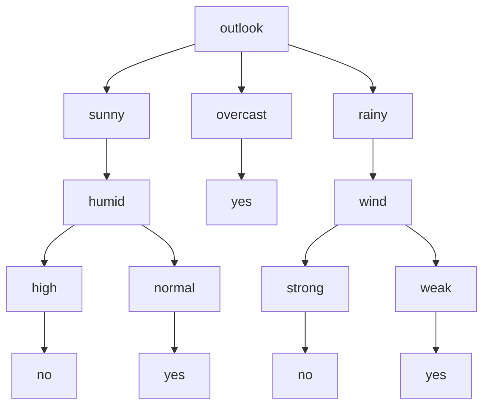

Der **ID3-Algorithmus**, kurz für Iterative Dichotomiser 3, ist ein Verfahren zur Konstruktion von Entscheidungsbäumen in der Datenanalyse. Er wählt iterativ Attribute mit dem höchsten Informationsgewinn aus, um Daten zu klassifizieren.

## Kurzüberblick

Der ID3-Algorithmus wurde 1986 von Ross Quinlan entwickelt und stellt einen der ersten Algorithmen zur automatischen Erzeugung von Entscheidungsbäumen dar. Sein Ziel ist die Klassifikation von Daten durch schrittweise Aufteilung in homogene Gruppen nach Merkmalen. Dabei verwendet er das Konzept der Entropie, um den besten Entscheidungsknoten zu bestimmen. Der Algorithmus findet Anwendung in der [Datenanalyse](datenanalyse) für interpretierbare Modelle und eignet sich besonders für Datensätze mit diskreten Attributen.

## Kontext und Einordnung

Entscheidungsbäume sind hierarchische Strukturen, die Entscheidungsregeln abbilden. Der ID3-Algorithmus gehört zur Familie der gierigen Algorithmen und baut Bäume von oben nach unten auf. Anders als spätere Varianten wie C4.5 oder CART normalisiert er den Informationsgewinn nicht und kann kontinuierliche Attribute nicht direkt verarbeiten. Seine Bedeutung liegt in der Einfachheit und als Grundlage für modernere Algorithmen, die Overfitting durch Pruning und andere Techniken beheben.

## Begriffe und Definitionen

- **Entropie**: Ein Maß für die Unreinheit oder Unsicherheit in einer Menge von Trainingsbeispielen. Sie ist maximal, wenn die Klassen gleichverteilt sind, und minimal (0), wenn alle Beispiele derselben Klasse angehören. Die Formel lautet:

$$ H(S) = -\sum\_{c \in C} p(c) \log_2 p(c) $$

wobei S die Menge der Beispiele, C die Klassen und p(c) die Wahrscheinlichkeit der Klasse c ist.

- **Informationsgewinn**: Die Differenz zwischen der Entropie vor und nach einer Aufteilung anhand eines Merkmals. Er quantifiziert die Reduktion der Unsicherheit. Die Formel ist:

$$ \text{Gain}(S, A) = H(S) - \sum\_{v \in \text{Values}(A)} \frac{|S_v|}{|S|} H(S_v) $$

wobei A das Attribut, S_v die Teilmenge für Wert v und |S| die Größe der Menge ist.

- **Blattknoten**: Terminale Knoten in einem Entscheidungsbaum, die eine finale Klassifikation enthalten. Der Baum besteht aus einem Wurzelknoten, internen Entscheidungsknoten und Zweigen zu den Blattknoten.

## Vorgehen

Der Algorithmus arbeitet rekursiv mit folgenden Schritten:

1. Wenn die Menge S leer ist, erstelle einen Blattknoten mit einem Standardwert (z. B. der Mehrheitsklasse aus dem übergeordneten Knoten).
2. Wenn alle Beispiele in S derselben Klasse angehören, erstelle einen Blattknoten mit dieser Klasse.
3. Wenn keine Attribute mehr verfügbar sind, erstelle einen Blattknoten mit der Mehrheitsklasse in S.
4. Andernfalls wähle das Attribut A mit dem höchsten Informationsgewinn.
5. Teile S anhand der Werte von A in Teilmengen auf.
6. Erstelle einen Entscheidungsknoten für A und rufe den Algorithmus rekursiv für jede Teilmenge auf.

Der Prozess terminiert, wenn alle Blattknoten Klassifikationen zugewiesen haben.

## Beispiele

Ein klassisches Beispiel ist der Play-Tennis-Datensatz, der vorhersagt, ob ein Tennisspiel stattfindet, basierend auf Attributen wie Wetter (outlook), Temperatur (temp), Luftfeuchtigkeit (humid), Wind und Tag. Die Entropie der Gesamtmenge mit 9 Ja- und 5 Nein-Fällen beträgt:

$$ H(S) = -\left( \frac{9}{14} \log_2 \frac{9}{14} + \frac{5}{14} \log_2 \frac{5}{14} \right) \approx 0.940 $$

Für das Attribut outlook (sunny: 2 Ja/3 Nein, overcast: 4 Ja/0 Nein, rainy: 3 Ja/2 Nein) ergibt sich der Informationsgewinn als etwa 0.247, was höher als bei anderen Attributen ist. Der resultierende Entscheidungsbaum verwendet outlook als Wurzel.

## Häufige Fehler und Tipps

- **Overfitting**: ID3 kann zu tiefen Bäumen führen, die Trainingsdaten perfekt lernen, aber auf neuen Daten schlecht generalisieren. Abhilfe: Pruning, also das Beschneiden von Ästen nach dem Bau des Baumes.
- **Many-valued Bias**: Attribute mit vielen Ausprägungen erhalten tendenziell höheren Informationsgewinn, was zu verzerrten Bäumen führt. In C4.5 wird dies durch Normalisierung behoben.
- **Nur diskrete Attribute**: Kontinuierliche Werte müssen vorab diskretisiert werden, was zu Informationsverlust führen kann.
- **Tipp**: Für kleine Datensätze ist ID3 gut interpretierbar; für große Datensätze eignen sich Random Forests besser.

## Weiterführendes

Weiterentwicklungen wie C4.5 (normalisiert Informationsgewinn, verarbeitet kontinuierliche Attribute) und CART (verwendet Gini-Unreinheit statt Entropie) beheben viele Schwächen von ID3. Für tiefergehende Analysen bieten sich Kurse zur [Datenanalyse](datenanalyse) an.
