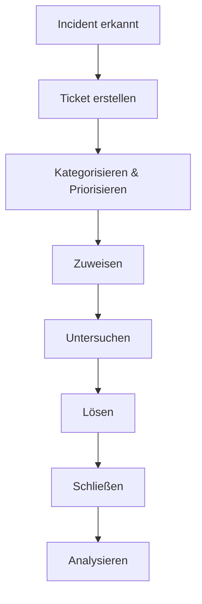

Der **Incident Management**-Prozess zielt darauf ab, ungeplante Unterbrechungen oder Qualitätsminderungen von IT-Services schnell zu identifizieren, zu beheben und zu analysieren, um die Auswirkungen auf den Geschäftsbetrieb zu minimieren und die Servicequalität aufrechtzuerhalten.

## Kurzueberblick

Incident Management ist eine Kernpraktik im IT Service Management (ITSM) nach ITIL-Standards. Es fokussiert sich auf die reaktive Behebung von Störungen, im Gegensatz zum präventiven [Problem Management](problem-management). Der Prozess umfasst die Erfassung, Kategorisierung, Priorisierung und Lösung von Incidents, um Ausfallzeiten zu reduzieren und die Kundenzufriedenheit zu erhöhen. In modernen Umgebungen wie DevOps integriert es sich mit Monitoring-Tools für automatisierte Erkennung.

## Kontext und Einordnung

Incident Management ist Teil des ITIL-Frameworks, das seit Version 4 als flexible "Praktik" definiert ist. Es unterstützt Organisationen dabei, IT-Services stabil zu halten, indem es auf Störungen reagiert. In DevOps-Teams ergänzt es SRE-Prinzipien (Site Reliability Engineering), wo Incident-Response-Teams für schnelle Wiederherstellung sorgen. Der Prozess interagiert eng mit anderen ITSM-Praktiken: Wenn ein Incident behoben ist, kann [Problem Management](problem-management) die Ursache analysieren, und [Change Management](change-management) geplante Änderungen implementieren.

## Begriffe und Definitionen

### Incident

Ein Incident ist eine ungeplante Unterbrechung oder Qualitätsminderung eines IT-Services. Beispiele sind Systemausfälle, Netzwerkprobleme oder Anwendungsfehler. Incidents sind Symptome, nicht Ursachen – die Behebung zielt auf schnelle Wiederherstellung ab.

### Ticket / Incident Record

Ein Ticket ist ein Datensatz, der den gesamten Lebenszyklus eines Incidents dokumentiert. Er enthält Beschreibung, Status, betroffene Systeme, Priorität und Lösungsschritte. Jedes Incident muss in einem Ticket erfasst werden, um Nachverfolgung zu ermöglichen.

### SLA (Service Level Agreement)

Ein SLA ist eine Vereinbarung zwischen Serviceanbieter und Kunde über erwartete Leistungsstandards. Im Incident Management definiert es Reaktionszeiten (z. B. Kritisch: 1 Stunde) und Lösungszeiten (z. B. Normal: 24 Stunden). SLAs messen die Einhaltung und steuern Prioritäten.

### Kategorisierung und Priorisierung

Kategorisierung teilt Incidents in Typen ein, wie Hardware, Software oder Netzwerk. Priorisierung bestimmt die Bearbeitungsreihenfolge basierend auf Dringlichkeit (wie schnell reagiert werden muss) und Auswirkung (wie stark der Betrieb betroffen ist). Hohe Dringlichkeit und Auswirkung ergeben kritische Priorität.

### Escalation

Escalation überträgt einen Incident an höhere Support-Ebenen oder Spezialisten, wenn er nicht zeitgerecht gelöst wird. Funktionale Escalation geht an Experten, hierarchische an Management. Regeln basieren auf SLAs und Prioritäten.

### Major Incident

Ein Major Incident ist ein besonders schwerer Incident, der Geschäftsabläufe massiv stört und sofortiges Handeln erfordert. Er wird von einem dedizierten Team bearbeitet und nach Lösung in einem Review analysiert.

### Support-Levels

Support ist hierarchisch gestaffelt: 1st Level (Basis-Support) versucht einfache Lösungen, eskaliert an 2nd Level (Spezialisten) und 3rd Level (Hersteller oder Experten).

## Vorgehen

Der Incident-Lifecycle folgt diesen Schritten:

1. **Incident-Identifikation**: Erkennen durch Benutzermeldung, Monitoring oder automatische Alarme.
2. **Ticket-Erstellung**: Erfassen von Details wie Beschreibung und betroffenen Systemen.
3. **Kategorisierung und Priorisierung**: Einteilung in Typ und Priorität basierend auf Kriterien.
4. **Zuweisung**: Weiterleitung an das passende Support-Level.
5. **Untersuchung und Diagnose**: Analyse der Ursache mit Tools wie Logs oder Tests.
6. **Lösung und Wiederherstellung**: Implementierung der Behebung und Überprüfung.
7. **Ticket-Schließung**: Dokumentation und Benutzerinfo, dann Schließung.
8. **Nachverfolgung und Analyse**: Review für Verbesserungen, ggf. Übergabe an [Problem Management](problem-management).

Dieses Diagramm zeigt den vereinfachten Ablauf eines Incidents von der Erkennung bis zur Analyse.

## Beispiele

### Einfacher Incident

Ein Benutzer meldet, dass er nicht auf seine E-Mails zugreifen kann. Das Ticket wird als Software-Problem kategorisiert, Priorität Normal. 1st Level-Support prüft Logs und findet einen Server-Fehler, behebt ihn und schließt das Ticket. SLA: Gelöst in 4 Stunden.

### Major Incident

Ein Datenbank-Ausfall legt das gesamte ERP-System lahm. Priorität Kritisch. Ein Major Incident Team aktiviert den Notfallplan, wechselt auf Backup-System und behebt die Ursache (Hardware-Defekt). Lösung in 1 Stunde, gefolgt von einem Review.

## Abgrenzungen zu verwandten Prozessen

- **Incident vs. [Problem Management](problem-management)**: Incidents sind Symptome (z. B. Ausfall), Probleme die Ursachen. Incident Management behebt reaktiv, Problem Management analysiert präventiv.
- **Incident vs. [Change Management](change-management)**: Incidents lösen manchmal Changes aus (z. B. Software-Update), aber Changes sind geplant, Incidents ungeplant.
- **Incident vs. Service Request**: Requests sind Routine-Anfragen (z. B. Passwort-Reset), keine Störungen; sie werden über Request Fulfillment bearbeitet.

## Häufige Fehler und Tipps

- **Fehlende Kategorisierung**: Führt zu falscher Zuweisung. Tipp: Nutze klare Kategorien wie Hardware/Software.
- **Unzureichende SLA-Einhaltung**: Ignoriert Prioritäten. Tipp: Automatisiere Überwachung mit Tools.
- **Keine Eskalationsregeln**: Verzögerungen. Tipp: Definiere Zeitlimits pro Level.
- **Post-Mortem ohne Analyse**: Verpasst Lernchancen. Tipp: Führe Reviews durch, ohne Schuldzuweisungen.
- **Mangelnde Integration**: Trennt Incident von Problem Management. Tipp: Übergabe bei wiederkehrenden Incidents.

## Komponenten eines Ticketsystems

Ein effektives Ticketsystem umfasst:

- Ticket-Erstellung: Meldung über Kanäle wie E-Mail oder Portal.
- Ticket-Kategorisierung: Einteilung nach Typ und Priorität.
- Ticket-Zuweisung: Automatische oder manuelle Weiterleitung an Teams.
- Ticket-Tracking: Statusverfolgung und Updates.
- Kommunikation: Austausch zwischen Support und Benutzern.
- Lösungsdokumentation: Speicherung von Lösungen für Wissensaufbau.

## Vorteile eines effektiven Incident Managements

- Zentralisierte Verwaltung: Alle Incidents an einem Ort.
- Effizienzsteigerung: Automatisierung von Prozessen.
- Transparenz: Benutzer sehen Status und Updates.
- Wissensdatenbank: Dokumentierte Lösungen für zukünftige Fälle.

## Typische Werkzeuge

- Jira Service Management: Für agile Teams.
- ServiceNow: Umfassende ITSM-Plattform.
- Zendesk: Kundensupport-Fokus.
- OTRS: Open-Source-Ticketsystem.

## Weiterführendes

Verwandte Themen sind [Problem Management](problem-management) und [Change Management](change-management). Für ITIL-Standards siehe offizielle Dokumentation.
