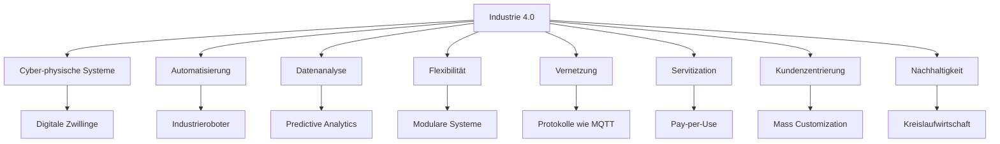

**Industrie 4.0** beschreibt die vierte industrielle Revolution. Sie zeichnet sich durch die intelligente Vernetzung von Maschinen, Prozessen und Produkten mithilfe von Informations- und Kommunikationstechnologien aus. Dadurch entsteht eine flexible, datenbasierte Produktion, die sich an individuelle Kundenbedürfnisse anpasst und Ressourcen effizient nutzt. Unternehmen werden dadurch wettbewerbsfähiger.

## Kontext und Einordnung
Industrie 4.0 baut auf den vorherigen industriellen Revolutionen auf. Industrie 1.0 begann im 18. Jahrhundert mit der Mechanisierung durch Dampfmaschinen. Industrie 2.0 folgte im 19. und 20. Jahrhundert mit Elektrifizierung und Fließbändern. Industrie 3.0 setzte ab den 1970er Jahren mit Computerisierung und Automatisierung ein. Industrie 4.0 hebt sich seit den 2010er Jahren durch Vernetzung und Digitalisierung ab. Sie ermöglicht Echtzeit-Datenverarbeitung und adaptive Produktion.

## Begriffe und Definitionen

- **Cyber-physische Systeme**: Systeme, die physische Komponenten mit digitalen Technologien verbinden. Sie tauschen Daten in Echtzeit aus und steuern Prozesse.
- **Mass Customization**: Massenfertigung individualisierter Produkte, auch als Losgröße 1 bekannt.
- **Servitization**: Geschäftsmodell, bei dem Hersteller Produkte als Dienstleistung anbieten. Beispiele sind Pay-per-Use oder Wartungsservices.
- **Digitaler Zwilling**: Digitale Repräsentation einer physischen Anlage zur Simulation und Optimierung.

## Vorgehen
Die Einführung von Industrie 4.0 erfolgt schrittweise. Zunächst werden bestehende Prozesse analysiert. Dann integrieren Unternehmen Sensoren und Vernetzung. Es folgen Datenanalyse und kontinuierliche Optimierung. Ein typischer Prozess umfasst:

1. Identifikation von Automatisierungspotenzialen.
2. Implementierung von cyber-physischen Systemen.
3. Datensammlung und -analyse für Entscheidungen.
4. Anpassung an Kundenanforderungen und Nachhaltigkeitsziele.

## Beispiele
In einer Automobilfabrik simuliert ein digitaler Zwilling einen Produktionsroboter. Mit Daten wie einer Ausfallrate von 5 % pro Monat und einer Produktionsmenge von 1000 Einheiten täglich prognostiziert die Analyse Wartungsbedarf. Dies reduziert Stillstandszeiten um 20 % und steigert die Effizienz.

Für Mass Customization fertigt ein Unternehmen individualisierte Schuhe. Kunden wählen online Größe, Farbe und Material. Die Produktion passt sich mit modularen Maschinen an. Daten aus 500 Bestellungen täglich optimieren die Lagerhaltung und halten Kosten bei 10 EUR pro Paar.

Bei Servitization bietet ein Roboterhersteller Wartung als Service an. Der Kunde zahlt 200 EUR monatlich für die Nutzung. Der Hersteller analysiert Sensordaten von 50 Maschinen, um Ausfälle vorab zu beheben. Dies führt zu 15 % weniger Reparaturen.

## Kernkonzepte und Technologien
Industrie 4.0 basiert auf Konzepten, die Produktionsprozesse optimieren.

### Cyber-physische Systeme
Diese Systeme verbinden physische Elemente wie Maschinen mit digitalen Komponenten über Sensoren und Aktoren. Vernetzte Roboter senden Daten zu Temperatur und Vibration in Echtzeit. Vorteile sind Echtzeit-Überwachung und Fehlerprävention. Nachteile umfassen hohe Kosten und Sicherheitsrisiken.

### Automatisierung
Automatisierte Systeme wie Industrieroboter übernehmen repetitive Aufgaben. In einer Montagehalle sortieren Roboter Teile mit einer Genauigkeit von 0,1 mm auf Basis von Kameradaten. Vorteile sind höhere Geschwindigkeit und Fehlerreduktion. Risiken betreffen Arbeitsplatzverluste und Investitionen.

### Datenanalyse und KI
Daten aus Produktionslinien werden analysiert, etwa mit Predictive Analytics für Ausfallvorhersagen. Bei 1000 Datensätzen pro Stunde identifiziert KI Muster, die Effizienz um 25 % steigern. Vorteile sind bessere Entscheidungen. Herausforderungen sind Datenschutz und Datenmengen.

### Flexibilität und Mass Customization
Modulare Systeme erlauben Anpassungen, beispielsweise 3D-Drucker für individualisierte Teile. Bei 50 Varianten passt die Produktion sich an, ohne Kosten zu erhöhen. Vorteile sind Marktanpassung. Nachteile die Komplexität.

### Vernetzung
Maschinen kommunizieren über Protokolle wie MQTT oder OPC UA. In einem Werk vernetzen 200 Geräte Daten für Transparenz. Vorteile sind effiziente Zusammenarbeit. Risiken sind Netzwerkabhängigkeit und Cybersecurity.

### Servitization
Hersteller bieten Produkte als Service an, etwa Pay-per-Use für Maschinen. Ein Kunde nutzt einen Drucker für 150 EUR pro Monat. Der Hersteller wartet proaktiv. Vorteile sind höhere Qualität. Herausforderungen sind Vertragsgestaltung.

### Kundenzentrierung
Produkte werden individualisiert, etwa durch Kundenportale. Bei 300 Anfragen täglich passt die Produktion sich an und steigert Zufriedenheit. Vorteile sind Wettbewerbsvorteile. Nachteile höhere Kosten.

### Nachhaltigkeit
Kreislaufwirtschaft reduziert Abfall, etwa durch energieeffiziente Maschinen, die Strom um 30 % sparen. Bei 5000 Produkten pro Monat sinken Kosten und Belastung. Vorteile sind Ressourcenschonung. Nachteile sind Investitionen.

Dieses Diagramm zeigt die Kernkonzepte von Industrie 4.0 und ihre Verbindungen. Es erleichtert das Verständnis der interdependenten Technologien.

## Herausforderungen und Risiken
Industrie 4.0 bringt Herausforderungen mit sich. Technisch sind Standardisierung und Interoperabilität von Komponenten nötig, da Systeme oft nicht kompatibel sind. Komplexitätsmanagement erfordert Schulungen für den Betrieb. Sicherheitsrisiken umfassen IT-Sicherheit, etwa Angriffe auf vernetzte Maschinen, und Datenschutz bei sensiblen Produktionsdaten. Wirtschaftlich sind hohe Investitionen ein Hemmnis. Gesellschaftlich verändert sie Arbeitsplätze, erfordert neue Qualifikationen und birgt Datenschutzrisiken.

## Weiterführendes
Für tiefergehende Einblicke in [Datenanalyse](datenanalyse) oder [Automatisierung](automatisierung-von-geschaeftsprozessen) lohnt sich die Betrachtung spezifischer Technologien wie [Internet der Dinge](iot). Die Plattform Industrie 4.0 bietet weitere Ressourcen zu Implementierungsstrategien.

## Einzelnachweise

- Plattform Industrie 4.0: Definition und Kernkonzepte.
- Fraunhofer IKS: Cyber-physische Systeme und Servitization.
- Gabler Wirtschaftslexikon: Detaillierte CPS-Definition.
