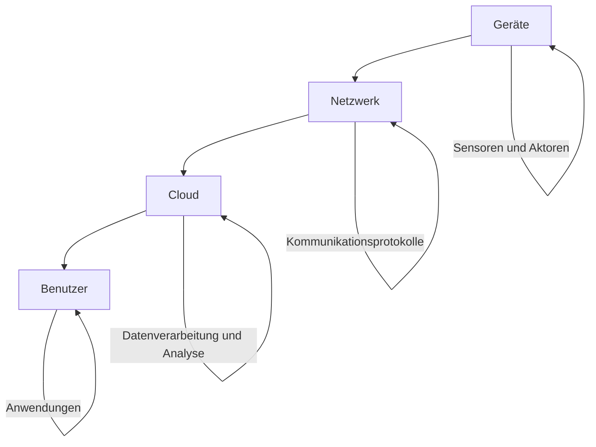

Der **Internet der Dinge (IoT)** beschreibt ein Netzwerk aus physischen Objekten, die mit Sensoren, Software und Konnektivität ausgestattet sind, um Daten aus ihrer Umgebung zu erfassen und autonom zu kommunizieren. Dies ermöglicht Automatisierung und Effizienzsteigerung in verschiedenen Bereichen wie Smart Homes, Industrie und Gesundheitswesen.

## Architektur von IoT-Systemen

Die Architektur eines IoT-Systems umfasst mehrere Schichten, die den Datenaustausch und die Verarbeitung ermöglichen. Sie besteht typischerweise aus Geräten, Netzwerken, Cloud-Infrastrukturen und Benutzerschnittstellen.

- **Geräte:** Physische Objekte wie Sensoren, Aktoren oder Maschinen, die Daten erfassen oder Aktionen ausführen.
- **Netzwerk:** Infrastruktur für den Datenaustausch zwischen Geräten und Servern, beispielsweise über WLAN, 4G/5G oder Bluetooth.
- **Cloud:** Plattform zur Speicherung, Verarbeitung und Analyse der Daten sowie zur Bereitstellung von Schnittstellen.
- **Benutzer:** Personen, die über Anwendungen die Daten visualisieren, analysieren und Steuerungen vornehmen.

## Komponenten eines IoT-Systems

IoT-Systeme setzen sich aus verschiedenen Komponenten zusammen, die zusammenarbeiten, um Funktionalität zu gewährleisten.

- **Sensoren:** Erfassen Parameter der physischen Umgebung, etwa Temperatur, Bewegung oder Licht.
- **Aktoren:** Führen Aktionen auf Basis der Daten aus, beispielsweise die Steuerung von Motoren oder Heizungen.
- **Gateways:** Vermitteln zwischen IoT-Geräten und der Cloud, aggregieren Daten, filtern Informationen und führen Protokollübersetzungen durch (zum Beispiel von CoAP zu MQTT).
- **Protokolle:** Ermöglichen die Kommunikation, darunter MQTT, HTTP oder CoAP.

## IoT-Protokolle

Protokolle sind essenziell für die Kommunikation in IoT-Systemen. Sie sind auf die Ressourcenbeschränkungen der Geräte abgestimmt.

- **MQTT:** Ein leichtgewichtiges Nachrichtenprotokoll, das auf einem Publish/Subscribe-Muster basiert. Es nutzt einen zentralen Broker und unterstützt verschiedene Qualitätsstufen für die Zustellungssicherheit bei instabilen Netzwerken. MQTT ist ideal für Geräte mit begrenzten Ressourcen und Netzwerke mit hoher Latenz.
- **CoAP:** Ein spezialisiertes Web-Transfer-Protokoll für ressourcenbeschränkte Geräte, das ein Request/Response-Modell ähnlich HTTP bietet, aber über UDP optimiert ist. Es unterstützt Multicast und hat einen niedrigen Overhead.
- **HTTP/HTTPS:** Das Standardprotokoll für Webanwendungen, geeignet für IoT-Geräte ohne Echtzeitbedarf, bietet aber höheren Overhead.

## Anwendungsbereiche von IoT

IoT findet in zahlreichen Bereichen Anwendung, wo es Effizienz steigert und neue Möglichkeiten eröffnet.

- **Smart Home:** Vernetzte Geräte wie Thermostate, Beleuchtung oder Sicherheitskameras, die automatisiert gesteuert werden.
- **Industrie 4.0:** Vernetzung von Maschinen und Prozessen zur Steigerung der Effizienz, etwa durch [Predictive Maintenance](predictive-maintenance).
- **Smart Cities:** Einsatz von Sensoren für effizientere Verkehrssteuerung, Müllentsorgung und Energieversorgung.
- **Gesundheitswesen:** Vernetzte Geräte zur Patientenüberwachung, beispielsweise Wearables für Vitaldaten.
- **Landwirtschaft:** Sensoren zur Überwachung von Bodenqualität, Wetter und automatisierten Bewässerungssystemen.

## Edge Computing vs. Cloud Computing in IoT

In IoT-Systemen werden Datenverarbeitungsmethoden gewählt, die auf die Anforderungen abgestimmt sind.

- **Edge Computing:** Verarbeitung nahe der Datenquelle, etwa am Gerät oder Gateway, um Latenz zu reduzieren und Bandbreite zu sparen. Fog Computing dient als Zwischenstufe zwischen Edge und Cloud.
- **Cloud Computing:** Zentrale Verarbeitung, Analyse und Speicherung der Daten; vorteilhaft bei großen Datenmengen oder rechenintensiven Aufgaben. Siehe [Cloud Computing](cloud-computing).

## Sicherheit und Datenschutz

IoT-Systeme bergen spezifische Sicherheitsrisiken, da Geräte oft direkt mit dem Internet verbunden sind und sensible Daten verarbeiten.

- **Bedrohungen:** Unsichere Standardpasswörter, fehlende Verschlüsselung, ungesicherte Kommunikation, Botnet-Angriffe, Datendiebstahl und DDoS-Attacken.
- **Maßnahmen:** Empfohlene Maßnahmen umfassen die Verwendung starker Passwörter, die Implementierung von Verschlüsselung, die Einrichtung von Authentifizierung und Zugriffskontrollen, die Durchführung regelmäßiger Updates sowie die Anwendung von Netzwerksegmentierung.
- **Datenschutz:** Empfohlene Maßnahmen umfassen die Beachtung der Datensparsamkeit, die Erhebung nur so viel Daten wie nötig sowie die Einhaltung der DSGVO.

## Herausforderungen und Risiken von IoT

Trotz der Vorteile bringt IoT Herausforderungen mit sich, die adressiert werden müssen.

- **Sicherheit:** Geräte sind anfällig für Cyberangriffe, oft aufgrund mangelnder Verschlüsselung oder unsicherer Standardpasswörter.
- **Skalierbarkeit:** Das Wachstum der Geräteanzahl erfordert robuste Infrastrukturen für Datenverarbeitung und -speicherung, einschließlich Device Management für Provisionierung, Konfiguration und Deaktivierung.
- **Interoperabilität:** Inkompatible Protokolle und Standards verschiedener Hersteller erschweren die Integration; Standardisierungsansätze wie oneM2M oder Matter helfen.
- **Datenschutz:** Der Umgang mit großen Datenmengen erfordert strenge Vorkehrungen, etwa die Einhaltung der DSGVO.

## Relevante Begriffe

- **Smart Devices:** Intelligente Geräte mit Sensoren und Internetverbindung.
- **Wearables:** Tragbare IoT-Geräte, häufig für Gesundheitsüberwachung, wie Fitness-Tracker.
- **Digital Twin:** Virtuelles Modell eines physischen Objekts zur Echtzeitüberwachung.
- **IoT-Plattformen:** Software zur Verwaltung und Analyse von IoT-Daten, beispielsweise AWS IoT oder Microsoft Azure IoT Hub.
