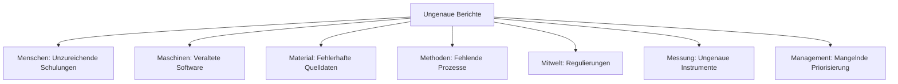

Das **Ishikawa-Diagramm**, auch bekannt als Fischgrätendiagramm oder Ursache-Wirkungs-Diagramm, dient der systematischen Identifikation und Analyse von Ursachen eines Problems. Es strukturiert die Untersuchung in verschiedene Bereiche, die typischerweise mit den Buchstaben M beginnen, und ermöglicht eine visuelle Darstellung der Ursachen-Wirkungs-Beziehungen. Entwickelt wurde es von Kaoru Ishikawa in den 1940er Jahren in Japan, um Qualitätsprobleme in der Produktion zu analysieren. Es basiert auf dem Ursache-Wirkungs-Prinzip und teilt Ursachen in Hauptkategorien auf, die von Hauptursachen zu Unterursachen verzweigen. Die Kategorien orientieren sich an den sogenannten M-Faktoren, die systematisch untersucht werden. Jede Kategorie deckt spezifische Aspekte ab, die zur Problementstehung beitragen können.

Das Ishikawa-Diagramm visualisiert potenzielle Ursachen eines Problems in einer fischgrätenähnlichen Struktur, wobei das Problem am rechten Ende steht und die Ursachen in Kategorien gegliedert auf der linken Seite abzweigen. Es fördert eine ganzheitliche Betrachtung und hilft, Ursachen zu priorisieren. Die 7M-Variante ist eine gängige Form, aber es existieren auch kürzere (4M) oder erweiterte (8M) Versionen, je nach Kontext.

## Entwicklung und Anwendung

Das Ishikawa-Diagramm entstand in den 1940er Jahren durch den japanischen Qualitätsmanagement-Experten Kaoru Ishikawa, der es als Teil der Total Quality Management-Bewegung entwickelte. Ursprünglich für die Fertigungsindustrie konzipiert, findet es heute Anwendung in verschiedenen Bereichen wie der [Datenanalyse](datenanalyse) und Prozessoptimierung. Es ist ein Werkzeug der Qualitätssicherung und wird oft in Kombination mit anderen Methoden wie dem [Projektmanagement](projektmanagement) oder [Lean-Management](lean-management) eingesetzt.

Das Diagramm gibt es in mehreren Varianten, abhängig von der Komplexität des Problems und dem Kontext. Häufig genutzt werden:

- 4M: Menschen (Man), Maschinen (Machine), Material, Methoden.
- 5M: Zusätzlich Mitwelt (Milieu).
- 6M: Zusätzlich Messung (Measurement).
- 7M: Zusätzlich Management.
- 8M: Erweitert um weitere Kategorien wie Geld oder Information.

Die Wahl der Variante richtet sich nach dem Anwendungsbereich; die 7M-Version eignet sich besonders für umfassende Analysen in Unternehmen.

## Erstellung

Die Erstellung eines Ishikawa-Diagramms erfolgt in mehreren Schritten:

1. **Problem definieren**: Das zu analysierende Problem klar formulieren und in die Mitte des Diagramms setzen.
2. **Hauptkategorien festlegen**: Je nach Variante (z. B. 7M) die Kategorien als Hauptäste zeichnen.
3. **Ursachen brainstormen**: Für jede Kategorie potenzielle Ursachen sammeln, idealerweise im Team.
4. **Verzweigungen erstellen**: Ursachen in Unterkategorien aufteilen, um Detailtiefe zu erreichen.
5. **Auswerten und priorisieren**: Die einflussreichsten Ursachen identifizieren und Maßnahmen ableiten.
6. **Dokumentieren**: Das Diagramm für spätere Referenzen speichern.

Bei der 7M-Variante werden die folgenden Bereiche untersucht:

- **Menschen**: Menschliche Faktoren wie Qualifikation und Teamdynamik.
- **Maschinen**: Technische Aspekte wie Gerätealter und Wartung.
- **Material**: Ressourcen wie Rohstoffqualität und Lieferketten.
- **Methoden**: Prozesse wie Standardisierung und [Projektmanagement](projektmanagement).
- **Mitwelt**: Externe Faktoren wie Regulierungen und Marktbedingungen.
- **Messung**: Datenerfassung und Analyse, einschließlich statistischer Methoden.
- **Management**: Führungsaspekte wie Strategie und Risikomanagement.

## Anwendungsbeispiel

Ein Beispiel: In einem Unternehmen tritt ein Qualitätsproblem bei der Datenverarbeitung auf – ungenaue Berichte. Das Ishikawa-Diagramm könnte so aussehen:

- Problem: Ungenaue Berichte
  - Menschen: Unzureichende Schulungen in Datenanalyse.
  - Maschinen: Veraltete Software ohne automatische Validierung.
  - Material: Fehlerhafte Quelldaten aus Lieferanten.
  - Methoden: Fehlende Standardprozesse für Datenprüfung.
  - Mitwelt: Neue Datenschutzregulierung erschwert den Zugriff.
  - Messung: Ungenaue Messinstrumente für Datenqualität.
  - Management: Mangelnde Priorisierung von Qualitätssicherung.

Nach der Analyse wird die Ursache "Fehlende Schulungen" priorisiert, und ein Schulungsprogramm eingeführt.

## Häufige Fehler und Hinweise zur Anwendung

Häufige Fehler umfassen eine zu enge Fokussierung auf eine Kategorie, was zu unvollständigen Analysen führt, oder subjektive Einschätzungen ohne Daten. Auch kann die Methode zeitaufwändig sein, wenn zu viele Ursachen gesammelt werden.

Nachteile des Ishikawa-Diagramms liegen in seiner Subjektivität, da Ursachen oft auf Annahmen basieren, und in der Beschränkung auf qualitative Aspekte, ohne quantitative Gewichtung. Es eignet sich weniger für komplexe, dynamische Systeme und kann bei falscher Anwendung zu Fehlprioritäten führen.

Zur Verbesserung der Analysequalität empfiehlt es sich, verschiedene Teammitglieder einzubeziehen, um vielfältige Perspektiven zu erfassen. Ursachen sollten mit Daten untermauert und das Diagramm iterativ angepasst werden. Ergänzend können andere Tools wie die [Datenanalyse](datenanalyse) genutzt werden, um eine quantitative Validierung hinzuzufügen.