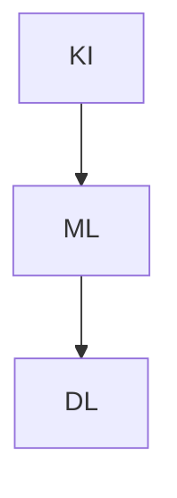

Die **Künstliche Intelligenz versus Maschinelles Lernen versus Deep Learning** beschreibt die hierarchische Beziehung zwischen diesen Konzepten in der Informatik. Künstliche Intelligenz (KI) stellt den Oberbegriff dar, der Systeme umfasst, die menschenähnliche Intelligenz simulieren. Maschinelles Lernen (ML) bildet einen spezifischen Ansatz innerhalb der KI, bei dem Algorithmen aus Daten lernen, um Muster zu erkennen und Vorhersagen zu treffen. Deep Learning (DL) hingegen ist eine fortgeschrittene Form des ML, die auf tiefen neuronalen Netzen basiert und besonders für die Verarbeitung großer Mengen unstrukturierter Daten geeignet ist. Diese Unterschiede zeigen sich in ihren Techniken, der Abhängigkeit von Daten, der Komplexität und den Anwendungsbereichen.

## Lernziele

Lernziele:

- die hierarchische Beziehung zwischen KI, ML und DL erklären,
- die Hauptunterschiede in Techniken, Datenabhängigkeit und Anwendungen benennen,
- typische Anwendungsbeispiele für jede Kategorie zuordnen,
- den Unterschied in Feature Engineering und Trainingszeiten zwischen ML und DL beschreiben.

## Kurzübersicht

KI, ML und DL sind eng miteinander verbunden und bilden eine Hierarchie:

$$ KI \supset ML \supset DL $$

KI bezieht sich auf die Simulation intelligenter Verhaltensweisen, ML fokussiert auf datenbasiertes Lernen, und DL nutzt tiefe neuronale Netze für komplexe Datenverarbeitung. Der Hauptunterschied liegt in der Datenabhängigkeit – KI kann ohne große Datenmengen arbeiten, während ML und insbesondere DL große Datensätze erfordern. DL automatisiert zudem die Merkmalsextraktion, im Gegensatz zum oft manuellen Feature Engineering in ML.

## Kontext und Einordnung

Diese Konzepte entstanden im Kontext der Informatik und Datenanalyse, um menschliche Intelligenz nachzuahmen. KI entwickelte sich seit den 1950er Jahren, ML seit den 1980er Jahren und DL seit den 2010er Jahren durch Fortschritte in Rechenleistung und Datenverfügbarkeit. Sie finden Anwendung in der Automatisierung von Prozessen, der Analyse großer Datenmengen und der Entwicklung intelligenter Systeme. In der Daten- und Prozessanalyse helfen sie bei der Mustererkennung, Prognose und Entscheidungsunterstützung.

## Begriffe und Definitionen

Künstliche Intelligenz (KI) bezeichnet den breiten Bereich der Entwicklung von Systemen, die Aufgaben auf intelligente Weise ausführen können, ähnlich wie der menschliche Verstand. Das Ziel liegt in der Simulation menschenähnlicher Intelligenz, um Probleme zu lösen, Entscheidungen zu treffen oder Aufgaben zu automatisieren.

Maschinelles Lernen (ML) ist ein Teilbereich der KI, der sich auf Algorithmen konzentriert, die durch Erfahrung und Daten ihre Leistung verbessern. Das Ziel besteht darin, Muster in Daten zu identifizieren und daraus zu lernen, ohne explizit programmiert zu werden.

Deep Learning (DL) stellt eine spezialisierte Unterkategorie des ML dar, die tiefe neuronale Netze mit mehreren Schichten verwendet. Das Ziel ist die Automatisierung der Merkmalsextraktion und -klassifikation, insbesondere bei komplexen Daten wie Bildern oder Sprache.

## Techniken und Datenabhängigkeit

Die Techniken variieren je nach Ansatz. KI umfasst regelbasierte Systeme, Expertensysteme sowie ML und DL. ML nutzt Methoden wie überwachtes, unüberwachtes und bestärkendes Lernen. DL hingegen verwendet spezifische Architekturen wie Convolutional Neural Networks (CNNs) oder Recurrent Neural Networks (RNNs).

Hinsichtlich der Datenabhängigkeit kann KI auch ohne große Datenmengen funktionieren, beispielsweise durch regelbasierte Ansätze. ML erfordert hingegen große Datenmengen, um effektive Muster zu erkennen. DL benötigt sehr große Datenmengen für ein effektives Training und ist oft auf spezialisierte Hardware wie GPUs angewiesen.

Ein wichtiger Unterschied besteht im Feature Engineering: Bei ML wird oft manuelles Feature Engineering benötigt, um relevante Merkmale aus den Daten zu extrahieren. DL hingegen automatisiert diesen Prozess durch die tiefen Netzwerke. Die Trainingszeiten unterscheiden sich ebenfalls: ML-Modelle trainieren typischerweise in Sekunden bis Stunden, während DL-Modelle Stunden bis Wochen benötigen.

## Beispiele

Für KI dient ein Schachcomputer als Beispiel, der durch regelbasierte Algorithmen spielt, ohne große Datenmengen zu benötigen. In ML analysiert ein Empfehlungssystem wie bei Streaming-Diensten Nutzerdaten, um Filme vorzuschlagen, basierend auf überwachtem Lernen. DL kommt bei der Bilderkennung zum Einsatz, etwa wenn ein neuronales Netz Gesichter in Fotos identifiziert, wobei Millionen von Bildern für das Training verwendet werden.

## Häufige Fehler und Tipps

Ein häufiger Fehler ist die Gleichsetzung von KI mit DL, obwohl DL nur ein Subfeld darstellt. Stattdessen sollte die Hierarchie beachtet werden: KI als Oberbegriff, ML als datenbasiertes Lernen und DL als spezialisierte Netzwerktechnik.

Bei der Wahl des Ansatzes gilt: Für einfache, regelbasierte Probleme eignet sich KI ohne ML; bei verfügbaren großen Datensätzen ist ML vorzuziehen; DL lohnt sich bei unstrukturierten Daten wie Bildern, erfordert aber Rechenressourcen.

Nicht alle Modelle sind interpretierbar: KI kann durch Regeln transparent sein, ML teilweise, DL oft als "Black Box". Bei Bedarf an Erklärbarkeit sollte daher ML gegenüber DL bevorzugt werden.

## Selbsttest

1. Welches Konzept bildet den Oberbegriff für KI, ML und DL?
2. Was ist der Hauptunterschied im Feature Engineering zwischen ML und DL?
3. Gib ein Anwendungsbeispiel für DL an.
4. Warum benötigt DL oft GPUs?
5. Was bedeutet die Hierarchie KI ⊃ ML ⊃ DL?
6. Welche Trainingszeiten sind typisch für DL im Vergleich zu ML?

## Weiterführendes

Für detaillierte Einblicke in KI empfiehlt sich der Artikel zu [Künstliche Intelligenz](ki). Weitere Informationen zu ML finden sich in [Maschinelles Lernen](maschinelles-lernen).

Dieses Diagramm veranschaulicht die hierarchische Beziehung: KI umfasst ML, das wiederum DL einschließt.

## Einzelnachweise

Die Quellen bieten weitere Informationen zu den Unterschieden und Anwendungen von KI, ML und DL.
