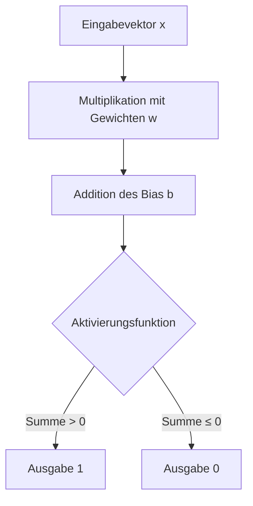

**Künstliche Intelligenz** bezeichnet die Simulation menschlicher Intelligenz durch Maschinen, insbesondere Computersysteme. Sie umfasst Algorithmen und Modelle, die Daten analysieren, Muster erkennen und Entscheidungen treffen können. Zu den Teilgebieten zählen maschinelles Lernen, Deep Learning und neuronale Netze. Anwendungen finden sich in Bereichen wie Sprachverarbeitung und autonomen Systemen.

## Lernziele

Dieser Artikel vermittelt Kenntnisse zu:

- Grundlagen und Teilgebieten der Künstlichen Intelligenz.
- Funktionsweise künstlicher neuronaler Netze.
- Ethischen Herausforderungen und Anwendungsgebieten der KI.
- Schritten zur Entwicklung eines KI-Modells.

## Kurzüberblick

Künstliche Intelligenz gliedert sich in verschiedene Teilgebiete, die spezifische Ansätze zur Simulation intelligenter Verhaltensweisen verfolgen. Sie bildet die Basis für Anwendungen in [Datenanalyse](datenanalyse) und [autonomen Systemen](autonome-systeme).

## Teilgebiete der KI

- **Maschinelles Lernen (ML):** Ein Teilbereich der KI, in dem Systeme aus Daten lernen, ohne explizit programmiert zu werden. Wichtige Methoden des maschinellen Lernens umfassen:
    - **Überwachtes Lernen:** Das Modell wird mit beschrifteten Daten trainiert, beispielsweise für Klassifikation oder Regression.
    - **Unüberwachtes Lernen:** Das Modell erkennt Muster in unbeschrifteten Daten, etwa durch Clustering oder Dimensionalitätsreduktion.
    - **Bestärkendes Lernen:** Das Modell lernt durch Belohnung und Bestrafung.
- **Deep Learning (DL):** Ein Subfeld des maschinellen Lernens, das neuronale Netze mit vielen Schichten nutzt, um komplexe Muster zu erkennen. Beispiele sind Bilderkennung und Sprachverarbeitung.
- **Neuroevolution:** Eine Methode, die neuronale Netze durch evolutionäre Algorithmen optimiert.

## Künstliche neuronale Netze

Künstliche neuronale Netze bilden die Grundlage vieler KI-Modelle und simulieren die Struktur des menschlichen Gehirns.

- **Mehrschichtige neuronale Netze (MLP):** Sie bestehen aus Eingabe-, versteckten und Ausgabeschichten und verwenden Aktivierungsfunktionen wie ReLU oder Sigmoid.
- **Backpropagation:** Ein Optimierungsalgorithmus, der Fehler rückwärts durch das Netzwerk propagiert, um Gewichte zu aktualisieren.

### Perzeptron

Das Perzeptron stellt ein grundlegendes Modell eines künstlichen Neurons dar und bildet die Basis für viele Algorithmen des maschinellen Lernens. Es wurde 1957 von Frank Rosenblatt entwickelt und dient zur binären Klassifikation von Daten, indem es Eingabesignale mit Gewichtungen kombiniert und diese mit einem Schwellenwert vergleicht. Das Modell ist besonders für linear separable Probleme geeignet und hat die Entwicklung neuronaler Netze maßgeblich beeinflusst.

Die Grundlagen des Perzeptrons gehen auf die Arbeiten von Warren McCulloch und Walter Pitts zurück, die 1943 ein logisches Schwellwert-Element als Modell für Nervenzellen einführten. Donald O. Hebb formulierte 1949 die Hebbsche Lernregel, die die Grundlage für das Lernen im Perzeptron bildet. Frank Rosenblatt präsentierte 1957 das Perzeptron als wahrnehmendes und erkennendes Automat, das als probabilistisches Modell für die Informationsspeicherung im Gehirn konzipiert war. Trotz anfänglicher Euphorie führte die Kritik von Marvin Minsky und Seymour Papert 1969, insbesondere das XOR-Problem, zu einer vorübergehenden Stagnation in der Forschung. Die Einführung mehrlagiger Perzeptronen und des Backpropagation-Algorithmus revitalisierte das Feld und führte zu modernen neuronalen Netzen.

Das Perzeptron verarbeitet einen Eingabevektor $\mathbf{x} = (x_1, x_2, \dots, x_n)$ durch Multiplikation mit Gewichtungen $\mathbf{w} = (w_1, w_2, \dots, w_n)$ und Addition eines Bias $b$. Die Ausgabe $o$ wird durch eine Aktivierungsfunktion bestimmt:

$$
o = \begin{cases}
1 & \text{wenn } \sum_{i=1}^{n} w_i x_i + b > 0 \\
0 & \text{ansonsten}
\end{cases}
$$

Der Bias $b$ entspricht einem negativen Schwellenwert $\theta$, wodurch die Bedingung zu $\sum w_i x_i > \theta$ wird.

Das Lernen erfolgt durch Anpassung der Gewichte basierend auf der Differenz zwischen gewünschter Ausgabe $t$ und tatsächlicher Ausgabe $o$. Die Lernregel lautet:

$$
\Delta w_i = \alpha (t - o) x_i
$$

Dabei ist $\alpha$ die Lernrate. Die Gewichte werden inkrementiert, wenn die Ausgabe zu niedrig ist, und dekrementiert, wenn sie zu hoch ist. Dieses Verfahren konvergiert nur für linear separable Datensätze, wie im Konvergenztheorem von Rosenblatt bewiesen.

Ein einfaches Perzeptron kann nicht-linear separable Probleme wie XOR nicht lösen, da es nur lineare Trennungen ermöglicht. Mehrlagige Perzeptronen mit verdeckten Schichten überwinden diese Limitation durch nicht-lineare Aktivierungsfunktionen und Backpropagation. Moderne Varianten umfassen robuste Algorithmen wie den Maxover- oder Pocket-Algorithmus für nicht-separable Daten.

Perzeptronen finden Anwendung in der Mustererkennung, Klassifikation und als Bausteine komplexerer neuronaler Netze. Sie sind essenziell für das Verständnis von maschinellem Lernen und bilden die Grundlage für Deep Learning.

## Support Vector Machines

Support Vector Machines sind ein Klassifikationsmodell, das eine Hyperplane erstellt, um Daten in verschiedene Klassen zu trennen. Das Ziel besteht darin, den Abstand zwischen der Hyperplane und den nächsten Datenpunkten zu maximieren.

## Anwendungsgebiete der KI

Künstliche Intelligenz findet in zahlreichen Bereichen Anwendung, wo sie menschliche Fähigkeiten unterstützt oder ersetzt.

- **Sprachverarbeitung:** Einsatz in Chatbots und Übersetzungsdiensten.
- **Bild- und Spracherkennung:** Beispiele sind Gesichtserkennung und Spracherkennung.
- **Empfehlungssysteme:** Verwendung für Produktvorschläge, etwa bei Amazon oder Netflix.
- **Autonome Systeme:** Anwendungen in selbstfahrenden Autos und Drohnen.

## Vorgehen zur Entwicklung eines KI-Modells

Die Entwicklung eines KI-Modells folgt einem strukturierten Prozess, um zuverlässige Ergebnisse zu gewährleisten.

1. **Daten sammeln:** Identifizierung von Datenquellen und Vorbereitung der Daten.
2. **Datenvorverarbeitung:** Bereinigung, Normalisierung und gegebenenfalls Reduktion der Daten.
3. **Feature-Engineering:** Auswahl relevanter Merkmale.
4. **Modelltraining:** Training eines Modells mit geeigneten Algorithmen.
5. **Evaluation:** Testen des Modells anhand eines separaten Datensatzes.
6. **Deployment:** Einsatz des Modells im produktiven Umfeld.

## Beispiele

Ein einfaches Beispiel für ein Perzeptron ist die Klassifikation von Punkten in einem zweidimensionalen Raum. Angenommen, Datenpunkte mit Koordinaten (x1, x2) sollen in zwei Klassen eingeteilt werden: Klasse 1, wenn x1 + x2 > 1, sonst Klasse 0. Das Perzeptron lernt Gewichte, um diese lineare Trennung zu approximieren.

Ein weiteres Beispiel ist die Verwendung von KI in Empfehlungssystemen. Basierend auf Nutzerdaten analysiert das System Muster, um personalisierte Vorschläge zu generieren, wie in Streaming-Diensten üblich.

## Häufige Fehler und Tipps

- **Overfitting vermeiden:** Es ist wichtig zu beachten, dass das Modell nicht zu stark an Trainingsdaten angepasst wird; stattdessen sollte Kreuzvalidierung genutzt werden, um die Generalisierung zu testen.
- **Bias erkennen:** Die Überprüfung von Trainingsdaten auf Verzerrungen ist erforderlich; bei Bedarf sollten Daten diversifiziert werden, um faire Ergebnisse zu erreichen.
- **Transparenz sicherstellen:** Bei komplexen Modellen ist die Anwendung von Erklärbarkeitsmethoden ratsam, um Entscheidungen nachvollziehbar zu machen.

## Ethik und Herausforderungen der KI

Die Entwicklung und Anwendung von KI wirft ethische Fragen und praktische Herausforderungen auf.

### Maschinenethik

Maschinenethik beschäftigt sich mit der Entwicklung moralischer Agenten. Es gibt Tests wie den Ethical Turing Test, um ethische Entscheidungen zu prüfen.

#### Robotik-Ethik

Dies bezieht sich auf den moralischen Umgang mit Robotern, einschließlich ihrer Auswirkungen auf Autonomie und Gerechtigkeit.

#### Roboterrechte

Das Konzept schlägt vor, dass Maschinen Rechte haben könnten, analog zu Menschen- oder Tierrechten.

#### Ethische Prinzipien

Häufige Prinzipien sind Transparenz, Fairness, Verantwortung, Datenschutz, Wohltätigkeit, Freiheit, Vertrauen, Nachhaltigkeit, Würde und Solidarität. Ein Rahmen von Floridi und Cowls basiert auf Bioethik-Prinzipien plus Erklärbarkeit.

### Herausforderungen

- **Algorithmische Verzerrungen:** KI kann Vorurteile aus Daten übernehmen, was zu unfairen Ergebnissen führt.
- **Transparenz:** Black-Box-Modelle erschweren die Nachvollziehbarkeit.
- **Datenschutz:** Umgang mit personenbezogenen Daten erfordert Einhaltung von Richtlinien wie DSGVO.
- **Regulierung:** Gesetze wie der EU Artificial Intelligence Act regeln KI-Systeme.

### Lösungen und Ansätze

Ansätze zur KI-Sicherheit umfassen Richtlinien, Regeln und Überwachungsmechanismen, um schädliche Ausgaben zu verhindern.

## Weiterführendes

Weitere Informationen finden sich in Themen wie Datenschutz und Regulierung Künstlicher Intelligenz.
