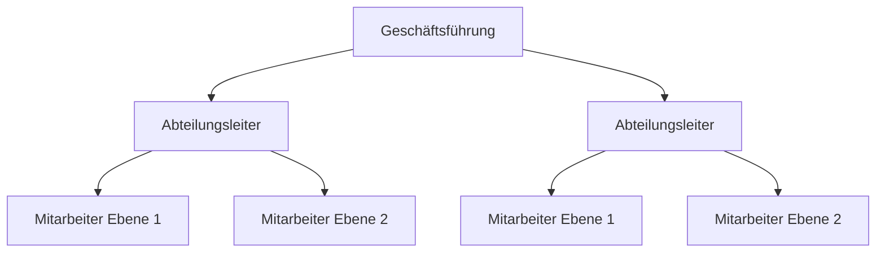

Der **Lean Management**-Ansatz verschlankt Unternehmensprozesse, minimiert Ressourcenverschwendung und fördert Kundenorientierung. Ursprünglich aus dem Toyota-Produktionssystem entwickelt, wendet er sich auf Produktion, Dienstleistungen und Verwaltung an und betont kontinuierliche Verbesserung sowie dezentrale Entscheidungsfindung.

## Lernziele
Nach diesem Artikel können Auszubildende:

- die Grundprinzipien des Lean Management erklären,
- die fünf Kernprinzipien von Lean Management anwenden,
- Verschwendung (Muda) in Prozessen identifizieren,
- den Unterschied zwischen Push- und Pull-Systemen verstehen,
- einfache Maßnahmen zur Prozessoptimierung vorschlagen.

## Kurzüberblick
Lean Management ist ein ganzheitliches Führungs- und Organisationskonzept, gekennzeichnet durch Dezentralisierung und Simultanisierung. Es fördert mehr Kundenorientierung bei gleichzeitiger Kostensenkung und umfasst Denkprinzipien, Methoden und Verfahrensweisen zur effizienten Gestaltung der Wertschöpfungskette. Der Ansatz stammt aus dem Toyota-Produktionssystem und gelangte durch die MIT-Studie "Die zweite Revolution in der Autoindustrie" in den Westen. Lean Management geht über die Produktion hinaus und findet Anwendung im Gesundheitswesen, Bauwesen und in der Verwaltung.

## Kontext und Einordnung
Lean Management entstand in den 1950er Jahren bei Toyota als Reaktion auf Ressourcenknappheit nach dem Zweiten Weltkrieg. Es entwickelte sich aus dem Toyota-Produktionssystem (TPS) und wurde 1990 durch das Buch "The Machine That Changed the World" von Womack, Jones und Roos bekannt. Im Gegensatz zu traditionellen tayloristischen Ansätzen, die auf Funktionsspezialisierung beruhen, integriert Lean Management Prozesse parallel und dezentralisiert Entscheidungen. Es grenzt sich von reinen Kostensenkungsprogrammen ab, indem es auf langfristige Wertschöpfung und Mitarbeiterbeteiligung setzt. Lean Management kombiniert sich oft mit verwandten Konzepten wie Total Quality Management (TQM) oder Just-in-Time (JIT).

## Begriffe und Definitionen
### Lean Management
Managementansatz, gekennzeichnet durch Dezentralisierung und Simultanisierung, der stärkerer Kundenorientierung bei konsequenter Kostensenkung für die gesamte Unternehmensführung dient. Synonym: Schlankes Management.

### Muda (Verschwendung)
Aktivitäten oder Prozesse, die Ressourcen wie Zeit, Geld oder Material verbrauchen, ohne Mehrwert für den Kunden zu schaffen. Die sieben Arten von Muda sind: Überproduktion, Wartezeiten, Transport, Überarbeitung, Lagerbestände, Bewegung und Fehler.

### Kaizen (Kontinuierliche Verbesserung)
Philosophie und Praxis schrittweiser Verbesserung von Prozessen, Produkten und Services. Alle Mitarbeiter hinterfragen Abläufe und bringen Verbesserungsideen ein.

### Dezentralisierung
Verlagerung von Aufgaben, Kompetenzen und Verantwortungen an Teams in primären Wertschöpfungsbereichen. Interne Dezentralisierung umfasst teamorientierte Arbeitsorganisation und breite Mitarbeiterqualifikationen; externe Dezentralisierung bedeutet Zusammenarbeit mit Partnern zur Verringerung der Leistungstiefe.

### Simultanisierung
Verzicht auf tayloristische Funktionsspezialisierung zugunsten von Integration und Parallelisierung von Planungsprozessen. Externe Simultanisierung nutzt informationstechnische Vernetzung mit Pull-Prinzipien wie Just-in-Time.

## Vorgehen
Lean Management folgt den fünf Kernprinzipien nach Womack und Jones:

1. **Wert aus Sicht des Kunden definieren**: Bestimmung dessen, was der Kunde wertschätzt, und Ausrichtung aller Tätigkeiten darauf.
2. **Wertstrom identifizieren**: Detaillierte Betrachtung aller Prozesse von Rohmaterial bis zum Kunden mittels Wertstromanalyse.
3. **Flussprinzip umsetzen**: Kontinuierlicher, reibungsloser Ablauf ohne Unterbrechungen, Vermeidung von Engpässen.
4. **Pull-Prinzip einführen**: Produktion erst bei Kundenanforderung, Vermeidung von Überproduktion.
5. **Perfektion anstreben**: Kontinuierliche Verbesserung durch [kaizen](kaizen) und Prozessoptimierung.

Die Umsetzung erfolgt in Phasen: Analyse des Ist-Zustands, Design des Soll-Zustands, Implementierung mit Pilotprojekten und Optimierung durch regelmäßige Reviews.

Dieses Diagramm zeigt eine traditionelle Hierarchie; Lean Management flacht sie ab durch Dezentralisierung und stärkt Teamverantwortung.

## Beispiele
In einem Automobilunternehmen wird der Montageprozess analysiert: Wertstromanalyse identifiziert Wartezeiten als Muda. Durch Einführung von Kanban-Karten (Pull-System) passt sich die Produktion an die Nachfrage an. Ein Team schlägt vor, Montageschritte zu parallelisieren (Simultanisierung), wodurch die Durchlaufzeit von 8 auf 5 Tage sinkt. Täglich finden Kaizen-Sitzungen statt, um kleine Verbesserungen einzuführen, wie die Umsortierung von Werkzeugen zur Reduzierung von Bewegung.

In der Verwaltung eines Krankenhauses wendet sich Lean auf die Patientenaufnahme an: Überarbeitung (z. B. doppelte Dateneingabe) wird durch digitale Integration eliminiert. Das Pull-Prinzip sorgt dafür, dass Ressourcen wie Betten erst bei Bedarf bereitgestellt werden.

## Häufige Fehler und Tipps

- Fehler: Übermäßige Fokussierung auf Kostensenkung ohne Kundenwert – Tipp: Immer mit Wertdefinition beginnen.
- Fehler: Widerstand durch fehlende Schulung – Tipp: Alle Mitarbeiter einbeziehen und schulen.
- Fehler: Überoptimierung führt zu Fragilität – Tipp: Puffer für unvorhergesehene Ereignisse beibehalten.
- Fehler: Vernachlässigung externer Partner – Tipp: Externe Dezentralisierung durch strategische Allianzen fördern.
- Tipp: Mit kleinen Pilotprojekten starten, um Erfolge sichtbar zu machen und Motivation zu steigern.

## Selbsttest

1. Was ist Muda? (Antwort: Verschwendung, die keinen Mehrwert schafft.)
2. Nennen Sie drei der fünf Lean-Prinzipien. (Antwort: Wert definieren, Fluss umsetzen, Pull einführen.)
3. Wie unterscheidet sich Pull von Push? (Antwort: Pull produziert auf Anforderung, Push nach Plan.)
4. Was ist Kaizen? (Antwort: Kontinuierliche Verbesserung.)
5. Welche Rolle spielt Dezentralisierung? (Antwort: Verlagerung von Verantwortung an Teams.)
6. Nennen Sie eine Art von Muda. (Antwort: Überproduktion, Wartezeiten etc.)

## Weiterführendes
Lean Management überschneidet sich mit [kontinuierlicher-verbesserungsprozess](kontinuierlicher-verbesserungsprozess) und kombiniert sich mit Six Sigma. Für tiefergehende Anwendung in Produktion siehe Toyota-Produktionssystem; für Dienstleistungen Lean Healthcare.
