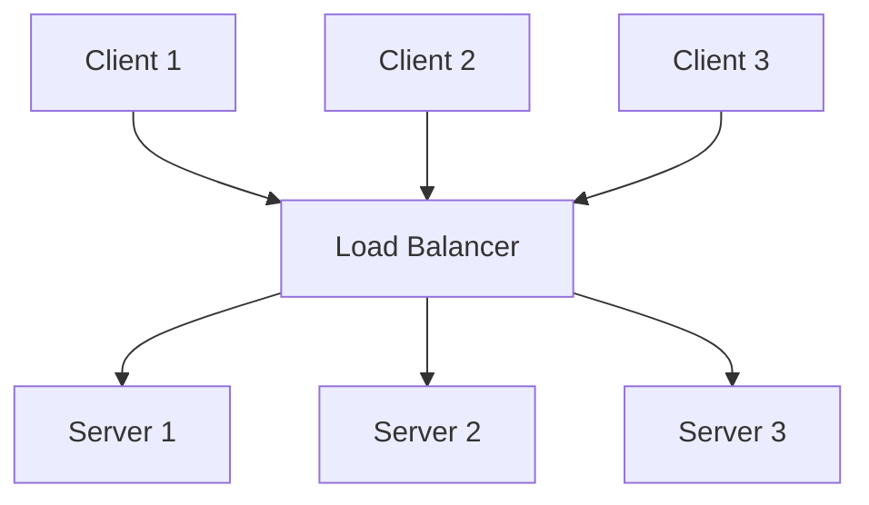

**Load Balancing** verteilt eingehende Rechen- oder Netzwerklasten auf zwei oder mehr Server, um die Belastung einzelner Systeme zu reduzieren, die Gesamtperformance zu erhöhen und die Latenz zu verringern. Es trägt zur Hochverfügbarkeit und Skalierbarkeit von IT-Infrastrukturen bei, indem es Ausfälle einzelner Server ausgleicht und den Datenverkehr effizient verteilt.

## Kontext und Einordnung

Load Balancing kommt in Netzwerken und Server-Architekturen zum Einsatz, wo hohe Verfügbarkeit und Performance erforderlich sind. Es unterscheidet sich von Clustering, das primär für Ausfallsicherheit durch Replikation ausgelegt ist, und von DNS-basiertem Routing, das statisch auf Domain-Ebene arbeitet. Hardwarebasierte Load Balancer bieten hohe Geschwindigkeit, während softwarebasierte Lösungen wie nginx flexibler und kostengünstiger sind. Im [OSI-Modell](osi-modell) arbeitet Load Balancing typischerweise auf Schicht 4 (Transport) oder 7 (Anwendung).

### Layer 4 vs. Layer 7 Load Balancing

Load Balancing kann auf zwei fundamentalen Ebenen erfolgen, die sich in Funktionsweise, Geschwindigkeit und Intelligenz unterscheiden.

**Layer 4 Load Balancing** arbeitet auf der Transportschicht des [OSI-Modells](osi-modell) und entscheidet basierend auf IP-Adressen und TCP/UDP-Ports, ohne den Paketinhalt zu inspizieren. Es verwendet Network Address Translation (NAT), um Anfragen an Backend-Server weiterzuleiten. Dieser Ansatz ist schnell und effizient für einfache Protokolle wie DNS, SNMP oder UDP-basierte Anwendungen wie Video-Streaming und VoIP.

**Layer 7 Load Balancing** operiert auf der Anwendungsschicht und analysiert den Inhalt der Nachrichten, etwa HTTP-Header, URLs oder Cookies. Als vollständiger Reverse Proxy ermöglicht es intelligente Entscheidungen, etwa basierend auf Datentypen oder Session-Status. Es unterstützt Funktionen wie Caching, Web Application Firewall (WAF) und flexibles Routing, eignet sich jedoch besser für Web-Traffic. Der Durchsatz kann etwas geringer sein als bei reinem Layer 4, die Flexibilität ist jedoch höher.

Die Wahl zwischen Layer 4 und Layer 7 hängt vom Anwendungsfall ab: Layer 4 für Geschwindigkeit und einfache Protokolle, Layer 7 für komplexe Web-Anwendungen mit Inhaltsanalyse.

## Vorgehen

Die Lastverteilung erfolgt durch Algorithmen, die statisch oder dynamisch den Datenverkehr auf Server verteilen. Health Checks überwachen die Server-Verfügbarkeit, und Session Persistence stellt die Konsistenz von Benutzersitzungen sicher.

### Algorithmen zur Lastverteilung

- **Round-Robin**: Verteilt Anfragen zyklisch auf die verfügbaren Server. Jeder Server erhält abwechselnd eine Anfrage, was zu einer gleichmäßigen Verteilung führt. Bei DNS-Round-Robin kann clientseitiges Caching jedoch zu Ungleichgewichten führen; softwarebasierte Implementierungen vermeiden dies durch aktive Verteilung.

- **Least Connection**: Leitet neue Anfragen an den Server mit der geringsten Anzahl aktiver Verbindungen. Dieser dynamische Algorithmus berücksichtigt unterschiedliche Bearbeitungszeiten und gleicht Lasten bei variablen Anfragezeiten aus.

- **Weighted Load Balancing**: Erweitert Round-Robin oder Least Connection um Gewichtungen, die die Kapazität der Server widerspiegeln. Server mit höherer Leistung erhalten mehr Anfragen.

- **IP-Hash**: Berechnet basierend auf der Client-IP-Adresse den Zielserver. Dies ermöglicht Session Persistence ohne zusätzliche Mechanismen.

### Health Checks

Load Balancer führen Health Checks durch, um die Funktionsfähigkeit der Backend-Server zu prüfen. Passive Health Checks erkennen Fehler durch fehlgeschlagene Antworten. Active Health Checks senden regelmäßige Testanfragen, etwa HTTP GET an einen Endpunkt wie /health. Parameter wie max_fails (maximale Fehlversuche) und fail_timeout (Zeit bis zur erneuten Prüfung) steuern das Verhalten. Defekte Server werden aus dem Verkehr gezogen, bis sie wieder verfügbar sind.

### Session Persistence

Bei zustandsbehafteten Anwendungen, die serverseitige Sitzungsdaten speichern (etwa Einkaufswagen), stellt Session Persistence sicher, dass alle Anfragen eines Clients während einer Sitzung an denselben Server geleitet werden. Implementierungen nutzen Cookies oder IP-Hash. Bei Server-Ausfall wird die Sitzung typischerweise neu initialisiert.

## Beispiele

In einem Webserver-Cluster verteilt ein Load Balancer eingehende HTTP-Anfragen auf drei Server. Bei Round-Robin erhält Server 1 die erste Anfrage, Server 2 die zweite, Server 3 die dritte, dann beginnt der Zyklus erneut. Health Checks prüfen stündlich die Erreichbarkeit; fällt ein Server aus, leitet der Balancer den Traffic um. Für eine E-Commerce-Anwendung mit Warenkorb-Funktionalität aktiviert Session Persistence via Cookies, um Datenverlust zu vermeiden.

Dieses Diagramm zeigt einen einfachen Load-Balancing-Szenario, bei dem Clients über einen zentralen Load Balancer auf mehrere Server zugreifen.

## Häufige Fehler und Tipps

- **Fehler**: DNS-basiertes Load Balancing mit Round-Robin führt durch Caching zu ungleichmäßiger Last. Reverse-Proxy-basierte Lösungen eignen sich für dynamische Verteilung.
- **Fehler**: Vernachlässigung von Health Checks resultiert in Anfragen an ausgefallene Server. Active Health Checks mit angemessenen fail_timeout-Werten reduzieren dieses Risiko.
- **Fehler**: Übermäßiger Einsatz von Session Persistence bei skalierbaren Anwendungen. Zustandslose Architekturen erhöhen die Flexibilität.
- Kontinuierliches Monitoring von Metriken wie Antwortzeiten und Server-Auslastung ermöglicht die Anpassung der Algorithmen.
- Bei hardwarebasierten Load Balancern wird Redundanz empfohlen, um Single Points of Failure zu vermeiden.

## Weiterführendes

Load Balancing ist eng mit Themen wie Hochverfügbarkeit, [Cloud Computing](cloud-computing) und [Internet of Things](iot) verbunden. Für praktische Implementierungen bieten nginx, HAProxy oder cloudbasierte Services wie AWS Elastic Load Balancing detaillierte Dokumentationen.
