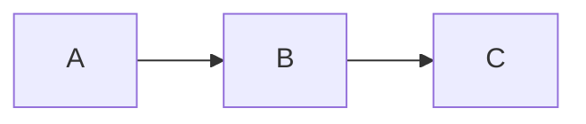
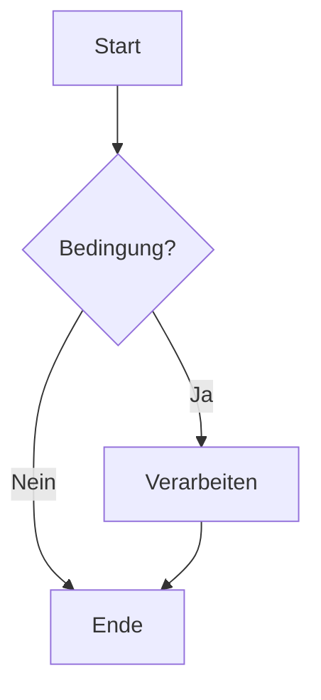
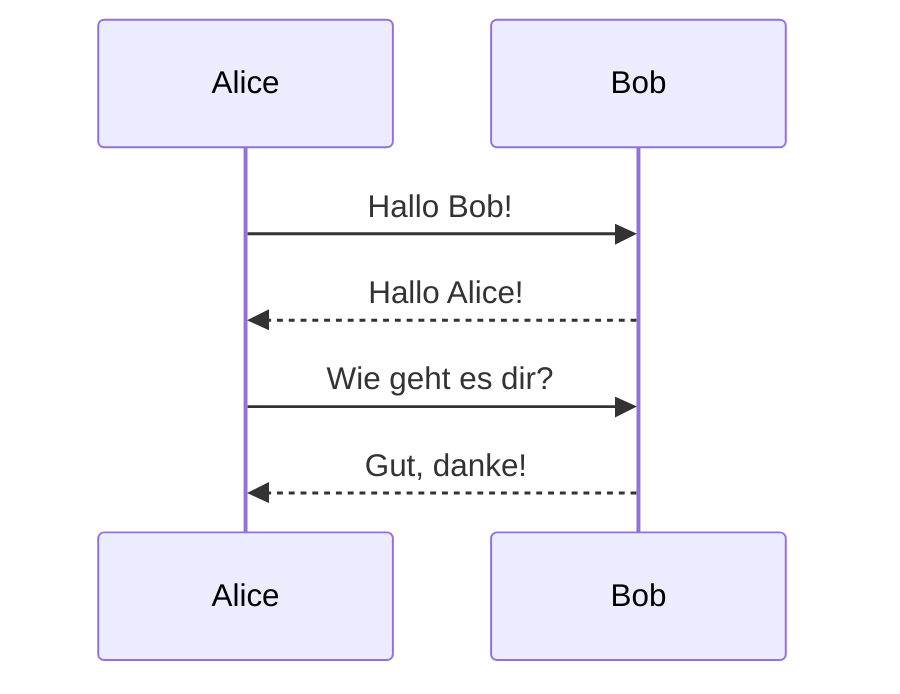
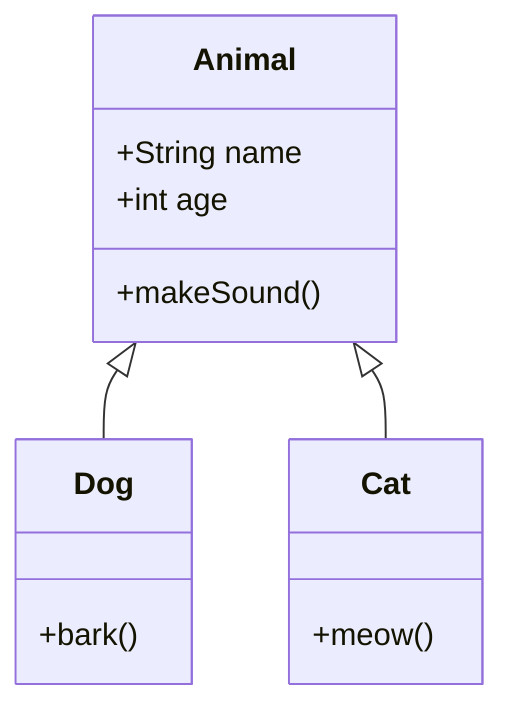

# Mermaid ASCII Diagramme

Diese Seite demonstriert ASCII-Diagramme mit beautiful-mermaid.

## Einfacher Graph

[[Math]]

## Workflow-Diagramm

## Sequenzdiagramm

## Klassendiagramm

## Vergleich: Standard vs ASCII

Zum Vergleich hier ein Standard-Mermaid-Diagramm (mit VitePress-Renderer):

Und das gleiche als ASCII (mit beautiful-mermaid):

