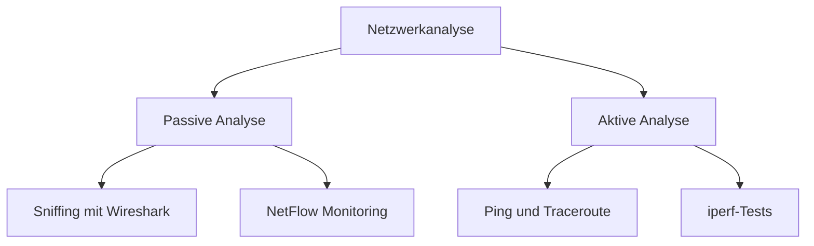

Die **Netzwerkanalyse** umfasst die systematische Untersuchung und Bewertung von Netzwerkverbindungen, um Leistung, Sicherheit und Zuverlässigkeit zu gewährleisten. Sie identifiziert Engpässe, diagnostiziert Fehler und optimiert Netzwerke in der Softwareentwicklung und IT-Administration. Typische Anwendungen umfassen die Überwachung von Datenverkehr, die Analyse von Protokollen und die Erkennung von Sicherheitsrisiken.

## Kontext und Einordnung

Netzwerkanalyse spielt eine zentrale Rolle in der Daten- und Prozessanalyse, insbesondere in der Netzwerkadministration und Softwareentwicklung. Sie misst und verbessert die Effizienz von Kommunikationssystemen durch Sammeln und Analysieren von Datenverkehrsinformationen. Im Rahmen des [OSI-Modells](osi-modell) arbeitet die Analyse auf verschiedenen Schichten, von der physikalischen Ebene bis zur Anwendungsschicht. Sie unterstützt die Qualitätssicherung in Unternehmensnetzwerken, Cloud-Infrastrukturen und IoT-Systemen, wo Stabilität und Geschwindigkeit entscheidend sind.

## Begriffe und Definitionen

- **Bandbreite**: Die maximale Datenmenge, die pro Zeiteinheit übertragen werden kann, gemessen in Bit pro Sekunde (bps).
- **Latenz**: Die Zeitspanne zwischen dem Senden einer Anfrage und dem Empfang der Antwort, oft in Millisekunden (ms) angegeben.
- **Paketverlust**: Der Anteil der Datenpakete, die während der Übertragung verloren gehen, ausgedrückt als Prozentsatz.
- **Jitter**: Die Schwankung der Latenz über mehrere Messungen, relevant für Echtzeit-Anwendungen wie Video- oder Sprachübertragung.
- **Throughput**: Die tatsächlich übertragene Datenmenge pro Zeiteinheit, die unter der Bandbreite liegen kann.
- **Traffic Monitoring**: Die kontinuierliche Überwachung des Datenverkehrs zur Erkennung von Mustern und Anomalien.
- **Protokollanalyse**: Die Untersuchung von Netzwerkprotokollen wie [TCP/IP](tcp-ip-modell), um Kommunikationsabläufe zu verstehen.
- **SNMP (Simple Network Management Protocol)**: Ein Standardprotokoll zur Abfrage und Verwaltung von Netzwerkgeräten.
- **Passive Analyse**: Methode, bei der Datenverkehr ohne Eingriff in das Netzwerk beobachtet wird, z. B. durch Sniffing.
- **Aktive Analyse**: Methode, bei der Tests wie Ping oder Traceroute durchgeführt werden, um das Netzwerk zu stimulieren.

## Vorgehen

Die Netzwerkanalyse folgt typischerweise diesen Schritten:

1. **Ziel definieren**: Die Ziele der Analyse werden festgelegt, um den Fokus auf Leistung, Sicherheit oder Zuverlässigkeit zu bestimmen.
2. **Kennzahlen festlegen**: Relevante Metriken wie Latenz, Paketverlust und Jitter werden ausgewählt.
3. **Methode wählen**: Es wird zwischen passiver Analyse (z. B. NetFlow) oder aktiver Analyse (z. B. iperf-Tests) entschieden.
4. **Daten sammeln**: Werkzeuge wie Wireshark für Protokollanalyse oder SNMP für Geräteabfragen werden verwendet.
5. **Daten analysieren**: Messwerte werden mit Schwellenwerten verglichen (z. B. Latenz unter 50 ms für gute Erfahrung).
6. **Optimieren und dokumentieren**: Engpässe werden identifiziert, Verbesserungen implementiert und Ergebnisse dokumentiert.

## Beispiele

### Passives Traffic Monitoring mit NetFlow

In einem Unternehmensnetzwerk wird NetFlow aktiviert, um den Datenverkehr zu überwachen. Dummy-Daten zeigen: Von 10:00 bis 11:00 Uhr fließen 500 GB Daten, hauptsächlich von Server A zu Client B. Anomalie: Ungewöhnlicher Traffic-Peak von 100 Mbps zu einem unbekannten IP-Bereich, was auf ein mögliches Sicherheitsrisiko hinweist. Analyse ergibt: Paketverlust von 0,5 %, Latenz von 20 ms.

### Aktive Latenzmessung mit Ping

Ein Administrator führt Ping-Tests durch: ping -c 10 example.com. Ergebnis: Minimum 15 ms, Maximum 25 ms, Durchschnitt 18 ms, Paketverlust 0 %. Jitter berechnet als Standardabweichung: $$ \sigma = \sqrt{\frac{\sum (x_i - \bar{x})^2}{n-1}} $$ mit Werten wie 15, 17, 18, 19, 20 ms ergibt ca. 2 ms Jitter. Das deutet auf stabile Verbindungen hin.

### Diagramm: Passive vs. aktive Analyse

Dieses Diagramm zeigt die Unterteilung der Methoden: Passive Analyse beobachtet ohne Eingriff, aktive Analyse testet aktiv.

## Häufige Fehler und Empfehlungen

- **Fehler**: Vernachlässigung von Jitter in Echtzeit-Anwendungen führt zu Qualitätsverlusten. Empfehlung: Jitter sollte gemessen und unter 5 ms gehalten werden.
- **Fehler**: Nur passive Analyse verwenden, ohne aktive Tests. Empfehlung: Beide Methoden sollten kombiniert werden, um vollständige Einsicht zu erhalten.
- **Fehler**: Messungen ohne Kontext durchführen. Empfehlung: Messungen sollten mit Benchmarks verglichen werden (z. B. Throughput > 80 % der Bandbreite).
- **Fehler**: SNMP nicht konfigurieren. Empfehlung: SNMP sollte auf Routern und Switches aktiviert werden, um detaillierte Gerätedaten zu erhalten.

## Weiterführendes

Für tiefergehende Kenntnisse kann die Untersuchung von Tools wie perfSONAR für erweiterte Messungen nützlich sein. Die Verknüpfung zur Netzwerksicherheit bietet weitere Einblicke in Angriffserkennung.
