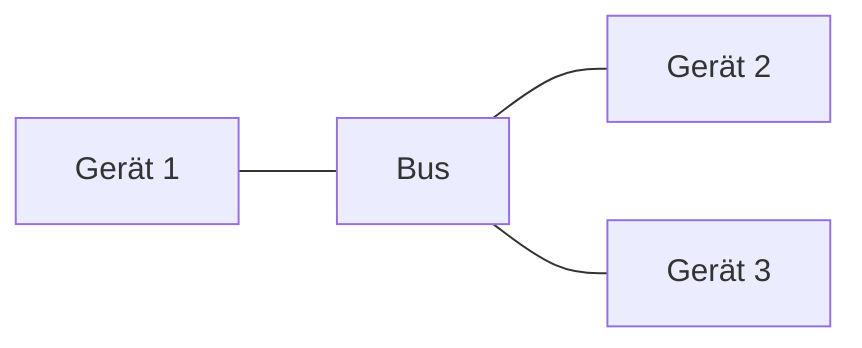
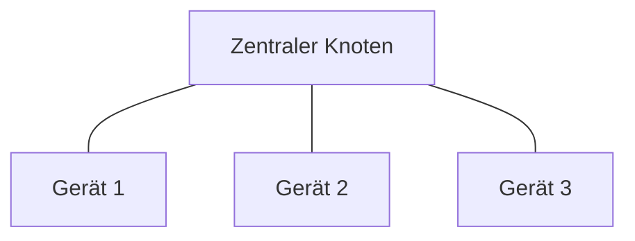
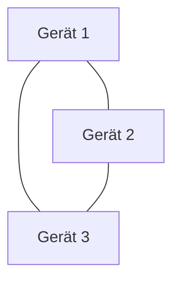
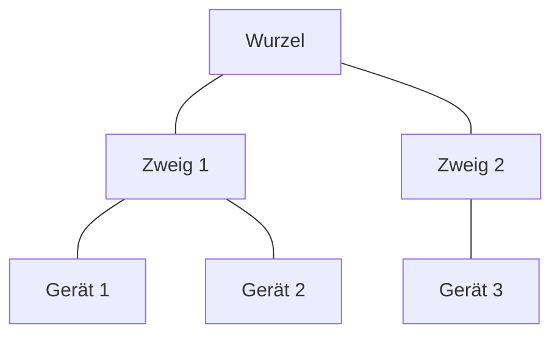

**Netzwerkkonzepte** umfassen die Grundlagen zur Strukturierung und Sicherung von Computernetzen. Sie unterscheiden verschiedene Netzwerktypen nach geografischer Reichweite, beschreiben physische und logische Anordnungen durch Topologien sowie Sicherheitsmechanismen zur Abwehr von Risiken. Diese Konzepte bilden die Basis für die Analyse und Optimierung von Datenflüssen in beruflichen Anwendungen, wie der Vernetzung von Geräten in Unternehmen oder der sicheren Kommunikation über das Internet.

## Kurzüberblick

Netzwerkkonzepte beschreiben die Organisation von Computernetzen zur effizienten Datenübertragung und Sicherheit. Sie gliedern sich in Netzwerktypen, die je nach Ausdehnung und Teilnehmerzahl variieren, Sicherheitsmechanismen zum Schutz vor Angriffen sowie Topologien zur physischen und logischen Vernetzung von Geräten. In der Daten- und Prozessanalyse dienen diese Konzepte zur Planung skalierbarer und sicherer Infrastrukturen, beispielsweise in Unternehmensnetzen oder IoT-Anwendungen.

## Netzwerktypen

Netzwerktypen klassifizieren Computernetze nach geografischer Reichweite, Anzahl der Teilnehmer und verwendeten Technologien. Die Abgrenzung erfolgt grob nach Metern für PAN, Quadratkilometern für LAN, Kilometern für MAN, Ländern für WAN und global für GAN. Typische Anwendungen reichen von persönlichen Geräten bis hin zum weltweiten Internet.

### PAN (Personal Area Network)

Ein PAN verbindet Geräte in unmittelbarer Nähe, wie Smartphones, Tablets und Wearables. Technologien umfassen Bluetooth, ZigBee oder NFC mit Reichweiten von 1 bis 10 Metern und Datenraten bis zu 3 Mbit/s. Es findet Anwendung in persönlichen Netzen, etwa zur Synchronisation von Geräten oder in Smart-Home-Systemen. Sicherheitsaspekte basieren auf einfacher Verschlüsselung wie AES bei ZigBee oder Preshared Keys bei Bluetooth.

### LAN (Local Area Network)

Ein LAN umfasst Netze innerhalb eines Gebäudes oder Campus, typischerweise bis zu $1 \text{ km}^2$. Es nutzt Ethernet-Kabel oder WLAN mit hohen Datenraten von 10 Mbit/s bis 100 Gbit/s. Anwendungen sind Büro- oder Schulnetze zur gemeinsamen Ressourcennutzung. Sicherheit erreicht man durch [VLAN](vlan) zur logischen Trennung, Firewalls und WPA3-Verschlüsselung. WLAN als Teil des LAN bietet kabellose Mobilität, aber höhere Risiken durch Abhörmöglichkeiten.

### MAN (Metropolitan Area Network)

Ein MAN verbindet Standorte in einer Stadt oder Region, bis zu 100 km entfernt, oft über Glasfaser mit Raten bis zu 100 Gbit/s. Es dient der Vernetzung von Niederlassungen oder Universitätsfakultäten. Sicherheit erfolgt durch VPN oder spezielle Verschlüsselung zur sicheren Datenübertragung zwischen entfernten Punkten.

### WAN (Wide Area Network)

Ein WAN erstreckt sich über Länder oder Kontinente, bereitgestellt durch Provider wie Telekommunikationsunternehmen. Technologien sind DSL, Glasfaser oder Satelliten mit variablen Raten von 1 Mbit/s bis 100 Gbit/s. Es ermöglicht globale Kommunikation, etwa für internationale Geschäftskontakte. Sicherheitsmaßnahmen umfassen IPsec oder VPN zur Verschlüsselung.

### GAN (Global Area Network)

Ein GAN bildet das weltweite Netz, wie das Internet, durch Zusammenschluss vieler WANs über Unterseekabel und Satelliten. Datenraten reichen von 1 Gbit/s bis über 100 Gbit/s. Es dient globaler Konnektivität und erfordert starke Sicherheit wie TLS für Webverbindungen oder IPsec für globale Netze.

## Sicherheitskonzepte

Sicherheitskonzepte in Netzwerken schützen vor Risiken wie Man-in-the-Middle-Angriffen oder unbefugtem Zugriff. Sie umfassen Verschlüsselung, Authentifizierung und Maßnahmen wie Firewalls. In der Analyse von Prozessen hilft dies, Schwachstellen zu identifizieren und zu beheben.

### Verschlüsselungstechnologien

- WPA2 und WPA3 sichern WLAN-Verbindungen; WPA3 bietet verbesserten Schutz gegen Brute-Force.
- PSK eignet sich für kleine Netze mit gemeinsamem Schlüssel.
- RADIUS ermöglicht zentrale Authentifizierung für größere Netze.
- [IPsec](ipsec) verschlüsselt Daten auf Netzwerkebene, oft in VPNs verwendet.
- TLS schützt Übertragungen, besonders im Web.

### Sicherheitsrisiken

- MitM-Angriffe, bei denen Angreifer Daten abfangen.
- Unverschlüsselte Netze erlauben einfachen Zugriff.
- Schwache Passwörter oder veraltete Standards wie WEP erhöhen Angriffsrisiken.
- Rogue Access Points täuschen legitime WLAN-Zugänge vor.

### Sicherheitsmaßnahmen

- Firewalls blockieren unerwünschten Verkehr.
- VPN verbergen Standorte und verschlüsseln Verbindungen.
- Netzsegmentierung durch VLANs trennt Bereiche.
- Zugriffskontrollen über RADIUS begrenzen Berechtigungen.
- Regelmäßige Updates und starke Passwörter minimieren Lücken.
- IDS und IPS überwachen und reagieren auf Bedrohungen.

## Netzwerktopologien

Topologien beschreiben die physische und logische Anordnung von Geräten in Netzwerken. Sie beeinflussen Ausfallsicherheit, Kosten und Skalierbarkeit. In der Praxis kombiniert man oft Topologien für optimale Leistung.

### Bustopologie

Alle Geräte teilen ein gemeinsames Kabel. Vorteile: Einfach und günstig. Nachteile: Kabelbruch führt zum Gesamtausfall; begrenzte Bandbreite.

### Sterntopologie

Geräte verbinden sich mit einem zentralen Hub oder Switch. Vorteile: Hohe Ausfallsicherheit bei Einzelgeräteausfall. Nachteile: Ausfall des Zentrums betrifft das ganze Netz.

### Ringtopologie

Geräte bilden einen geschlossenen Ring. Vorteile: Geringe Kollisionen. Nachteile: Ausfall eines Elements unterbricht den Ring.

### Vermaschte Topologie

Mehrere Verbindungen pro Gerät. Vorteile: Sehr hohe Ausfallsicherheit. Nachteile: Hoher Verkabelungsaufwand.

### Baumtopologie

Hierarchische Struktur wie ein Baum. Vorteile: Erweiterbar. Nachteile: Ausfall zentraler Verbindungen betrifft Teile des Netzes.

## Häufige Fehler und Tipps

- Nicht alle Topologien sind gleich sicher: Bei Bustopologie einen Kabelbruch vermeiden, indem redundante Verbindungen geprüft werden.
- Schwache Verschlüsselung wie PSK in großen Netzen vermeiden; stattdessen RADIUS nutzen, da es individuelle Authentifizierung bietet.
- Unverschlüsselte PAN-Geräte nicht in sensiblen Umgebungen verwenden; AES bei ZigBee bevorzugen, weil es robust gegen Abhörangriffe ist.
- Bei Topologie-Wahl Kosten und Skalierbarkeit abwägen: Stern für Einfachheit, Vermascht für Kritikalität.
