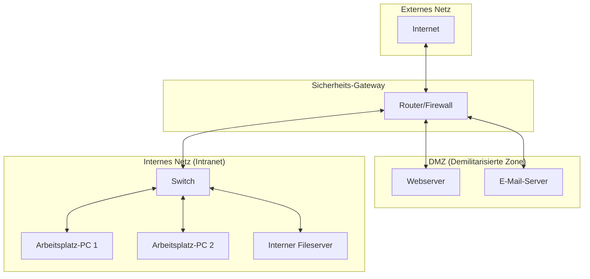

Ein **Netzwerkplan** ist eine schematische Darstellung einer Netzwerkarchitektur, die physische Hardwarekomponenten und deren logische Verbindungen abbildet. Als zentrales Dokumentationswerkzeug dient er als Grundlage für die Planung, Implementierung, Fehlerdiagnose und Verwaltung von IT-Systemen.

## Lernziele

Dieser Artikel vermittelt Kenntnisse über folgende Aspekte:

- Bedeutung eines Netzwerkplans für den sicheren Betrieb.
- Differenzierung zwischen physischen und logischen Netzwerkplänen.
- Identifikation wichtiger Netzwerkkomponenten und deren Symbole.
- Konzepte der Netzsegmentierung und Zonierung (z. B. DMZ).
- Strukturierter Entwurf eines Netzwerkplans basierend auf technischen Anforderungen.

## Kurzüberblick

Ein Netzwerkplan schafft Transparenz über die Struktur einer IT-Umgebung. Er dokumentiert vorhandene Geräte wie Router, Switches oder Server, deren physische Verkabelung und die logische Steuerung des Datenverkehrs. Aktuelle Pläne sind Voraussetzung für eine effiziente Fehlersuche und die Einhaltung von Sicherheitsstandards.

## Kontext und Einordnung

In der IT-Administration ist die Erstellung von Netzwerkplänen eine regulatorische Notwendigkeit. Gemäß dem Standard NET.1.1 des BSI IT-Grundschutzes ist eine aktuelle Netzdokumentation für den sicheren Betrieb von Informationsverbünden verpflichtend. Netzwerkpläne unterstützen die [Informationssicherheit](datensicherheit), indem sie Angriffsflächen sichtbar machen und die Planung von Schutzmaßnahmen wie Firewalls und Zugriffskontrollen ermöglichen.

## Begriffe und Definitionen

### Physischer Netzwerkplan

Der physische Netzwerkplan konzentriert sich auf die Hardware und die tatsächliche Infrastruktur. Er dokumentiert:

- **Geräte:** Standorte von Servern, Switches und Routern, oft inklusive Raum- und Rack-Nummern.
- **Verkabelung:** Verwendete Kabeltypen (z. B. Kupfer-Ethernet oder Glasfaser) sowie Port-Belegungen.
- **Schnittstellen:** Physische Anschlüsse und deren Spezifikationen.

Ziel ist die Beantwortung der Frage nach dem physischen Standort und der materiellen Verbindung der Geräte.

### Logischer Netzwerkplan

Der logische Netzwerkplan beschreibt den Datenfluss und die abstrakte Struktur des Netzwerks, unabhängig von der physischen Platzierung der Geräte. Wesentliche Inhalte sind:

- **[IP-Adressierung](ip):** Subnetze, Masken und Gateway-Informationen.
- **VLANs:** Virtuelle Trennungen innerhalb physischer Infrastrukturen.
- **Routing:** Pfade, über die Datenpakete zwischen Netzen geleitet werden.

Der Fokus liegt auf der Art der Kommunikation zwischen den Systemen.

### Netzsegmentierung und Zonen

Ein moderner Netzwerkplan weist Sicherheitszonen aus. Der IT-Grundschutz sieht häufig eine Trennung in drei Kernbereiche vor:

1. **Internes Netz (Intranet):** Vertrauenswürdiger Bereich für interne Clients und Server.
2. **Demilitarisierte Zone (DMZ):** Pufferzone für Dienste, die aus dem Internet erreichbar sein müssen (z. B. Webserver).
3. **Externes Netz (Internet):** Nicht vertrauenswürdiger Bereich.

## Vorgehen

Die Erstellung eines Netzwerkplans erfolgt in der Regel strukturiert:

1. **Bestandsaufnahme:** Erfassung aller aktiven Netzwerkkomponenten (Router, Switches, Firewalls, Endgeräte).
2. **Strukturierung:** Trennung in eine physische Ansicht (Verkabelung) und eine logische Ansicht (Datenfluss).
3. **Zonierung:** Festlegung von Sicherheitsbereichen und Identifikation der Übergangspunkte.
4. **Visualisierung:** Einsatz standardisierter Symbole für Geräte und Verbindungstypen.
5. **Validierung und Aktualisierung:** Regelmäßiger Abgleich des Plans mit der realen Konfiguration.

## Beispiele

### Einfache Netzarchitektur mit DMZ

Das folgende Diagramm zeigt eine klassische Drei-Zonen-Architektur:

Zugriffe aus dem externen Netz dringen nur bis zur DMZ vor, während das interne Netz durch das Sicherheits-Gateway geschützt bleibt.

### Logische vs. Physische Betrachtung

In komplexen Umgebungen kann eine physische [Sterntopologie](netzwerktopologie) logisch mehrere getrennte Netzwerke abbilden, beispielsweise durch den Einsatz von VLANs.

## Häufige Fehler und Tipps

- **Fehlende Aktualität:** Veraltete Pläne erschweren die Fehlersuche. Netzwerkpläne sollten integraler Bestandteil des Änderungsmanagements sein.
- **Mangelnde Detailtiefe:** Kritische Informationen wie IP-Adressbereiche oder VLAN-IDs fehlen oft im logischen Plan.
- **Vermischung der Ebenen:** Überladene Pläne, die physische und logische Details gleichzeitig darstellen, verlieren an Lesbarkeit. Die Verwendung separater Layer oder Dokumente für physische und logische Sichten ist zweckmäßig.
- **Fehlende Legende:** Symbole müssen eindeutig erklärt sein, sofern keine Industriestandards verwendet werden.

## Selbsttest

1. Warum ist ein rein physischer Netzwerkplan für die Diagnose von Routing-Problemen unzureichend?
2. Welche drei Zonen sieht der IT-Grundschutz für eine grundlegende Netzarchitektur vor?
3. Welcher Dokumenttyp (physisch oder logisch) enthält Informationen zur VLAN-Konfiguration?
4. Welche Funktion erfüllt eine DMZ innerhalb eines Netzwerkplans?
5. Warum ist die Dokumentation der Port-Belegungen im physischen Plan für Wartungsarbeiten wichtig?
