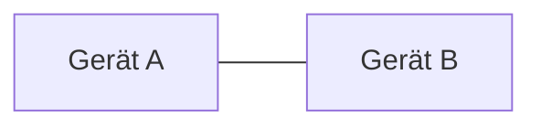
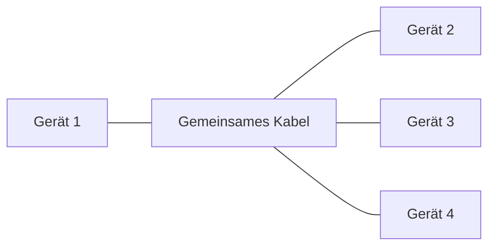
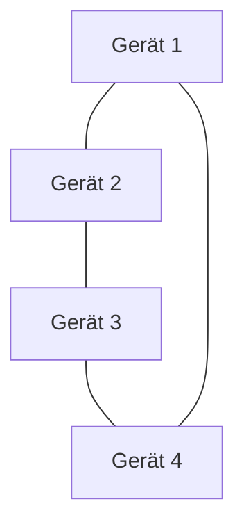
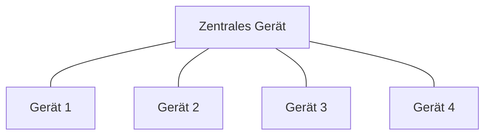
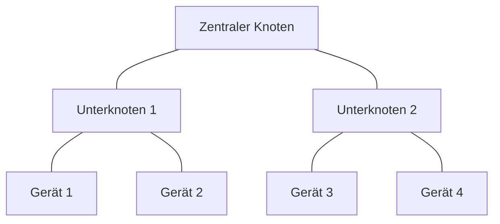
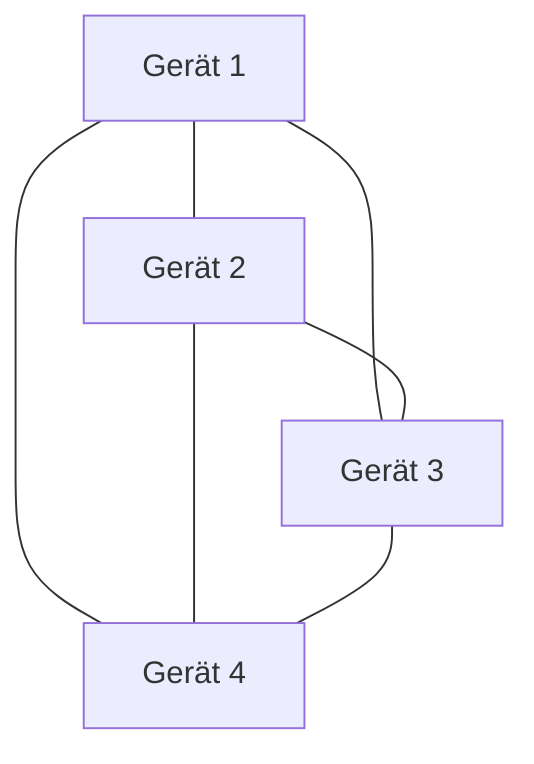

Die **Netzwerktopologie** beschreibt die physische und logische Anordnung von Knoten und Verbindungen in einem Rechnernetzwerk. Sie bestimmt, wie Daten zwischen Geräten fließen, und beeinflusst Kosten, Zuverlässigkeit und Wartungsaufwand. Verschiedene Topologien wie Stern, Ring oder Mesh bieten unterschiedliche Vor- und Nachteile für verschiedene Anwendungsfälle.

## Lernziele

- Erklärung der Unterschiede zwischen physischer und logischer Topologie.
- Kenntnis der wichtigsten Topologietypen und ihrer Anwendungsbereiche.
- Abwägung von Vor- und Nachteilen verschiedener Topologien zur Auswahl der geeigneten für ein Netzwerk.

## Kurzüberblick

Netzwerktopologien bilden die Grundlage für den Aufbau von Rechnernetzen. Sie unterscheiden sich in physische Topologien, die die tatsächliche Verkabelung und Geräteplatzierung beschreiben, und logische Topologien, die den Datenfluss darstellen. Wichtige Topologien sind Punkt-zu-Punkt, Bus, Ring, Stern, Baum und Mesh. Die Wahl der Topologie hängt von Faktoren wie Kosten, Ausfallsicherheit und Skalierbarkeit ab und findet Anwendung in lokalen Netzwerken, Rechenzentren und industriellen Systemen.

## Kontext und Einordnung

Netzwerktopologien sind in der Daten- und Prozessanalyse entscheidend, da sie die Effizienz von Kommunikationswegen in Netzwerken bestimmen. Sie werden bei der Planung von [Netzwerkkonzepten](netzwerkkonzepte) berücksichtigt, um Datenströme zu optimieren und Risiken wie Ausfälle zu minimieren. Physische Topologien betreffen die Infrastruktur, wie Kabel verlegt werden, während logische Topologien den Signalfluss unabhängig davon beschreiben. Ein Beispiel: Ein Ethernet-Netzwerk mit einem Hub ist physisch sternförmig, aber logisch wie ein Bus, da Signale an alle Geräte gehen. Mit einem [Switch](switching) wird es auch logisch zu einem Stern.

## Begriffe und Definitionen

- **Physische Topologie**: Beschreibt den tatsächlichen Aufbau der Netzverkabelung und die Platzierung der Netzwerkkomponenten, wie Switches oder Router.
- **Logische Topologie**: Beschreibt, wie Daten durch das Netzwerk fließen, unabhängig von der physischen Verkabelung.
- **Knoten**: Verbindungspunkte im Netzwerk, einschließlich Endgeräte wie Computer und Netzwerkkomponenten wie Router oder Switches.
- **Links/Verbindungen**: Übertragungsmedien, die Daten zwischen Knoten transportieren, z. B. Kabel oder drahtlose Verbindungen.

## Vorgehen: Topologietypen

Die Auswahl einer Topologie erfolgt in mehreren Schritten: Zunächst die Anforderungen an das Netzwerk definieren (z. B. Anzahl der Geräte, Budget, Ausfallsicherheit). Dann die Topologietypen vergleichen und die passende implementieren. Hier die wichtigsten Typen:

### Punkt-zu-Punkt-Topologie

Diese Topologie verbindet zwei Geräte direkt. Sie bietet hohe Geschwindigkeit und einfache Wartung, ist aber auf zwei Teilnehmer beschränkt. Bei Ausfall eines Geräts bricht die Kommunikation ab. Einsatz: Basis für Fiber-Channel-Netze.

### Bus-Topologie

Alle Geräte teilen sich ein gemeinsames Kabel. Kostengünstig und einfach in der Installation, aber Ausfall des Kabels legt das Netzwerk lahm. Kollisionen können auftreten. Historisch in älteren Ethernet-Netzwerken verwendet.

### Ring-Topologie

Geräte bilden einen geschlossenen Ring, jeder Knoten hat zwei Nachbarn. Deterministische Kommunikation ohne Kollisionen, aber Ausfall eines Knotens kann den Ring unterbrechen. Dual-Ring-Systeme bieten Redundanz. Einsatz: Token Ring, FDDI, Feldbussysteme.

### Stern-Topologie

Alle Geräte verbinden sich mit einem zentralen Hub oder Switch. Einfache Fehlerbehebung und Erweiterung, aber Abhängigkeit vom Zentrum. Standard in modernen LANs.

### Baum-Topologie

Hierarchische Struktur mit zentralem Wurzelknoten und untergeordneten Sternen. Gut organisiert und erweiterbar, aber Ausfall des Wurzelknotens beeinträchtigt Teilbereiche. Einsatz in großen Gebäuden.

### Mesh-Topologie

Geräte sind vielfach verbunden, mit redundanten Pfaden. Hohe Ausfallsicherheit und Leistung, aber hohe Kosten. Einsatz: Internet, Rechenzentren, drahtlose Mesh-Netzwerke.

Hybride Topologien kombinieren diese Typen, z. B. Stern-Bus in älteren Netzwerken oder Stern-Stern in modernen Unternehmensnetzen.

## Beispiele

### Worked Example 1: Kleines Büro-Netzwerk

Ein Büro mit 5 Computern und einem Drucker verwendet eine Stern-Topologie mit einem zentralen Switch. Jedes Gerät verbindet sich direkt mit dem Switch. Vorteil: Einfache Erweiterung um einen weiteren Computer. Nachteil: Ausfall des Switches legt das Netzwerk lahm. Alternative: Mesh-Topologie für höhere Sicherheit, aber mit höheren Kosten.

### Worked Example 2: Industrielles Ring-Netzwerk

In einer Fabrik verbinden Sensoren und Steuerungen in einer Ring-Topologie. Daten laufen deterministisch im Kreis. Bei Ausfall eines Sensors bleibt der Ring intakt dank Redundanz. Dies ermöglicht zuverlässige Prozesssteuerung.

## Häufige Fehler und Tipps

- Point-to-Multipoint nicht als eigenständige Grundtopologie ansehen; es handelt sich um ein Verbindungsmuster oder eine Variante der Stern-Topologie.
- Line- und Bus-Topologie nicht verwechseln: Line-Topologie ist ein offener Ring, oft in Industrie-Kontexten; klar abgrenzen.
- Ausfall eines Geräts in Punkt-zu-Punkt nicht generell als kritisch betrachten: Gilt nur für exakt zwei Teilnehmer; bei Mehrfachverbindungen variiert dies.
- Beispiele für physikalisch vs. logisch verwenden: Immer mit Hub (logisch Bus) vs. Switch (logisch Stern) illustrieren.
- Hybride Topologien nicht ignorieren: In der Praxis wichtig, z. B. für große Netze.
- Tipp: Bei Auswahl der Topologie Kosten gegen Ausfallsicherheit abwägen; Mesh für kritische Anwendungen, Stern für Einfachheit.

## Selbsttest

1. Was ist der Unterschied zwischen physischer und logischer Topologie?
2. Welche Vor- und Nachteile hat die Stern-Topologie?
3. Wann wird eine Mesh-Topologie gewählt?
4. Was ist ein Beispiel für eine hybride Topologie?
5. Warum ist die Ring-Topologie deterministisch?
6. Wie beeinflusst die Topologie die Netzwerkkosten?

## Weiterführendes

Für tiefergehende Kenntnisse zu Netzwerkprotokollen siehe [OSI-Modell](osi-modell).