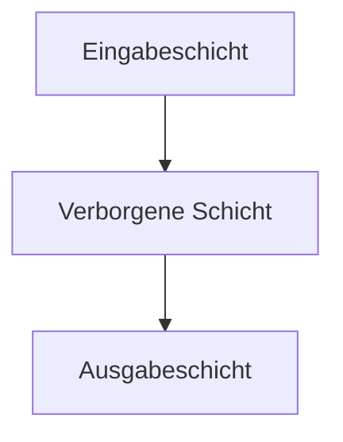

**Neuronale Netze** sind Modelle des [Maschinellen Lernens](maschinelles-lernen), die dem menschlichen Gehirn nachempfunden sind. Sie bestehen aus mehreren Schichten von Knoten, die Informationen gewichten und verarbeiten, um Ergebnisse zu erzielen. Diese Netze eignen sich besonders für die Analyse komplexer Daten und finden Anwendung in Bereichen wie Bildverarbeitung und Prognosen.

## Kontext und Einordnung

Neuronale Netze gehören zu den Methoden des Maschinellen Lernens und werden häufig in der Datenanalyse eingesetzt, wenn lineare Modelle nicht ausreichen. Sie sind besonders nützlich für nichtlineare Zusammenhänge in großen Datensätzen, wie in der Bilderkennung oder Zeitreihenanalyse. Im Vergleich zu einfacheren Algorithmen wie [Entscheidungsbäumen](decision-tree) bieten sie höhere Flexibilität, erfordern aber mehr Rechenressourcen und Daten.

## Grundstruktur

Neuronale Netze verarbeiten Daten durch Schichten von Neuronen, wobei Eingaben gewichtet und durch Aktivierungsfunktionen transformiert werden. Sie lernen aus Daten, um Muster zu erkennen oder Vorhersagen zu treffen. Der Aufbau umfasst Eingabe-, verborgene und Ausgabeschichten, mit Techniken zur Vermeidung von Überanpassung und Optimierung des Lernprozesses.

### Begriffe und Definitionen

- **Neuron**: Eine Verarbeitungseinheit, die Eingaben gewichtet summiert und durch eine Aktivierungsfunktion leitet.
- **Schicht**: Eine Ebene von Neuronen; Eingabeschicht nimmt Daten auf, verborgene Schichten verarbeiten sie, Ausgabeschicht gibt Ergebnisse aus.
- **Gewichtung**: Ein Parameter, der die Stärke der Verbindung zwischen Neuronen bestimmt.
- **Bias (Schwellenwert)**: Ein zusätzlicher Parameter, der die Aktivierung eines Neurons verschiebt.
- **Aktivierungsfunktion**: Eine mathematische Funktion, die Nichtlinearität einführt, z. B. ReLU oder Sigmoid.
- **Backpropagation**: Der Algorithmus zur Anpassung der Gewichtungen durch Rückführung des Fehlers.

## Lernprozess

1. **Initialisierung**: Gewichtungen und Biases werden zufällig zugewiesen.
2. **Vorwärtspropagation**: Eingabedaten werden durch die Schichten geleitet, gewichtet und aktiviert.
3. **Fehlerberechnung**: Der Unterschied zwischen Vorhersage und tatsächlichem Ergebnis wird ermittelt.
4. **Backpropagation**: Gewichtungen werden basierend auf dem Fehler angepasst.
5. **Iteration**: Schritte 2–4 werden wiederholt, bis das Modell konvergiert.

Optimierungsalgorithmen wie Adam passen die Lernrate an, um effizienter zu lernen.

## Beispiel

Ein einfaches neuronales Netz mit einem Neuron verwendet folgende Werte: Eingabe $$ x_1 = 1 $$, $$ x_2 = 0.6 $$, Gewichtungen $$ w_1 = 0.4 $$, $$ w_2 = -0.5 $$, Bias $$ b = 0.1 $$, Aktivierungsfunktion ReLU.

Die Berechnung erfolgt wie folgt:

$$
z = x_1 \cdot w_1 + x_2 \cdot w_2 + b = 1 \cdot 0.4 + 0.6 \cdot (-0.5) + 0.1 = 0.4 - 0.3 + 0.1 = 0.2
$$

$$
a = \max(0, z) = 0.2
$$

Dies ergibt eine Ausgabe von 0.2, die als Aktivierung dient.

Das Diagramm zeigt den Fluss von Eingabe über verborgene Schichten zur Ausgabe.

## Häufige Herausforderungen

- **Overfitting vermeiden**: Die Verwendung von Regularisierung wie Dropout hilft, das Modell zu generalisieren.
- **Vanishing Gradient**: ReLU wird statt Sigmoid in tiefen Netzen bevorzugt, da Gradienten nicht verschwinden.
- Nicht zu viele Schichten ohne ausreichende Daten; ein Start mit einfachen Architekturen wird empfohlen.
- Lernrate anpassen: Zu hoch führt zu Instabilität, zu niedrig zu langsamem Lernen.

## Weiterführendes

Für tiefergehende Architekturen wie Convolutional Neural Networks oder Recurrent Neural Networks empfiehlt sich die Betrachtung spezialisierter Modelle. Anwendungen in der Prozessanalyse umfassen Anomalieerkennung und Vorhersagemodelle.
