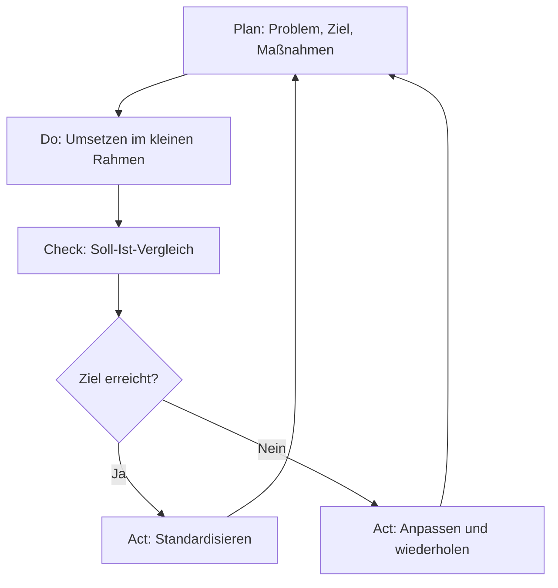

Der **PDCA-Zyklus** ist ein zyklisches Vorgehensmodell, das im Rahmen des [Kontinuierlichen Verbesserungsprozesses](kontinuierlicher-verbesserungsprozess) (KVP) eingesetzt wird. Er dient der systematischen Weiterentwicklung von Produkten, Dienstleistungen und Prozessen sowie der Analyse von Fehlern. Das Modell besteht aus vier Schritten: Planen (Plan), Umsetzen (Do), Überprüfen (Check) und Handeln (Act). Der Ansatz geht auf den US-amerikanischen Physiker William Edwards Deming zurück und basiert auf Ideen von Walter Andrew Shewhart.

## Lernziele

Dieser Artikel vermittelt:

- die vier Phasen des PDCA-Zyklus und deren Inhalte,
- die Abgrenzung der Varianten PDSA und SDCA,
- die Anwendung des PDCA-Zyklus auf einfache Fälle,
- typische Fehler bei der Anwendung.

## Kurzüberblick

PDCA ist ein einfaches, effektives Werkzeug zur kontinuierlichen Verbesserung. Die vier Phasen werden wiederholt durchlaufen, sodass der Prozess fortlaufend ist. Jeder Durchlauf liefert Erkenntnisse, die in den nächsten Zyklus einfließen. PDCA wird in vielen Bereichen eingesetzt: im Qualitätsmanagement, bei der Prozessoptimierung, in der Fehler-Ursachen-Analyse und auch im persönlichen Zeitmanagement.

## Kontext und Einordnung

Der PDCA-Zyklus ist ein zentrales Instrument im Qualitätsmanagement und im Lean Management. Er verkörpert die Philosophie des KVP, also der permanenten, schrittweisen Verbesserung. PDCA ist keine einmalige Projektmanagement-Methode, sondern eine dauerhafte Denkweise im Unternehmen. Synonyme werden Begriffe wie Deming-Kreis, Deming-Zyklus oder Deming-Rad verwendet.

## Die vier Phasen des PDCA-Zyklus

### 1. Plan (Planen)
Die Plan-Phase ist die Grundlage des gesamten Zyklus. Hier werden folgende Schritte durchgeführt:

- Problem identifizieren
- Ist-Analyse durchführen
- Ziel definieren (messbar und realistisch)
- Maßnahmen planen und dokumentieren
- Erfolgskriterien festlegen

### 2. Do (Umsetzen)
In dieser Phase wird der Plan in die Praxis umgesetzt. Die Umsetzung erfolgt häufig im kleinen Rahmen getestet (Pilotphase), bevor sie im gesamten Unternehmen ausgerollt wird. Dies minimiert Risiken und ermöglicht frühzeitige Anpassungen.

### 3. Check (Überprüfen)
Hier wird ein [Soll-Ist-Vergleich](soll-ist-vergleich) durchgeführt. Die Ergebnisse der Do-Phase werden objektiv ausgewertet:

- Daten sammeln und analysieren
- Ergebnisse mit den Erfolgskriterien vergleichen
- Abweichungen identifizieren
- Ursachen von Abweichungen untersuchen

### 4. Act (Handeln)
In der Act-Phase werden die Erkenntnisse aus der Check-Phase umgesetzt:

- Erfolgreiche Maßnahmen standardisieren
- Den optimierten Prozess als neuen Normalzustand etablieren
- Bei Zielverfehlung den Zyklus mit angepasstem Plan wiederholen
- Erkenntnisse für den nächsten Zyklus dokumentieren

## Varianten des PDCA-Modells

### PDSA (Plan-Do-Study-Act)
PDSA ist eine Variante, bei der die dritte Phase nicht "Check", sondern "Study" heißt. Der Begriff "Study" betont stärker das Lernen aus der Umsetzung statt eines reinen rückwärtsgewandten Soll-Ist-Vergleichs. Deming bevorzugte diese Formulierung, da "Check" oft missverständlich als reine Kontrolle verstanden wurde.

### SDCA (Standardize-Do-Check-Act)
SDCA ist ein komplementärer Zyklus, der auf die Stabilisierung von Prozessen fokussiert, nachdem diese durch PDCA optimiert wurden. Die Phasen sind: Standardize (Prozess dokumentieren), Do (Standard trainieren und anwenden), Check (Audits zur Einhaltung), Act (Standard bei Bedarf nachschärfen). PDCA treibt Innovation, SDCA sichert Stabilität.

## Beispiel: Fehlerquote in der Produktion senken

**Situation:** Ein Unternehmen möchte die Fehlerquote bei der Montage von Bauteilen von 8 % auf unter 4 % senken.

**Plan:**

- Problem: Fehlerquote zu hoch
- Ziel: Fehlerquote auf 3,5 % senken
- Maßnahme: Checkliste für kritische Arbeitsschritte einführen

**Do:**

- Checkliste an zwei Arbeitsstationen für 4 Wochen testen
- Fehlerdaten erfassen und dokumentieren

**Check:**

- Fehlerquote sank auf 3,2 % an den Teststationen
- Mitarbeiter akzeptieren Checkliste positiv

**Act:**

- Checkliste auf alle Arbeitsstationen ausrollen
- Als Standard in Arbeitsanweisung aufnehmen
- Nächster Zyklus: Bearbeitungszeit reduzieren

## Häufige Fehler und Tipps

- PDCA als einmaliges Projekt auffassen: PDCA ist ein zyklischer Prozess ohne Endpunkt.
- Die Do-Phase im großen Umfang durchführen: Ein Test im kleinen Rahmen (Pilot) ist empfehlenswert.
- Check-Phase vernachlässigen: Ein fundierter Soll-Ist-Vergleich ist die Basis für erfolgreiche Verbesserungen.
- Act-Phase überspringen: Ohne Standardisierung gehen Verbesserungen verloren.
- SDCA ignorieren: Nach erfolgreicher Optimierung sollte der Prozess stabilisiert werden, um Rückschritte zu vermeiden.

## Einzelnachweise

[1] REFA. (o.D.). PDCA-Zyklus Definition. Abgerufen von https://refa.de/service/refa-lexikon/pdca-zyklus

[2] Q-Learning. (o.D.). PDCA und SDCA im Lean Management. Abgerufen von https://www.q-learning.de/fachwissen/pdca-und-sdca/

[3] Karrierebibel. (2024). PDCA-Zyklus: Plan-Do-Check-Act – einfach erklärt. Abgerufen von https://karrierebibel.de/pdca-zyklus/
