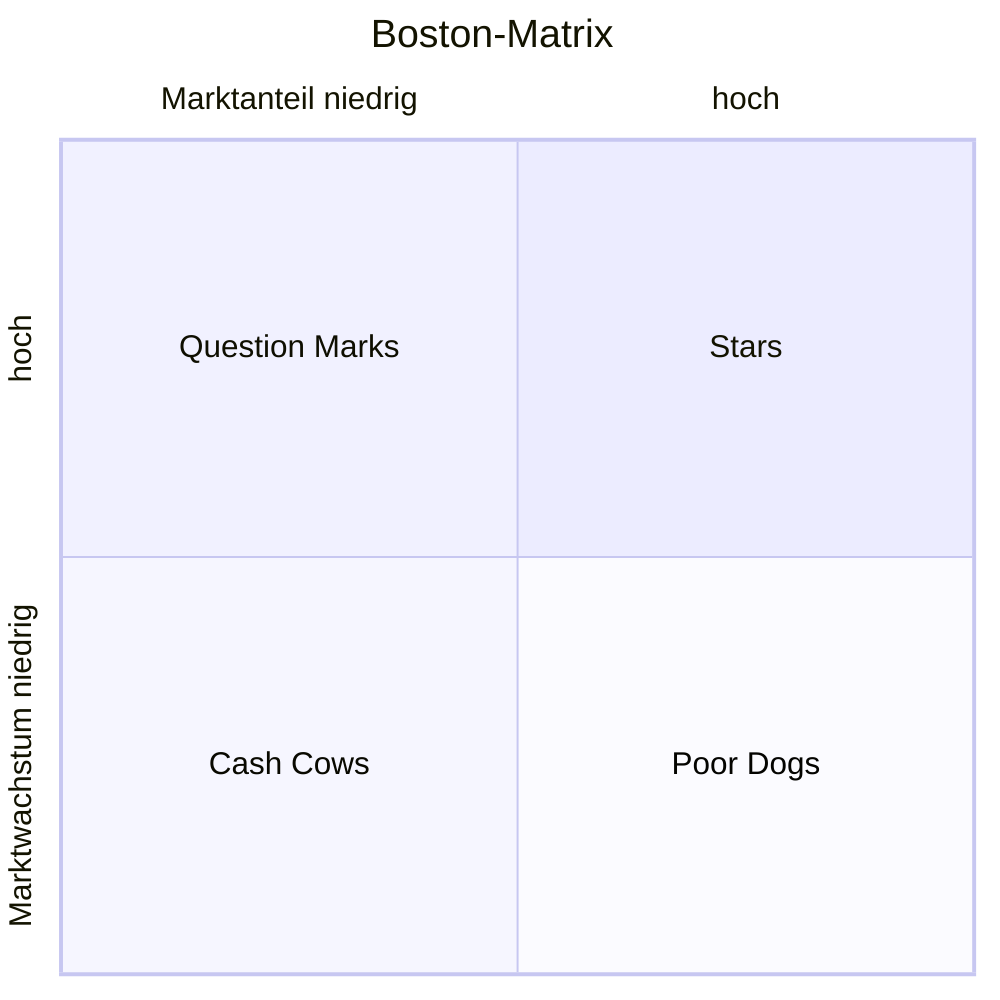

Die **Portfolioanalyse** ist ein Instrument des strategischen Managements zur Bewertung von Produkten und Dienstleistungen. Sie unterstützt Unternehmen bei der Optimierung ihres Produktportfolios und der effizienten Verteilung von Ressourcen. Dabei analysiert sie strategische Geschäftsfelder, um Stärken und Schwächen zu identifizieren und langfristige Entscheidungen zu treffen.

## Lernziele

Nach diesem Artikel können Auszubildende in Daten- und Prozessanalyse:

- Die Grundlagen der Portfolioanalyse und ihre Rolle im strategischen Management erklären.
- Die Boston-Matrix anwenden, um Produkte in Kategorien einzuordnen.
- Normstrategien für verschiedene Portfolio-Kategorien ableiten.
- Die theoretischen Grundlagen wie Erfahrungskurve und Produktlebenszyklus verstehen.
- Die Schritte zur Durchführung einer Portfolioanalyse durchführen.

## Definition

Die Portfolioanalyse nutzt Methoden zur ganzheitlichen Betrachtung strategischer Geschäftsfelder eines Unternehmens. Ihr Ziel ist ein ausgewogenes Produkt- und Marktprogramm, das zukünftige Chancen und Risiken berücksichtigt. Sie gehört zum strategischen Management und hilft bei Entscheidungen über Investitionen, Erhaltung oder Desinvestition.

## Arten der Portfolioanalyse

Es gibt verschiedene Ansätze zur Portfolioanalyse. Der bekannteste ist die BCG-Matrix, auch Boston-Matrix genannt. Daneben gibt es die McKinsey-Matrix, die neben Marktanteil und Marktwachstum weitere Faktoren wie Marktattraktivität einbezieht. Andere Varianten umfassen Technologie-Portfolios oder spezifische Branchenanwendungen.

## Boston-Matrix

Die Boston-Matrix ist ein zweidimensionales Koordinatensystem, das strategische Geschäftsfelder anhand von Marktanteil (X-Achse, relativ zum stärksten Wettbewerber) und Marktwachstum (Y-Achse) positioniert. Jedes strategische Geschäftsfeld wird einem von vier Quadranten zugeordnet, was eine visuelle Übersicht über die Marktposition ermöglicht.

Die vier Kategorien sind:

- **Poor Dogs**: Strategische Geschäftsfelder mit geringem Marktanteil und geringem Marktwachstum. Sie generieren wenig Cashflow und bieten wenig Potenzial.
- **Cash Cows**: Strategische Geschäftsfelder mit hohem Marktanteil und geringem Marktwachstum. Sie sind etabliert und generieren stabilen Cashflow.
- **Question Marks**: Strategische Geschäftsfelder mit geringem Marktanteil und hohem Marktwachstum. Sie erfordern hohe Investitionen, um Marktanteile zu gewinnen.
- **Stars**: Strategische Geschäftsfelder mit hohem Marktanteil und hohem Marktwachstum. Sie sind Wachstumstreiber, benötigen aber Investitionen zur Positionssicherung.

## Normstrategien je Kategorie

Für jede Kategorie der Boston-Matrix werden Normstrategien empfohlen:

| Kategorie      | Normstrategie                            | Beschreibung                                                                         |
| -------------- | ---------------------------------------- | ------------------------------------------------------------------------------------ |
| Stars          | Investieren                              | Marktposition halten und ausbauen, um langfristiges Wachstum zu sichern.             |
| Cash Cows      | Erhalten und Cashflow abschöpfen         | Stabile Einnahmen nutzen, ohne weitere Investitionen, bis Marktanteil verloren geht. |
| Question Marks | Selektiv investieren oder desinvestieren | Entscheiden, ob Investitionen lohnen, oder Produktion einstellen.                    |
| Poor Dogs      | Desinvestieren                           | Ressourcen abziehen und Produktion einstellen.                                       |

## Theoretische Grundlagen

Die Portfolioanalyse basiert auf zwei zentralen Konzepten: der Erfahrungskurve und dem Produktlebenszyklus. Die Erfahrungskurve beschreibt, wie Kosten mit zunehmender Produktionserfahrung sinken, was hohe Marktanteile vorteilhaft macht. Der Produktlebenszyklus modelliert die Phasen eines Produkts von Einführung bis Rückgang, was mit den Achsen der Matrix korrespondiert. Diese Grundlagen untermauern die Annahmen der Boston-Matrix.

## Durchführungsschritte

Die Portfolioanalyse wird in folgenden Schritten durchgeführt:

1. Relevante Daten sammeln, einschließlich Marktanteil, Marktwachstum und Konkurrenzdaten für jedes strategische Geschäftsfeld.
2. Die Boston-Matrix erstellen und die strategischen Geschäftsfelder in die entsprechenden Quadranten einordnen.
3. Strategische Maßnahmen ableiten, um Stärken zu nutzen und Schwächen zu beheben. Ergänzende Analysen wie die [SWOT-Analyse](swot-analyse) und [Nutzwertanalyse](nutzwertanalyse) können Erkenntnisse vertiefen.

## Vorteile

Die Portfolioanalyse bietet mehrere Vorteile:

- Sie ermöglicht eine einfache Visualisierung komplexer Marktverhältnisse.
- Sie liefert Handlungsstrategien für jedes strategische Geschäftsfeld.
- Sie verschafft eine Übersicht über die eigene Marktposition und die Konkurrenz.

## Nachteile

Trotz ihrer Nützlichkeit weist die Portfolioanalyse Nachteile auf:

- Sie berücksichtigt nur Marktanteil und Marktwachstum, vernachlässigt komplexere Faktoren wie Technologie oder Wettbewerbsdynamik.
- Sie eignet sich nur für Produkte mit einem typischen Lebenszyklus.
- Die vorgeschlagenen Strategien sind nicht universell anwendbar und erfordern Anpassungen.

## Selbsttest

- Was ist der Unterschied zwischen Portfolioanalyse und Boston-Matrix?
- Ein Beispielprodukt in die Boston-Matrix einordnen und eine Normstrategie ableiten.
- Die Beeinflussung der Portfolioanalyse durch die Erfahrungskurve erklären.
