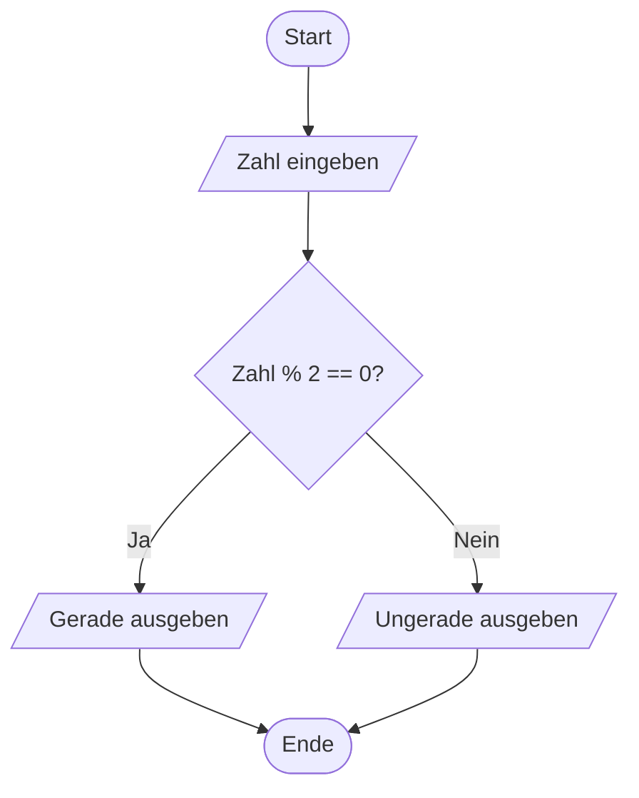

Der **Programmablaufplan** ist eine grafische Darstellung zur Visualisierung des zeitlichen Ablaufs von Algorithmen und Computerprogrammen. Er verwendet standardisierte Symbole nach DIN 66001, um Operationen, Entscheidungen, Ein- und Ausgaben sowie den Kontrollfluss zu zeigen. Dies erleichtert das Verständnis komplexer Abläufe, die Analyse von Problemen und die Kommunikation zwischen Fachleuten.

## Kurzüberblick

Der Programmablaufplan, auch bekannt als Flussdiagramm oder Programmstrukturplan, dient der visuellen Abbildung von Programmabläufen. Er basiert auf der Norm DIN 66001, die sechs grundlegende Symbole definiert: Terminatoren für Anfang und Ende, Pfeile für den Kontrollfluss, Rechtecke für Operationen, Rauten für Verzweigungen, Parallelogramme für Ein- und Ausgaben sowie spezielle Symbole für Unterprogramme und Marken. Im Vergleich zu textbasierten Methoden wie Pseudocode betont er die grafische Struktur, was ihn besonders für Anfänger geeignet macht. Historisch entstand er in der imperativen Programmierung und wird heute vor allem in der Ausbildung und für kleinere Algorithmen verwendet.

## Kontext und Einordnung

Der Programmablaufplan entwickelte sich in den 1960er Jahren als Teil der strukturierten Programmierung. Er ermöglicht es, Algorithmen unabhängig von einer spezifischen Programmiersprache darzustellen und fördert das Verständnis von Ablaufsteuerungen wie Schleifen und Bedingungen. In der heutigen Praxis tritt er gegenüber objektorientierten Ansätzen wie UML-Aktivitätsdiagrammen zurück, bleibt aber relevant für die Grundlagenvermittlung. Im Gegensatz zu Datenflussplänen fokussiert er auf den zeitlichen Ablauf von Operationen, nicht auf den Datenfluss zwischen Speicherorten.

## Begriffe und Definitionen

- **Programmablaufplan (PAP)**: Grafische Darstellung eines Algorithmus mit standardisierten Symbolen zur Visualisierung des Ablaufs.
- **DIN 66001**: Deutsche Norm für Sinnbilder in Datenfluss- und Programmablaufplänen, definiert sechs Basissymbole.
- **Terminator**: Ovales Symbol für den Anfang oder das Ende eines Ablaufs.
- **Kontrollfluss**: Pfeile, die die Richtung des Ablaufs zwischen Symbolen anzeigen.
- **Operation**: Rechteckiges Symbol für eine Tätigkeit oder Berechnung.
- **Verzweigung**: Rautenförmiges Symbol für Entscheidungen mit zwei oder mehr Ausgängen.
- **Ein-/Ausgabe**: Parallelogramm für Dateninput oder -output.
- **Unterprogramm**: Rechteck mit doppelten vertikalen Linien für den Aufruf einer benannten Folge von Anweisungen.
- **Marke**: Symbol für Zusammenführungspunkte von Abläufen.

## Vorgehen

Der Erstellungsprozess eines Programmablaufplans umfasst folgende Schritte:

1. Der Startpunkt des Algorithmus wird mit einem Terminator markiert.
2. Eingabedaten werden mit einem Parallelogramm definiert.
3. Operationen werden in Rechtecken beschrieben und mit Pfeilen verbunden.
4. Verzweigungen werden als Rauten hinzugefügt, wenn Entscheidungen getroffen werden.
5. Ausgaben und Unterprogramme werden nach Bedarf integriert.
6. Der Ablauf wird mit einem Terminator abgeschlossen.
7. Der Ablauf wird auf Vollständigkeit und logische Konsistenz überprüft.

## Beispiele

### Beispiel: Berechnung des Durchschnitts

Ein Algorithmus liest drei Zahlen ein, berechnet deren Durchschnitt und gibt ihn aus. Die Zahlen sind 4, 7 und 9.

1. Start: Terminator mit "Start".
2. Eingabe: Parallelogramm mit "Drei Zahlen eingeben: a, b, c".
3. Operation: Rechteck mit "durchschnitt = (a + b + c) / 3".
4. Ausgabe: Parallelogramm mit "Durchschnitt ausgeben".
5. Ende: Terminator mit "Ende".

Das Ergebnis beträgt 6,67 (bei Ganzzahldivision gerundet).

```mermaid
flowchart TD
    A([Start]) --> B[/Drei Zahlen eingeben: a, b, c/]
    B --> C[Durchschnitt = (a + b + c) / 3]
    C --> D[/Durchschnitt ausgeben/]
    D --> E([Ende])
```

### Beispiel: Entscheidung mit Verzweigung

Ein Algorithmus prüft, ob eine eingegebene Zahl gerade ist. Zahl: 8.

1. Start: "Start".
2. Eingabe: "Zahl eingeben".
3. Verzweigung: "Ist Zahl % 2 == 0?" mit Ja/Nein.
4. Ja: "Gerade ausgeben".
5. Nein: "Ungerade ausgeben".
6. Ende.

Ergebnis: "Gerade".



## Häufige Fehler und Tipps

- Der Kontrollfluss sollte mit Pfeilen dargestellt werden, um den Ablauf klar zu machen.
- Symbole sollten nicht überladen werden: Eine Operation pro Rechteck.
- Bei komplexen Abläufen können Unterprogramme zur Übersichtlichkeit verwendet werden.
- Verzweigungen sollten klar beschriftet werden, um Mehrdeutigkeit zu vermeiden.
- Im Vergleich zu Pseudocode sind Programmablaufpläne visuell, aber bei Änderungen umständlicher als Text.

## Weiterführendes

Für tiefergehende Kenntnisse zu verwandten Themen siehe [Flussdiagrammen](flussdiagramm), [Nassi-Shneiderman-Diagrammen](nassi-shneiderman-diagramm), [Pseudocode](pseudocode) und [UML-Aktivitätsdiagrammen](uml-aktivitaetsdiagramm). Praktische Werkzeuge wie Draw.io oder PlantUML unterstützen die Erstellung.