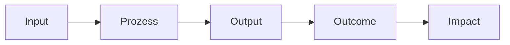

**Prozessindikatoren** sind spezifische, messbare Größen, die zur Bewertung, Steuerung und Optimierung von Geschäftsprozessen dienen. Sie ermöglichen eine quantitative Analyse der Effektivität, Effizienz und Qualität von Abläufen und helfen dabei, Engpässe zu identifizieren sowie kontinuierliche Verbesserungen voranzutreiben. In der Daten- und Prozessanalyse dienen sie als Basis für datenbasierte Entscheidungen und die Einhaltung von Qualitätsstandards wie ISO 9001.

## Lernziele

- Prozessindikatoren definieren und von allgemeinen Kennzahlen abgrenzen
- Die Klassifizierung nach dem IOOI-Modell (Input, Output, Outcome, Impact) anwenden
- Merkmale guter Prozessindikatoren benennen und deren Bedeutung erklären
- Typische Prozessindikatoren wie Durchlaufzeit und Fehlerquote in Beispielen anwenden
- Den Zusammenhang mit dem PDCA-Zyklus und der kontinuierlichen Verbesserung beschreiben
- Häufige Fehler bei der Auswahl und Nutzung von Prozessindikatoren vermeiden

## Definition und Bedeutung
Prozessindikatoren, auch als Key Performance Indicators (KPIs) oder Prozesskennzahlen bezeichnet, sind messbare Größen, die die Leistung von Geschäftsprozessen quantifizieren. Im Gegensatz zu allgemeinen Zielen sind sie spezifisch, quantifizierbar und auf die Überwachung von Prozessabläufen ausgerichtet. Ihre Bedeutung liegt in der Unterstützung des Qualitätsmanagements: Sie decken Abweichungen auf, ermöglichen die Identifikation von Optimierungspotenzialen und fördern Transparenz gegenüber Stakeholdern. Gemäß ISO 9001:2015 sind sie in Kapitel 9.1 als Anforderung für die Überwachung, Messung, Analyse und Bewertung von Prozessleistungen vorgesehen. Sie bilden zudem die Grundlage für den kontinuierlichen Verbesserungsprozess (KVP), indem sie Daten für datenbasierte Entscheidungen liefern.

## Klassifizierung nach Prozessposition (IOOI-Modell)
Das IOOI-Modell unterscheidet Indikatoren nach ihrer Position im Prozessablauf und beschreibt eine Wirkungskette von Input über Output zu Outcome und Impact.

- **Input-Indikatoren** messen die Ressourcen, die in einen Prozess eingehen, wie Personalaufwand, Materialverbrauch oder Investitionen. Sie zeigen die Verfügbarkeit von Ressourcen an, sagen aber allein noch nichts über die Prozessqualität aus.
- **Output-Indikatoren** erfassen die direkten Ergebnisse eines Prozesses, etwa die Anzahl bearbeiteter Aufträge oder produzierte Stückzahlen. Sie messen, was unmittelbar geliefert wird, ohne die Wirkung auf die Zielgruppe zu berücksichtigen.
- **Outcome-Indikatoren** bewerten die tatsächlichen Veränderungen bei Nutzern oder Stakeholdern, wie gesteigerte Kundenzufriedenheit oder verbesserte Kompetenzen. Sie gehen über die reinen Ergebnisse hinaus und messen die beabsichtigte Wirkung.
- **Impact-Indikatoren** (optional) beschreiben langfristige, übergeordnete Effekte auf die Gesellschaft oder das Unternehmen, etwa reduzierte Arbeitslosigkeit durch Schulungsprogramme.

Dieses Diagramm zeigt die Wirkungskette: Ressourcen fließen in den Prozess ein, führen zu direkten Ergebnissen, die wiederum Veränderungen bewirken, welche langfristige Auswirkungen haben.

## Klassifizierung nach Messrichtung
Neben der prozessualen Position lassen sich Indikatoren nach ihrer Messrichtung einteilen, um unterschiedliche Aspekte zu beleuchten:

- **Zeitbasierte Indikatoren** fokussieren auf Geschwindigkeit und Dauer, wie Durchlaufzeit oder Bearbeitungszeit.
- **Qualitätsbasierte Indikatoren** bewerten Fehlerfreiheit und Zufriedenheit, etwa Fehlerquote oder Kundenzufriedenheit.
- **Kostenbasierte Indikatoren** analysieren Wirtschaftlichkeit, beispielsweise Kosten pro Prozess oder Einsparpotenziale.
- **Produktivitätsbasierte Indikatoren** messen die Ressourcennutzung, wie Auslastung oder Mitarbeiterproduktivität.

## Merkmale guter Prozessindikatoren
Gute Prozessindikatoren zeichnen sich durch folgende Eigenschaften aus, die ihre Nützlichkeit sicherstellen:

- **Messbarkeit**: Sie liefern quantifizierbare Daten, die regelmäßig erfasst werden können.
- **Relevanz**: Sie beziehen sich direkt auf die Prozessziele und unterstützen strategische Entscheidungen.
- **Verfügbarkeit**: Die erforderlichen Daten sind leicht zugänglich und ohne hohen Aufwand zu beschaffen.
- **Verständlichkeit**: Sie sind klar definiert und für alle Beteiligten nachvollziehbar.
- **Eindeutigkeit**: Sie vermeiden Mehrdeutigkeiten und sind präzise formuliert.

Das SMART-Prinzip (Spezifisch, Messbar, Erreichbar, Relevant, Zeitgebunden) dient als Checkliste für die Auswahl. Zu viele Indikatoren führen zu einem "Zahlenfriedhof" – besser wenige, zielgerichtete KPIs wählen, die zu Maßnahmen führen.

## Typische Prozessindikatoren mit Beispielen
Typische Indikatoren umfassen zeit-, qualitäts-, kosten- und produktivitätsbasierte Messungen. Hier Beispiele mit Dummy-Daten für einen Produktionsprozess in einem Unternehmen, das 100 Einheiten pro Tag herstellt:

- **Durchlaufzeit**: Gesamtzeit vom Auftragseingang bis zur Auslieferung, z. B. 5 Tage. Eine Reduzierung auf 3 Tage deutet auf Effizienzsteigerungen hin.
- **Fehlerquote**: Anteil fehlerhafter Produkte, z. B. 2 % (2 von 100 Einheiten). Eine Senkung auf 1 % verbessert die Qualität.
- **Ressourcenauslastung**: Verhältnis genutzter zu verfügbarer Kapazität, z. B. 85 % für Maschinen. Über 90 % kann Engpässe signalisieren.
- **Bearbeitungszeit**: Zeit für einzelne Schritte, z. B. 2 Stunden pro Einheit. Optimierungen reduzieren Wartezeiten.
- **Kundenzufriedenheit**: Durchschnittliche Bewertung auf einer Skala von 1–5, z. B. 4,2. Eine Steigerung auf 4,5 zeigt positive Outcome.
- **Kosten pro Prozess**: Gesamtkosten pro Einheit, z. B. 50 EUR. Eine Senkung auf 45 EUR spart Ressourcen.

In einem Beispielprozess zur Kundenauftragsbearbeitung: Input-Indikator (Personalstunden: 10 pro Auftrag), Output-Indikator (Anzahl bearbeiteter Aufträge: 50 pro Tag), Outcome-Indikator (Kundenzufriedenheit: 90 % positive Rückmeldungen). Eine Verbesserung der Durchlaufzeit von 7 auf 5 Tage führte zu einer Steigerung der Zufriedenheit um 5 %.

## Anwendung im Kontext der kontinuierlichen Verbesserung
Prozessindikatoren sind essenziell für den [PDCA-Zyklus](pdca): Im Plan-Schritt werden relevante Indikatoren definiert, im Do-Schritt gemessen, im Check-Schritt analysiert und im Act-Schritt für Verbesserungen genutzt. Sie unterstützen den kontinuierlichen Verbesserungsprozess (KVP), indem sie Verbesserungspotenziale aufdecken und die Wirkung von Maßnahmen messen. Im [Benchmarking](benchmarking) dienen sie dem Vergleich mit Best Practices, und im Reporting informieren sie Stakeholder über Leistungen.

## Häufige Fehler und Tipps

- **Zu viele Indikatoren**: Zu viele Indikatoren führen zu einem "Zahlenfriedhof". Daher sollten 3–5 kritische KPIs gewählt werden, die wirklich Entscheidungen beeinflussen.
- **Indikatoren ohne Zweck**: Indikatoren ohne klaren Bezug zu Zielen führen nicht zu Maßnahmen. Es sollten nur solche ausgewählt werden, die direkt zu Verbesserungen beitragen.
- **Fehlende Datenverfügbarkeit**: Fehlende Datenverfügbarkeit macht Indikatoren wertlos. Es sollte vorab sichergestellt werden, dass Daten regelmäßig erfasst werden können.
- **Indikatoren statt Dialog**: Indikatoren sollten nicht blind vertraut werden. Sie sollten mit qualitativen Einschätzungen kombiniert werden.
- **Tipp**: Einfache Indikatoren eignen sich zum Start. Eine schrittweise Erweiterung ist ratsam, zudem können Tools zur automatischen Erfassung genutzt werden, um den Aufwand zu minimieren.

## Selbsttest

1. Was unterscheidet Output- von Outcome-Indikatoren?
2. Nennen Sie drei Merkmale guter Prozessindikatoren.
3. Wie integrieren sich Prozessindikatoren in den PDCA-Zyklus?
4. Berechnen Sie die Fehlerquote für 100 Produkte mit 3 Fehlern.
5. Warum sind Prozessindikatoren für ISO 9001 relevant?
6. Geben Sie ein Beispiel für einen kostenbasierten Indikator.