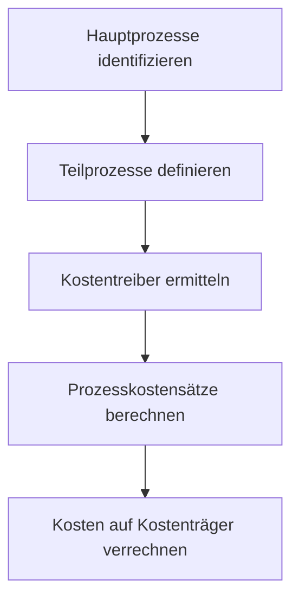

Die **Prozesskostenrechnung** ist ein Verfahren der Kostenrechnung, das Gemeinkosten verursachungsgerecht auf Kostenträger verteilt. Anstatt pauschale Zuschläge zu verwenden, analysiert sie Prozesse und deren Kostentreiber, um eine genauere Kalkulation zu ermöglichen. Dieses Vorgehen basiert auf dem Activity Based Costing und unterstützt Unternehmen dabei, steigende Gemeinkosten besser zu handhaben.

## Kurzüberblick

Die Prozesskostenrechnung zielt darauf ab, Gemeinkosten, die in indirekten Bereichen wie Verwaltung oder Logistik entstehen, präziser auf Produkte oder Dienstleistungen zu verrechnen. Sie identifiziert wiederholende Tätigkeiten als Prozesse und nutzt Kostentreiber, um die Kostenverursachung zu messen. Dadurch werden Ungenauigkeiten in der traditionellen Kostenrechnung, die oft auf Lohnzuschlägen basiert, überwunden. Die Methode eignet sich besonders für Unternehmen mit hohen Gemeinkostenanteilen und findet Anwendung in der Produktkalkulation, Preisbildung und Entscheidungsfindung über Outsourcing, wie [Kosten-Nutzen-Analyse](kosten-nutzen-analyse) und [Break-Even-Analyse](break-even-analyse).

## Kontext und Einordnung

Traditionelle Kostenrechnungssysteme verrechnen Gemeinkosten oft pauschal über Zuschlagssätze, die auf Fertigungslöhnen basieren. Bei zunehmender Automatisierung verliert dieser Ansatz an Aussagekraft, da viele Kosten in vor- und nachgelagerten Bereichen entstehen. Die Prozesskostenrechnung, auch als Activity Based Costing bekannt, ergänzt oder ersetzt diese Zuschlagskalkulation. Sie ist keine eigenständige Kostenrechnung, sondern integriert sich in bestehende Systeme wie Vollkostenrechnung oder Plankostenrechnung. Historisch entwickelte sich die Idee in den 1970er Jahren bei Siemens und wurde in den 1980er Jahren von Wissenschaftlern wie Cooper und Kaplan sowie Horváth und Mayer weiterentwickelt. In der Praxis wird sie häufig fallweise eingesetzt, da ein kontinuierlicher Betrieb zu aufwendig ist.

## Begriffe und Definitionen

- **Prozess**: Eine repetitive Tätigkeit, die mehrere Kostenstellen überspannen kann. Teilprozesse werden zu Hauptprozessen zusammengefasst, um Kosten zu bündeln.
- **Kostentreiber**: Eine Maßgröße, die die Inanspruchnahme von Ressourcen widerspiegelt, wie die Anzahl der Aufträge oder bearbeitete Stunden. Der Kostentreiber dient als Bezugsgröße für die Verrechnung der Prozesskosten.
- **Prozesskostensatz**: Der Betrag, der pro Einheit des Kostentreibers anfällt. Er ergibt sich aus der Division der Prozesskosten durch die Menge des Kostentreibers.
- **Leistungsmengeninduzierte (lmi) Prozesse**: Prozesse, deren Kosten mit der Ausbringungsmenge variieren und einen klaren Kostentreiber haben.
- **Leistungsmengenneutrale (lmn) Prozesse**: Prozesse mit fixen Kosten, die keinen direkten Kostentreiber aufweisen. Ihre Kosten werden prozentual zu den lmi-Prozesskosten verteilt.

## Vorgehen

Die Implementierung der Prozesskostenrechnung folgt einem strukturierten Ablauf:

1. Identifizierung von Hauptprozessen pro Kostenstelle.
2. Unterteilung in Teilprozesse und Aktivitäten.
3. Erfassung der Zeiten und Kosten je Teilprozess.
4. Klassifizierung von Prozessen als leistungsmengeninduziert (lmi) oder leistungsmengenneutral (lmn).
5. Bestimmung von Kostentreibern für lmi-Prozesse.
6. Berechnung von Prozesskostensätzen durch Division der Kosten durch die Kostentreibermenge.
7. Erstellung einer Preisliste der Prozesse.
8. Verrechnung von Kosten auf Kostenträger basierend auf durchlaufenen Prozessen.

Dieser Ablauf kann in einem Diagramm dargestellt werden:

## Beispiele

Betrachte eine Kostenstelle mit dem Hauptprozess "Auftragsbearbeitung". Die Teilprozesse umfassen "Auftrag annehmen" (lmn, fixe Kosten 5.000 Euro pro Periode) und "Auftrag verarbeiten" (lmi, Kosten 10.000 Euro, Kostentreiber: 200 Aufträge). Der Prozesskostensatz für "Auftrag verarbeiten" beträgt $$ \frac{10.000}{200} = 50 $$ Euro pro Auftrag.

Für lmn-Prozesse wird der Kostensatz basierend auf dem Verhältnis zu lmi-Prozessen ermittelt. Angenommen, die lmi-Prozesse haben insgesamt 10.000 Euro, lmn 5.000 Euro, dann beträgt der lmn-Anteil 33 Prozent. Bei 200 Aufträgen entfallen 16,50 Euro pro Auftrag auf lmn-Kosten.

In einer Produktkalkulation verrechnet ein Produkt mit 5 Aufträgen Kosten von 5 × (50 + 16,50) = 332,50 Euro.

## Häufige Fehler und Tipps

Die Prozesskostenrechnung sollte nicht als vollständiges neues System eingeführt werden. Stattdessen wird sie in bestehende Strukturen integriert, um den Aufwand zu minimieren.

Bei lmn-Prozessen wird kein Kostentreiber erzwungen. Stattdessen erfolgt eine prozentuale Verteilung, da diese Prozesse keinen klaren Mengenbezug haben.

Kostentreiber müssen relevant und messbar sein. Zu viele Kostentreiber sollten vermieden werden, um die Komplexität zu reduzieren.

Prozesse werden regelmäßig überprüft, um sicherzustellen, dass sie noch aktuell sind, da sich Geschäftsprozesse ändern können.
