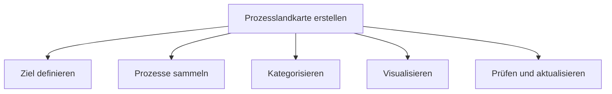

**Prozesslandkarten** sind eine visuelle Darstellung der Ablauforganisation eines Unternehmens und bieten einen Überblick über alle Geschäftsprozesse. Sie gliedern diese in drei Hauptbereiche – Kernprozesse, Führungsprozesse und Unterstützungsprozesse – und schaffen Transparenz über interne Abläufe sowie Wertschöpfung. Als oberste Ebene der Prozessarchitektur dienen sie als Ausgangspunkt für detaillierte Modellierungen mit Methoden wie [BPMN](bpmn) oder [eEPK](eepk).

## Lernziele

Dieser Artikel vermittelt folgende Kenntnisse:

- Den Zweck und die Struktur von Prozesslandkarten beschreiben.
- Die drei Hauptprozessarten (Kern-, Führungs- und Unterstützungsprozesse) voneinander abgrenzen und mit Beispielen belegen.
- Den Unterschied zwischen Prozesslandkarten und detaillierten Prozessmodellen erklären.
- Typische Anwendungsfälle und Nutzenaspekte von Prozesslandkarten benennen.
- Häufige Fehler bei der Erstellung vermeiden und Best Practices anwenden.
- Die Einordnung in Qualitätsmanagement-Konzepte verstehen.

## Kurzüberblick

Prozesslandkarten sind nicht standardisiert, folgen aber bewährten Praktiken und werden häufig im Kontext von Qualitätsmanagement-Systemen entwickelt. Sie zeigen die oberste Ebene der Prozessarchitektur und fassen Prozesse zu übergeordneten Hauptprozessen zusammen. Die Dreiteilung in Kernprozesse (wertschöpfend), Führungsprozesse (steuernd) und Unterstützungsprozesse (unterstützend) ist eine etablierte Gliederung, die Transparenz schafft und als Navigationsinstrument für Mitarbeiter dient. Sie helfen, Optimierungspotenziale zu identifizieren und unterstützen Governance, Risiko- und Compliance-Management. Für detaillierte Abläufe werden standardisierte Notationen wie BPMN oder eEPK verwendet.

## Kontext und Einordnung

Prozesslandkarten sind Teil der Prozessarchitektur, einem hierarchischen Modell der Geschäftsprozesse eines Unternehmens. Sie bilden die oberste Ebene und unterscheiden sich von detaillierten Prozessmodellen dadurch, dass sie nur strategische Überblicke liefern, ohne einzelne Aktivitäten oder Ereignisse darzustellen. Im Qualitätsmanagement dokumentieren sie interne Abläufe und bilden die Grundlage für kontinuierliche Verbesserungen. Typische Darstellungen sind horizontal oder vertikal strukturiert, oft als Diagramme oder Tabellen visualisiert, um die Beziehungen zwischen den Prozessarten zu zeigen.

## Begriffe und Definitionen

- **Prozesslandkarte**: Grafische Übersicht aller modellierten Geschäftsprozesse eines Unternehmens, gegliedert in Kern-, Führungs- und Unterstützungsprozesse; oberste Ebene der Prozessarchitektur.
- **Kernprozesse** (auch Leistungsprozesse): Prozesse, die direkt an der Wertschöpfung beteiligt sind und externe Kundenanforderungen erfüllen, z. B. Produktion, Auftragsabwicklung oder Kundenservice.
- **Führungsprozesse** (auch Managementprozesse): Prozesse, die das Unternehmen strategisch steuern, Richtlinien festlegen und alle Prozesse koordinieren, z. B. strategische Planung oder Controlling.
- **Unterstützungsprozesse** (auch Supportprozesse): Prozesse, die Rahmenbedingungen schaffen, interne Kunden bedienen und gesetzliche Auflagen erfüllen, z. B. IT, Personalwesen oder Rechnungswesen.
- **Prozessarchitektur**: Hierarchische Gliederung aller Prozesse von der Prozesslandkarte über Hauptprozesse bis zu detaillierten Teilprozessen.

## Vorgehen

Die Erstellung einer Prozesslandkarte erfolgt typischerweise in folgenden Schritten:

1. **Zielsetzung definieren**: Klären, wofür die Prozesslandkarte dient, z. B. Transparenz, Optimierung oder Compliance.
2. **Prozesse identifizieren und sammeln**: Alle relevanten Geschäftsprozesse des Unternehmens erfassen, z. B. durch Workshops oder Dokumentenanalyse.
3. **Prozesse kategorisieren**: Jeder Prozess den drei Hauptarten (Kern, Führung, Unterstützung) zuordnen und Synonyme berücksichtigen.
4. **Hierarchie aufbauen**: Prozesse zu Hauptprozessen zusammenfassen und Beziehungen visualisieren, ohne zu viele Details einzubeziehen.
5. **Visualisierung erstellen**: Ein einfaches Diagramm oder eine Tabelle verwenden, um die Struktur darzustellen.
6. **Prüfen und aktualisieren**: Regelmäßig überprüfen und anpassen, z. B. jährlich, um Aktualität zu gewährleisten.

## Beispiele

Ein fiktives Unternehmen für Bürobedarf erstellt eine Prozesslandkarte. Kernprozesse umfassen: "Kundenaufträge bearbeiten" (Bestellung entgegennehmen, Produkte zusammenstellen, Lieferung organisieren), "Produkte entwickeln" (Marktanalyse, Design, Testung) und "Kundenservice bereitstellen" (Reklamationen bearbeiten, Support geben). Führungsprozesse sind: "Strategie festlegen" (Ziele definieren, Budget planen) und "Gesamtunternehmen koordinieren" (Abteilungen abstimmen, Leistung messen). Unterstützungsprozesse beinhalten: "IT-Infrastruktur verwalten" (Server warten, Software aktualisieren), "Personalwesen führen" (Einstellungen, Schulungen) und "Finanzen und Rechnungswesen handhaben" (Buchhaltung, Steuern).

In einem weiteren Beispiel optimiert ein Dienstleistungsunternehmen seine Prozesslandkarte, um Ineffizienzen zu identifizieren: Die Karte zeigt, dass der Kernprozess "Dienstleistungen erbringen" stark von Unterstützungsprozessen wie "Ressourcen bereitstellen" abhängt. Durch Visualisierung wird klar, dass eine Automatisierung der Ressourcenverwaltung den Kernprozess beschleunigt, was zu Kosteneinsparungen von 15 % führt.

## Häufige Fehler und Best Practices

Häufige Fehler sind Überkomplexität durch zu viele Details, unklare Struktur ohne klare Kategorisierung oder fehlende Aktualisierung, was die Karte unbrauchbar macht. Auch fehlende Verantwortlichkeiten führen dazu, dass Prozesse nicht gepflegt werden. Best Practices: Die Abstraktion sollte hoch gehalten werden und operative Details vermieden werden; Verantwortliche für die Wartung sollten definiert werden; die Karte sollte in Qualitätsmanagement-Konzepte integriert werden für Nachhaltigkeit. Nicht Supportprozesse als Kernprozesse einstufen, da sie primär interne Kunden bedienen; stattdessen als wertschöpfungsunterstützend sehen.

## Selbsttest

1. Was ist die Hauptfunktion einer Prozesslandkarte?
2. Nenne drei Hauptprozessarten und je ein Beispiel.
3. Wie unterscheidet sich eine Prozesslandkarte von einem detaillierten Prozessmodell wie BPMN?
4. Warum ist die Dreiteilung in Kern-, Führungs- und Unterstützungsprozesse bewährt?
5. Welche Best Practice hilft, Fehler bei der Erstellung zu vermeiden?
6. In welchem Kontext wird eine Prozesslandkarte oft verwendet?

## Weiterführendes

Für detaillierte Prozessmodellierung bieten [BPMN](bpmn) und [eEPK](eepk) standardisierte Ansätze. Im Qualitätsmanagement können Prozesslandkarten als Grundlage für kontinuierliche Verbesserungsprozesse dienen. Bei Bedarf können Tools wie Prozessmodellierungssoftware die Visualisierung erleichtern.