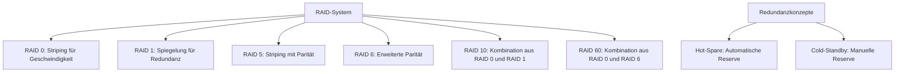
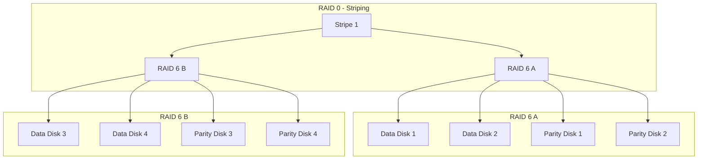

**RAID** bezeichnet eine Technologie, die mehrere physische Festplatten zu einem logischen Laufwerk verbindet, um Daten effizient zu speichern und zu schützen. Die Abkürzung steht für Redundant Array of Independent Disks und erfordert einen RAID-Controller zur Verwaltung der Datenverteilung. Verschiedene RAID-Levels kombinieren Leistungssteigerung, Kapazitätserweiterung und Datensicherheit – von reiner Geschwindigkeitsoptimierung bis hin zu hoher Redundanz gegen Ausfälle.

## Definition und Überblick

RAID fasst mehrere Festplatten zu einem Array zusammen, um Daten effizient zu speichern und zu schützen. Die Array-Kapazität richtet sich nach der kleinsten Festplatte. Ein RAID-Controller steuert die Datenverteilung und -sicherung. Hardware-RAID verwendet dedizierte Controller für optimale Leistung, während Software-RAID auf Betriebssystemebene läuft und CPU-Ressourcen verbraucht.

## RAID-Levels

### RAID 0

RAID 0 benötigt mindestens zwei Festplatten. Daten werden in gleichgroße Blöcke aufgeteilt und abwechselnd auf die Festplatten geschrieben – ein Verfahren namens Striping. Die Blockgröße beträgt üblicherweise 64 kByte. Die Array-Kapazität entspricht der Summe aller Festplattenkapazitäten, begrenzt durch die kleinste Festplatte.

Vorteile:

- Verarbeitung großer Datenmengen.
- Schnellere Lese- und Schreibvorgänge durch parallelen Zugriff.

Nachteile:

- Hohe Ausfallwahrscheinlichkeit, da kein Schutz vor Festplattenausfällen besteht.

Formel für die Kapazität:
$$Kapazität = (Anzahl \space Festplatten) \times Festplattenkapazität$$

### RAID 1

RAID 1 benötigt mindestens zwei Festplatten. Daten werden parallel auf zwei Festplatten geschrieben, wodurch eine Spiegelung entsteht. Bei genau zwei Festplatten entspricht die Kapazität der kleinsten Festplatte. Bei mehr Festplatten, die in Paaren gespiegelt werden, halbiert sich die Gesamtkapazität.

Vorteile:

- Hohe Datensicherheit; ein Ausfall wird toleriert.
- Bei intelligentem Controller kann die Lesegeschwindigkeit steigen.

Nachteile:

- Doppelte Speicherkapazität erforderlich.
- Hohe Kosten.

Formel für die Kapazität (bei zwei Festplatten):
$$Kapazität = \left(\dfrac{Anzahl \space Festplatten}{2}\right) \times Festplattenkapazität$$

### RAID 5

RAID 5 benötigt mindestens drei Festplatten. Es kombiniert Striping mit Paritätsinformationen, die durch XOR-Verknüpfung berechnet werden. Die Kapazität entspricht der Summe aller Kapazitäten minus einer Festplatte für Parität, begrenzt durch die kleinste Festplatte.

Vorteile:

- Hohe Datensicherheit.
- Effiziente Kapazitätsnutzung im Vergleich zu RAID 1.

Nachteile:

- Langsamere Schreibvorgänge wegen Paritätsberechnung.
- Parität beansprucht zusätzlichen Speicherplatz.

Formel für die Kapazität:
$$Kapazität = (Anzahl \space Festplatten - 1) \times Festplattenkapazität$$

### RAID 6

RAID 6 erweitert RAID 5 um doppelte Parität und toleriert bis zu zwei Festplattenausfälle. Es benötigt mindestens vier Festplatten. Die Kapazität entspricht der Summe minus zwei Festplatten für Parität.

Vorteile:

- Höhere Sicherheit als RAID 5.
- Weniger anfällig für Datenverlust während des Rebuilds.

Nachteile:

- Noch langsamere Schreibvorgänge.
- Größerer Kapazitätsverlust.

Formel für die Kapazität:
$$Kapazität = (Anzahl \space Festplatten - 2) \times Festplattenkapazität$$

### RAID 10

RAID 10 kombiniert RAID 1 und RAID 0, indem Daten über gespiegelte Paare gestripet werden. Es benötigt mindestens vier Festplatten. Ein Ausfall pro Spiegelpaar wird toleriert, während Striping die Leistung steigert.

Vorteile:

- Balance aus Leistung und Redundanz.
- Schneller Rebuild als RAID 5.

Nachteile:

- Hoher Kapazitätsverlust (50 %).
- Mindestens vier Festplatten erforderlich.

### RAID 60

RAID 60 kombiniert RAID 0 und RAID 6 für hohe Ausfallsicherheit und gesteigerten Datendurchsatz. Daten werden über mehrere RAID-6-Verbünde gestripet, wobei jeder Verbund doppelte Parität verwendet.

RAID 60 verbindet Striping (RAID 0) mit Block-Level-Striping und doppelter Parität (RAID 6). Mehrere RAID-6-Arrays bilden einen übergeordneten RAID-0-Verbund. Daten werden in Streifen aufgeteilt und über die Arrays verteilt, jedes mit doppelter Parität zur Fehlerkorrektur.

Ein RAID-60-Verbund benötigt mindestens acht Festplatten, typischerweise zwei RAID-6-Arrays mit je vier Festplatten. Die nutzbare Kapazität ergibt sich aus: (Anzahl RAID-6-Arrays) × (Datenplatten pro Array) × Kapazität der kleinsten Festplatte. Bei zwei Arrays mit je zwei Datenplatten pro Array beträgt die nutzbare Kapazität zwei Arrays × zwei Datenplatten × Kapazität.

Vorteile:

- Hohe Ausfallsicherheit; bis zu zwei Ausfälle pro RAID-6-Array werden toleriert.
- Gesteigerter Datendurchsatz durch Striping über Arrays.

Nachteile:

- Geringere nutzbare Kapazität als bei einfacheren Levels.
- Zeitaufwändige Rekonstruktion nach Ausfällen.

Anwendungsbereiche:

- Rechenzentren, Datenbanken und Archivierungssysteme mit Bedarf an hoher Leistung und Redundanz.

Zusätzlich zu den RAID-Levels unterstützen Konzepte wie Hot-Spare und Cold-Standby die Redundanz in [redundante-systeme](redundante-systeme).

## MTTDL-Berechnung

Die Mean Time To Data Loss (MTTDL) gibt die erwartete Zeit bis zum Datenverlust in einem RAID-System an. Sie misst die Zuverlässigkeit redundanter Speichersysteme und hilft bei der Planung von Datensicherungsmaßnahmen.

### Definition

MTTDL bezeichnet die mittlere Zeitspanne bis zum Datenverlust in einem RAID-Array. Dieser tritt ein, wenn mehr Festplatten ausfallen, als der RAID-Level toleriert – etwa bei RAID 5 bei zwei gleichzeitigen Ausfällen. Im Gegensatz zur Mean Time Between Failures (MTBF), die einzelne Komponenten betrachtet, fokussiert MTTDL auf das Gesamtsystem.

### Berechnung

MTTDL basiert auf der MTBF der Festplatten, der Anzahl n der Festplatten und der Rebuild-Zeit T_rebuild. Eine Näherungsformel für RAID 5 lautet:

$$ MTTDL = \frac{MTBF^2}{(n-1) \times T\_{rebuild}} $$

Dabei gilt:

- MTBF: Mittlere Zeit zwischen Ausfällen einer Festplatte (in Stunden).
- n: Anzahl der Festplatten im Array.
- T_rebuild: Zeit für den Wiederaufbau nach Ausfall (in Stunden).

Die Formel berücksichtigt die Wahrscheinlichkeit eines zweiten Ausfalls während des Rebuilds, was Datenverlust verursacht.

Für RAID 6, das zwei Ausfälle toleriert, ist MTTDL höher, da drei Ausfälle nötig sind. Die Formel wird komplexer und berücksichtigt Dreifachausfälle.

### Beispiele

Angenommen, ein RAID-5-Array mit fünf Festplatten hat eine MTBF von 100.000 Stunden. Die Rebuild-Zeit beträgt 10 Stunden. Dann ergibt sich:

$$ MTTDL = \frac{100000^2}{(5-1) \times 10} = \frac{10.000.000.000}{40} = 250.000.000 \text{ Stunden} $$

Das entspricht etwa 28.500 Jahren und zeigt hohe Zuverlässigkeit.

### Bedeutung

MTTDL ist wichtig für die Dimensionierung von RAID-Systemen in Unternehmen. Sie quantifiziert das Datenverlust-Risiko und hilft bei Entscheidungen zu Redundanz, Hot-Spare-Laufwerken oder Backup-Strategien. Hohe Werte deuten auf robuste Systeme hin, niedrige erfordern zusätzliche Maßnahmen. RAID ersetzt jedoch kein [backup](backup), da es nicht vor logischen Fehlern oder Katastrophen schützt.

## Hot-Spare

Ein Hot-Spare ist eine zusätzliche Festplatte, die bereitgehalten wird, um bei Ausfall sofort einspringen zu können.

Vorteile:

- Automatischer Wechsel minimiert Ausfallzeiten.
- Keine manuelle Intervention nötig.

Nachteile:

- Festplatte steht im Standby nicht für Daten zur Verfügung.
- Erhöhte Kosten durch zusätzliche Hardware.

## Cold-Standby

Ein Cold-Standby ist eine zusätzliche Festplatte, die nicht aktiv integriert ist, aber bei Ausfall manuell hinzugefügt werden kann.

Vorteile:

- Kostengünstig, da keine permanente Hardware benötigt.
- Flexibilität bei Bedarf.

Nachteile:

- Längere Ausfallzeiten wegen manueller Intervention.
- Erhöhtes Risiko von Datenverlust bei verzögerter Behebung.
