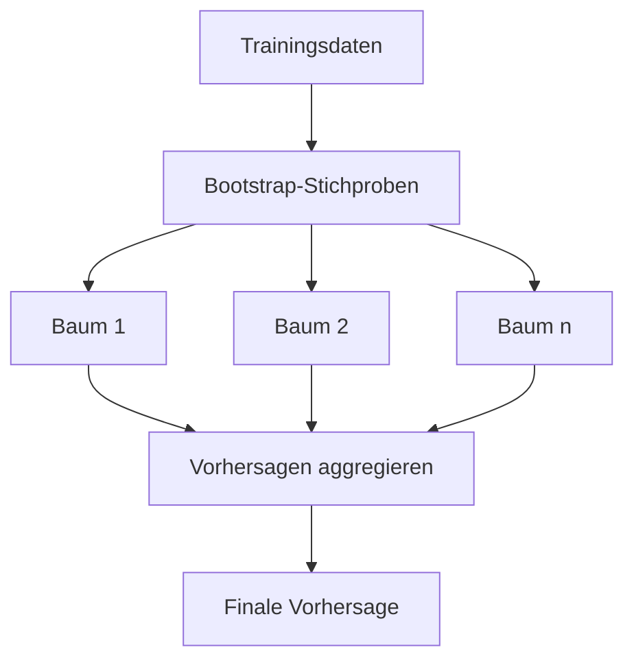

Der **Random Forest** ist ein Ensemble-Lernalgorithmus im [maschinellen Lernen](maschinelles-lernen), der mehrere [Entscheidungsbäume](entscheidungsbaum) kombiniert, um robuste und genaue Vorhersagen für [Klassifikation](klassifikation) und [Regression](regression) zu treffen. Er dient dazu, die Schwächen einzelner Bäume wie Overfitting zu überwinden und eignet sich besonders für komplexe Datensätze mit vielen Merkmalen.

## Kurzüberblick
Random Forest kombiniert mehrere Entscheidungsbäume zu einem Ensemble, um die Vorhersagegenauigkeit zu erhöhen. Durch zufällige Stichproben und Merkmalsauswahl reduziert er Varianz und Overfitting. Er findet Einsatz in Klassifikation und Regression und bietet interpretierbare Merkmalswichtigkeit.

## Kontext und Einordnung
Random Forest gehört zu den Ensemble-Methoden im [maschinellen Lernen](maschinelles-lernen), speziell zum [überwachten Lernen](ueberwachtes-und-nicht-ueberwachtes-lernen). Im Gegensatz zu einzelnen [Entscheidungsbäumen](entscheidungsbaum) minimiert er Overfitting durch Diversität. Er baut auf Bagging auf und integriert Random Subspace für Merkmale.

## Begriffe und Definitionen

- **Ensemble-Lernen**: Kombination mehrerer Modelle zur Verbesserung der Leistung.
- **Bootstrap-Aggregating (Bagging)**: Training mit zufälligen Stichproben mit Zurücklegen.
- **Feature Bagging**: Zufällige Auswahl von Merkmalen pro Split.
- **Out-of-Bag (OOB)**: Unverwendete Daten für interne Validierung.
- **Feature Importance**: Maß für die Relevanz von Merkmalen, basierend auf Gini-Impurity-Reduktion.

## Vorgehen
Der Algorithmus erzeugt Bootstrap-Stichproben aus den Trainingsdaten. Für jede Stichprobe wird ein Entscheidungsbaum trainiert, wobei pro Split zufällig Merkmale ausgewählt werden. Die Vorhersagen werden aggregiert: durch Mehrheitsvotum bei Klassifikation oder Mittelwert bei Regression. OOB-Daten dienen der Validierung ohne separaten Testdatensatz. Feature Importance wird für die Interpretation berechnet.

## Beispiele
Bei der Klassifikation von E-Mails als Spam trainiert Random Forest 100 Bäume auf Bootstrap-Stichproben. Jeder Baum wählt zufällig 10 Merkmale pro Split. Die finale Entscheidung basiert auf der Mehrheit der Bäume.

In der Regression zur Vorhersage von Hauspreisen kombiniert der Algorithmus Bäume, die auf zufälligen Daten- und Merkmalsteilmengen trainiert wurden, um den Durchschnittspreis zu berechnen.

## Häufige Fehler
Zu wenige Bäume führen zu hoher Varianz. Typische Werte für n_estimators liegen bei 100 oder mehr.

Die Verwendung aller Merkmale pro Split führt zu geringer Diversität. Ein typischer Wert für max_features ist sqrt(d).

Overfitting tritt auf, wenn Bäume zu tief sind. Der OOB-Score dient der internen Validierung, und Hyperparameter können angepasst werden.

## Weiterführendes
Für tieferes Verständnis bietet sich der Vergleich mit anderen Ensemble-Methoden wie Gradient Boosting. Die Implementierung erfolgt typischerweise in Bibliotheken wie scikit-learn.

