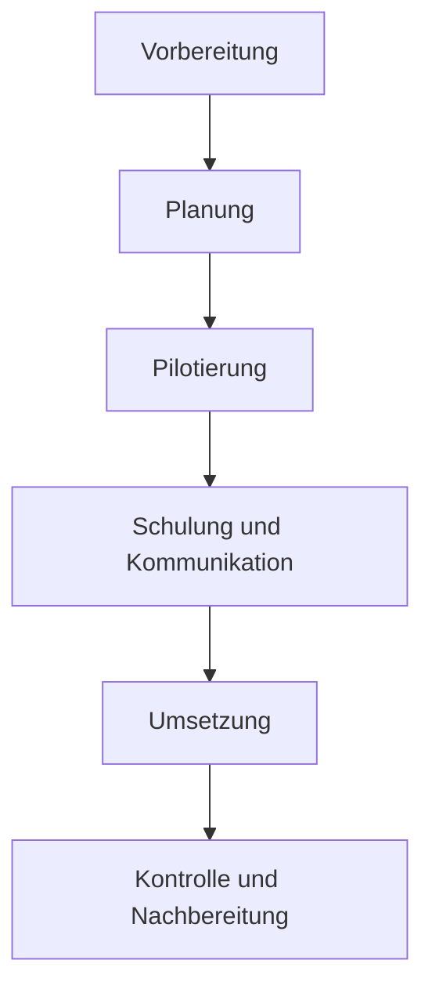

Der **Roll-out des Sollprozesses** beschreibt die systematische Einführung und Umsetzung eines neu definierten oder optimierten Prozesses in einer Organisation. Er zielt darauf ab, neue Arbeitsabläufe effizient zu implementieren, Widerstände zu minimieren und eine einheitliche Ausführung sicherzustellen, um die definierten Ziele zu erreichen.

## Definition und Bedeutung

Ein Prozess-Roll-out ist die phasenweise Einführung und Implementierung eines Sollprozesses, der aus der Optimierung des Istzustands hervorgegangen ist. Im Gegensatz zum IT-Roll-out, der sich auf technische Systeme konzentriert, betrifft der Prozess-Roll-out organisatorische Veränderungen wie neue Abläufe, Verantwortlichkeiten und Arbeitsweisen. Der Sollprozess dient als Meilenstein, auf den ein kontinuierlicher Verbesserungszyklus folgt, etwa nach dem PDCA-Modell. Ziele umfassen Effizienzsteigerung, Fehlerreduktion und nachhaltige Verankerung der neuen Prozesse.

## Phasen des Prozess-Roll-outs

Der Roll-out folgt typischerweise sechs Phasen, die eine strukturierte Umsetzung ermöglichen. Diese Phasen können iterativ durchlaufen werden.

### Phase 1: Vorbereitung
In dieser Phase wird der Sollprozess analysiert und dokumentiert. Es erfolgt eine [Stakeholder-Analyse](stakeholder-analyse), um Betroffene zu identifizieren und deren Bedürfnisse zu berücksichtigen.

### Phase 2: Planung
Hier werden Ressourcen, Zeitpläne und Risiken geplant. Ein detaillierter Roll-out-Plan mit Meilensteinen entsteht.

### Phase 3: Pilotierung
Der Prozess wird in einem begrenzten Bereich getestet, um Fehler zu erkennen und Anpassungen vorzunehmen.

### Phase 4: Schulung und Kommunikation
Mitarbeiter erhalten Schulungen und Informationen über den neuen Prozess. Kommunikationskanäle werden genutzt, um Akzeptanz zu fördern.

### Phase 5: Umsetzung
Der Prozess wird organisationweit eingeführt. Support-Strukturen stehen bereit.

### Phase 6: Kontrolle und Nachbereitung
Erfolge werden gemessen, Feedback eingeholt und der Prozess bei Bedarf optimiert.

## Change Management als Erfolgsfaktor

Change Management ist essenziell für den Roll-out, um Widerstände zu minimieren und Akzeptanz zu schaffen. Bekannte Modelle sind das Lewin-3-Phasen-Modell (Unfreezing, Moving, Refreezing) und das Kotter-8-Stufen-Modell (Dringlichkeit erzeugen, Führungskoalition, Vision, Kommunikation, Befähigung, Erfolge, Konsolidierung, Verankerung). Eine [Stakeholder-Analyse](stakeholder-analyse) hilft, Kommunikationspläne zu entwickeln und Widerstandsmanagement zu betreiben.

## Erfolgsfaktoren

- Klare Zielsetzung und Nutzenkommunikation.
- Unterstützung durch das Top-Management.
- Frühzeitige Einbindung der Mitarbeiter.
- Ausreichende Ressourcenbereitstellung.
- Flexible Anpassung an Feedback.

## Herausforderungen und Risiken

- Widerstand gegen Veränderungen.
- Hohe Komplexität des neuen Prozesses.
- Unzureichende Schulung und Kommunikation.
- Technische Probleme bei der Umsetzung.
- Mangelnde Akzeptanz der neuen Arbeitsweisen.

## KPIs zur Erfolgsmessung

Zur Bewertung des Roll-out-Erfolgs dienen [KPIs](kpi) wie Prozesseffizienz (z. B. Durchlaufzeit), Qualitätskennzahlen (Fehlerrate), Mitarbeiterzufriedenheit, Kundenfeedback und Kosteneinsparungen. Diese sollten SMART formuliert und regelmäßig überwacht werden.

## Best Practices

- Pilotierung in einem begrenzten Bereich vor der flächendeckenden Einführung.
- Schrittweise Einführung, um Risiken zu minimieren.
- Regelmäßige Feedbackschleifen zur Anpassung.
- Klare Kommunikation von Meilensteinen und Erfolgen.
- Bereitstellung von Support und Ansprechpartnern.
- Kontinuierliche Verbesserung nach dem Roll-out.