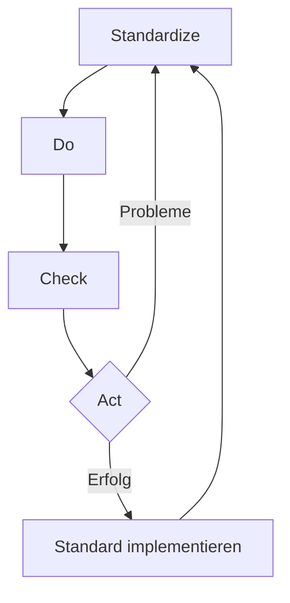

**SDCA-Zyklus** ist ein Modell für kontinuierliche Verbesserung, ähnlich dem [PDCA-Zyklus](pdca). Er umfasst die Schritte Standardize (Lösung standardisieren), Do (testen), Check (überprüfen) und Act (umsetzen).

## Kurzüberblick

Der SDCA-Zyklus (Standardize-Do-Check-Act) ist eine Methode zur kontinuierlichen Verbesserung. Sie konzentriert sich auf die Standardisierung und Stabilisierung von Prozessen. Im Gegensatz zum PDCA-Zyklus zielt SDCA darauf ab, erfolgreiche Lösungen in verbindliche Unternehmensstandards zu überführen und diese nachhaltig zu verankern. Der Zyklus ist ein zentrales Instrument des Lean Managements und ergänzt den PDCA-Ansatz.

## Kontext / Einordnung

Der SDCA-Zyklus entstammt dem [Lean Management](lean-management) und ist mit dem [Kaizen](kaizen)-Prinzip verbunden. Er entwickelte sich aus japanischen Managementprinzipien nach dem Zweiten Weltkrieg und ist Teil eines umfassenderen Systems zur operationalen Exzellenz. Während der [PDCA-Zyklus](pdca) als Motor für Innovation und Verbesserung dient, fungiert SDCA als Garant für Stabilität und Standardisierung.

> PDCA und SDCA sind keine konkurrierenden Ansätze, sondern ergänzen sich. PDCA schafft neue, bessere Prozesse, SDCA sichert deren nachhaltige Etablierung.

## Begriffe & Definitionen

- **Standardize (Standardisieren):** Dokumentation eines verbesserten Prozesses als verbindlicher Unternehmensstandard.
- **Do (Durchführen):** Testen und Validieren des Standards (nicht die vollständige Umsetzung).
- **Check (Überprüfen):** Regelmäßige Kontrolle der Einhaltung und Wirksamkeit des Standards.
- **Kaizen:** Japanische Philosophie der kontinuierlichen Verbesserung.
- **Lean Management:** Managementansatz zur Maximierung des Kundennutzens bei Minimierung der Verschwendung.

## Vorgehen / Methode

Der SDCA-Zyklus besteht aus vier Schritten, die iterativ durchlaufen werden:

### 1. Standardize
Die Lösung verstehen und in einen klaren, nachvollziehbaren Standard überführen. Dies umfasst:

- Prozessbeschreibung mit klaren Schritten.
- Definition von Verantwortlichkeiten.
- Festlegung von Qualitätskriterien.
- Erstellung von Arbeitsanweisungen und Dokumentationen.

### 2. Do
Testen des Standards mit schnellen und einfachen Mitteln. Wichtig hierbei:

- Kleiner, kontrollierter Testlauf (Pilot).
- Erfassung von Abweichungen und Problemen.
- Identifikation von Verbesserungspotenzialen.
- Validierung der Praktikabilität.

### 3. Check
Das Resultat mit der Erwartung überprüfen und bewerten:

- Vergleich der Ergebnisse mit den definierten Kriterien.
- Analyse von Abweichungen.
- Überprüfung der Mitarbeiterakzeptanz.
- Bewertung der Prozessstabilität.

### 4. Act
Die Umsetzung freigeben oder an der Standardisierung weiterarbeiten:

- Bei Erfolg: Freigabe des Standards für die breite Anwendung.
- Bei Problemen: Rückkehr zur Standardisierungsphase.
- Kontinuierliche Optimierung des Standards.
- Schulung der Mitarbeiter.

## Beispiel(e)

**Beispiel aus der Produktion:**

Ein Fertigungsunternehmen identifiziert eine Methode zur Reduzierung von Ausschuss in der Montage.

1. **Standardize:** Die erfolgreiche Methode wird dokumentiert: Arbeitsschritte, Werkzeuge, Qualitätsprüfpunkte, Zeitvorgaben.
2. **Do:** Die Methode wird an einer Produktionslinie getestet. Mitarbeiter geben Feedback, Abweichungen werden protokolliert.
3. **Check:** Die Ausschussquote wird gemessen. Statt 8 % beträgt sie nun 2 %. Mitarbeiterfeedback ist positiv.
4. **Act:** Der standardisierte Prozess wird für alle Montagelinien freigegeben. Schulungen werden durchgeführt.

**Beispiel aus dem IT-Service:**

Ein IT-Helpdesk entwickelt eine verbesserte Methode zur Ticketbearbeitung.

1. **Standardize:** Neuer Prozess mit Eskalationsstufen, Antwortzeitvorgaben und Dokumentationspflichten wird festgelegt.
2. **Do:** Pilot in einer Abteilung mit 50 Mitarbeitern.
3. **Check:** Bearbeitungszeit sinkt von 48 auf 12 Stunden, Kundenzufriedenheit steigt.
4. **Act:** Standard wird unternehmensweit implementiert und in Service-Level-Agreements verankert.

## Häufige Fehler & Tipps

### Häufige Fehler

- **Missverständnis des "Do"-Schritts:** Oft wird hier bereits voll implementiert statt nur getestet.
- **Einmalzyklus-Mentalität:** SDCA wird als einmaliges Projekt statt als kontinuierlicher Prozess verstanden.
- **Unzureichende Dokumentation:** Die Standardisierung wird unzureichend dokumentiert.
- **Fehlende Abgrenzung zu PDCA:** Unklarheit, wann welcher Zyklus eingesetzt werden soll.

### Hinweise für die Praxis

- Ein Einstieg mit kleinen, überschaubaren Prozessen reduziert Komplexität und Widerstand.
- Frühe Einbindung der Mitarbeitenden erhöht Akzeptanz und Wissenstransfer.
- Verständliche Dokumentation fuer Anwender statt Expertenjargon erleichtert die Umsetzung.
- Regelmaessige Reviews, etwa vierteljaehrlich, sichern die Aktualitaet von Standards.
- Ein Vorher-Nachher-Vergleich macht den Nutzen der Standardisierung messbar.

> Ein guter Standard ist wie ein gutes Rezept: Jeder kann es nachkochen und erhält das gleiche hohe Ergebnis.

## Weiterführendes

- **PDCA-Zyklus:** Der komplementäre Zyklus für Prozessverbesserung und Innovation.
- **Kaizen:** Die übergeordnete Philosophie der kontinierlichen Verbesserung.
- **Lean Management:** Das umfassende Managementkonzept zur Verschwendungsminderung.
- **Qualitätsmanagement:** Systematischer Ansatz zur Sicherung von Qualität in Organisationen.
- **Prozessmanagement:** Methoden und Werkzeuge zur Gestaltung und Optimierung von [Geschäftsprozessen](geschaeftsprozess).
