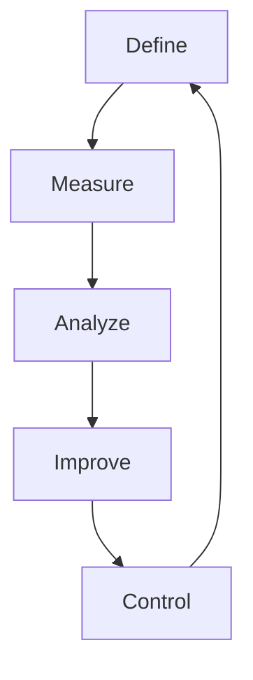

Der **Six Sigma**-Ansatz ist eine systematische Methode zur Prozessoptimierung, die auf mathematischen und statistischen Grundlagen basiert. Er zielt darauf ab, Fehlerquoten auf maximal 3,4 pro einer Million Möglichkeiten zu reduzieren, die Kundenzufriedenheit zu steigern und nachhaltige Verbesserungen durch datengestützte Entscheidungen zu erreichen. Entwickelt wurde die Methode in den 1980er Jahren von Motorola, und sie umfasst Kernprinzipien wie Kundenfokus, systematische Prozessverbesserung und eine Kultur des kontinuierlichen Lernens.

## Lernziele

Der Artikel vermittelt Kenntnisse zu:

- dem Unterschied zwischen DMAIC- und DMADV-Zyklus sowie ihren Anwendungsbereichen.
- den Rollen im Six Sigma-System und ihren Verantwortlichkeiten.
- den Vorteilen und Anwendungsbereichen von Six Sigma in verschiedenen Branchen.
- der Planung einfacher Prozessverbesserungen mit Six Sigma-Prinzipien.

## Kurzüberblick

Six Sigma kombiniert Qualitätsmanagement mit statistischen Methoden, um Prozesse effizienter zu gestalten. Es unterscheidet zwischen der Optimierung bestehender Prozesse mittels DMAIC und der Entwicklung neuer Produkte oder Prozesse mittels DMADV. Die Methode fördert eine rollenbasierte Hierarchie, die von Yellow Belts bis zu Master Black Belts reicht, und betont die Messbarkeit von Qualitätsmerkmalen zur Identifikation kausaler Zusammenhänge.

## DMAIC-Zyklus

Der DMAIC-Zyklus dient der kontinuierlichen Verbesserung bestehender Prozesse. Er besteht aus fünf Schritten: Define, Measure, Analyze, Improve und Control. DMAIC ist reaktiv und zielt auf inkrementelle Verbesserungen ab, indem Probleme im aktuellen Prozess gelöst werden.

1. **Define (Definieren)**: Der zu verbessernde Prozess wird identifiziert, das Problem dokumentiert und Zielgrößen sowie der Projektumfang festgelegt.
2. **Measure (Messen)**: Relevante Qualitätsmerkmale werden untersucht und die aktuelle Prozessleistung erhoben, oft durch Datensammlung und statistische Analyse.
3. **Analyze (Analysieren)**: Ursachen und kausale Zusammenhänge werden herausgearbeitet, um die Wurzeln der Probleme zu verstehen.
4. **Improve (Verbessern)**: Der Prozess wird optimiert, gegebenenfalls unter Einbeziehung externer Methoden wie [Kontinuierlicher Verbesserung](kontinuierlicher-verbesserungsprozess).
5. **Control (Überwachen)**: Der Prozess wird durch statistische Auswertungen überwacht, um nachhaltige Verbesserungen sicherzustellen.

### Beispiel für DMAIC

In einem Produktionsunternehmen wird der DMAIC-Zyklus angewendet, um die Fehlerquote bei der Montage von Produkten zu reduzieren. Define identifiziert die Montagelinie als problematisch. Measure zeigt eine Fehlerquote von 5 %. Analyze deckt eine mangelhafte Schulung als Ursache auf. Improve führt ein neues Schulungsprogramm ein, und Control stellt durch regelmäßige Audits sicher, dass die Quote unter 1 % bleibt.

## DMADV-Zyklus

Im Gegensatz zu DMAIC ist DMADV proaktiv und für die Entwicklung neuer Prozesse oder Produkte konzipiert. Er steht für Define, Measure, Analyze, Design und Verify und wird auch als Design for Six Sigma (DFSS) bezeichnet. Der Fokus liegt auf der Verhinderung von Fehlern bereits in der Design-Phase.

1. **Define (Definieren)**: Designziele und Anforderungen werden festgelegt, basierend auf Kundenbedürfnissen und Spezifikationen.
2. **Measure (Messen)**: Kritische Qualitätseigenschaften werden identifiziert und gemessen, um potenzielle Risiken zu bewerten.
3. **Analyze (Analysieren)**: Designoptionen werden analysiert und bewertet, um die beste Lösung auszuwählen.
4. **Design (Gestalten)**: Die detaillierte Ausgestaltung der Lösung erfolgt, wobei statistische Methoden zur Optimierung eingesetzt werden.
5. **Verify (Überprüfen)**: Das Design wird getestet und validiert, um sicherzustellen, dass es die Ziele erfüllt.

DMADV grenzt sich von DMAIC ab, da es nicht auf bestehende Prozesse abzielt, sondern neue Lösungen schafft. Ein Beispiel ist die Entwicklung eines neuen Produkts, bei dem DMADV verwendet wird, um Qualitätsstandards von Anfang an zu integrieren, anstatt spätere Korrekturen vorzunehmen.

## Rollen im Six Sigma

Six Sigma definiert eine rollenbasierte Hierarchie, die Expertise und Verantwortlichkeiten verteilt. Diese Rollen sind nach Kampfsportgürteln benannt und fördern eine strukturierte Umsetzung.

| Rolle              | Beschreibung                                                                 |
|--------------------|-----------------------------------------------------------------------------|
| Yellow Belt        | Einstiegszertifizierung mit Grundlagenwissen; unterstützt Projekte operativ und leistet Datensammlung. |
| Green Belt         | Fundierte methodische Kenntnisse; leitet DMAIC-Projekte im eigenen Bereich und widmet etwa 20 % der Arbeitszeit Six Sigma. |
| Black Belt         | Tiefe fachliche Expertise und Sozialkompetenz; leitet komplexe unternehmensweite Projekte und motiviert Veränderungen. |
| Master Black Belt  | Höchste operative Stufe; trainiert andere Belts, entwickelt Kennzahlen und berät strategisch. |
| Champion           | Managementebene; wählt Projekte aus, initiiert sie und überwacht die Umsetzung ohne operative Beteiligung. |

## Vorteile und Anwendungsbereiche

Six Sigma bietet Vorteile wie reduzierte Kosten durch geringere Fehlerquoten, gesteigerte Kundenzufriedenheit und verbesserte Wettbewerbsfähigkeit. Es strukturiert Prozesse klar und unterstützt eine Kultur des Lernens, in der [Qualitätsmanagement](total-quality-management) eine zentrale Rolle spielt. Anwendung findet es in Fertigung, Dienstleistungen und Verwaltung, wo datengestützte Entscheidungen essenziell sind. Erfolgsfaktoren umfassen Management-Unterstützung, Schulungen und eine solide Datenbasis.

## Häufige Fehler und Tipps

- Nicht X: DMAIC und DMADV verwechseln; stattdessen Y: DMAIC für bestehende, DMADV für neue Prozesse verwenden, um Ressourcen effizient einzusetzen.
- Nicht X: Ohne Messungen vorgehen; stattdessen Y: Immer Daten sammeln und analysieren, um Entscheidungen zu begründen.

## Selbsttest

1. Was ist das Ziel von Six Sigma bezüglich Fehlerquoten?
2. Nenne die Schritte des DMAIC-Zyklus.
3. Wie grenzt sich DMADV von DMAIC ab?
4. Welche Rolle ist für die strategische Ausrichtung verantwortlich?

## Einzelnachweise

[1] ZEP.de: Six Sigma Definition und Zyklen.
[2] Purdue University: DMAIC vs. DMADV.
[3] DGQ: Rollen im Six Sigma.
