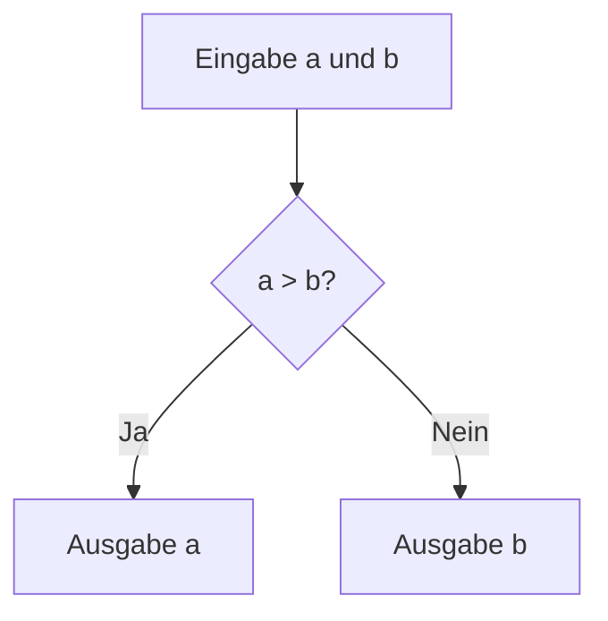
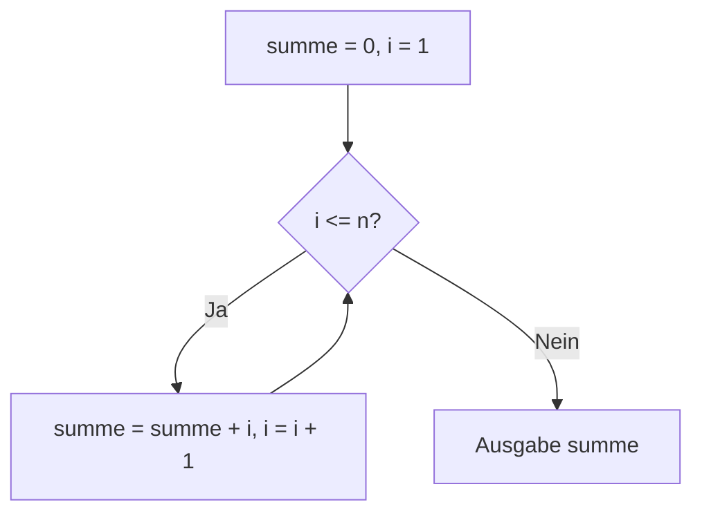

Das **Struktogramm** ist ein grafisches Hilfsmittel zur Darstellung von Algorithmen und Programmabläufen in der strukturierten Programmierung. Es ermöglicht, komplexe Probleme top-down in kleinere Teilprobleme zu zerlegen und schrittweise zu verfeinern. Struktogramme nutzen standardisierte Elemente, um den Ablauf visuell zu strukturieren und die Lesbarkeit durch hierarchische Schachtelung zu verbessern, im Gegensatz zu linearen Verknüpfungen in Flussdiagrammen.

## Lernziele

Nach diesem Artikel lassen sich Struktogramme erstellen und interpretieren.
Die Grundelemente wie Anweisungen, Bedingungen und Schleifen sind bekannt.
Der Unterschied zu anderen Darstellungsformen wie Flussdiagrammen und Pseudocode ist klar.
Einfache Algorithmen können in Struktogramme umgesetzt und in Programmiersprachen wie Python oder Pascal implementiert werden.
Häufige Fehler bei der Erstellung von Struktogrammen sind erkennbar und vermeidbar.

## Kurzüberblick

Das Struktogramm, auch Nassi-Shneiderman-Diagramm genannt, wurde 1972/1973 von Isaac Nassi und Ben Shneiderman entwickelt. Es baut auf der Idee der strukturierten Programmierung auf, die nur drei Grundstrukturen verwendet: Sequenz, Selektion und Iteration. Diese werden hierarchisch geschachtelt dargestellt, wodurch der Programmfluss klar und übersichtlich wird. Im Vergleich zu Flussdiagrammen sind Struktogramme kompakter und vermeiden unübersichtliche Pfeile. Sie werden in der Softwareentwicklung zur Planung und Dokumentation von Algorithmen eingesetzt.

## Kontext und Einordnung

Struktogramme sind ein Werkzeug der [strukturierten Programmierung](strukturierte-programmierung), die in den 1960er und 1970er Jahren populär wurde, um die Zuverlässigkeit und Wartbarkeit von Software zu verbessern. Sie stehen in Beziehung zu anderen Notationen wie [Pseudocode](pseudocode), der textbasiert ist, oder UML-Aktivitätsdiagrammen, die objektorientierte Aspekte einbeziehen. Die DIN-Norm 66261 standardisiert Struktogramme in Deutschland und definiert ihre Elemente. Sie fördern Modularität und Top-down-Design durch Unterstützung der schrittweisen Problemlösung.

## Begriffe und Definitionen

- **Struktogramm**: Eine grafische Notation zur Darstellung von Algorithmen, bestehend aus geschachtelten Rechtecken für Kontrollstrukturen.
- **Nassi-Shneiderman-Diagramm**: Synonym für Struktogramm, benannt nach den Entwicklern.
- **Top-down-Programmierung**: Methode, bei der ein Problem von oben nach unten in Teilprobleme zerlegt wird.
- **Kontrollstruktur**: Element zur Steuerung des Programmflusses, wie Sequenz, Selektion oder Iteration.
- **Sequenz**: Aneinanderreihung von Anweisungen ohne Verzweigung.
- **Selektion**: Verzweigung im Ablauf basierend auf einer Bedingung (z. B. if-then-else).
- **Iteration**: Wiederholung eines Anweisungsblocks, solange eine Bedingung gilt (Schleife).
- **Modularität**: Aufteilung in wiederverwendbare Unterprogramme.

## Vorgehen

Die Erstellung eines Struktogramms erfolgt in folgenden Schritten:

1. Definition des Gesamtproblems und Zerlegung top-down in Teilprobleme.
2. Identifikation der Kontrollstrukturen: Sequenzen für lineare Abläufe, Selektionen für Verzweigungen, Iterationen für Schleifen.
3. Hierarchische Zeichnung der Elemente: Jede Struktur ist ein Rechteck, Unterstrukturen sind darin geschachtelt.
4. Verwendung von Standardformen: Anweisungen als einfache Rechtecke, Bedingungen mit einer Raute oben, Schleifen mit einer Raute seitlich.
5. Überprüfung des Ablaufs von oben nach unten und links nach rechts.

## Beispiele

### Einfaches Beispiel: Maximum zweier Zahlen bestimmen

Angenommen, es sollen zwei Zahlen a und b verglichen werden, um die größere zu bestimmen. Das Struktogramm zeigt den Ablauf: Zuerst werden die Zahlen eingelesen, dann wird verglichen, und das Ergebnis ausgegeben.



Dieses Diagramm approximiert ein Struktogramm; echte Nassi-Shneiderman-Diagramme verwenden geschachtelte Rechtecke ohne Pfeile.

In Python könnte dies so implementiert werden:

```python
a = int(input("Eingabe von a: "))
b = int(input("Eingabe von b: "))
if a > b:
    print(a)
else:
    print(b)
```

In Pascal:

```pascal
program Maximum;
var a, b: integer;
begin
    readln(a);
    readln(b);
    if a > b then
        writeln(a)
    else
        writeln(b);
end.
```

### Beispiel mit Schleife: Summe von 1 bis n berechnen

Für die Berechnung der Summe von 1 bis n wird eine Iteration verwendet. Das Struktogramm initialisiert summe und i, wiederholt die Addition solange i <= n gilt.



In Python:

```python
n = int(input("Eingabe von n: "))
summe = 0
i = 1
while i <= n:
    summe += i
    i += 1
print(summe)
```

## Häufige Fehler und Tipps

Zu vermeiden sind zu tiefe Schachtelungen, da diese die Übersichtlichkeit beeinträchtigen. Stattdessen ist eine Modularisierung in Unterprogramme empfehlenswert.
Break sollte sparsam verwendet werden, um den strukturierten Ablauf nicht zu unterbrechen.
Sicherzustellen ist, dass jede Verzweigung und Schleife korrekt geschlossen ist, um unvollständige Strukturen zu vermeiden.
Bei Parallelausführung ist auf Synchronisation zu achten, da Struktogramme sequentiell gedacht sind.
Beginnen mit einfachen Diagrammen und schrittweise Verfeinerung erleichtern die Erstellung.

## Selbsttest

1. Was ist der Hauptzweck eines Struktogramms?
2. Nenne die drei Grundstrukturen der strukturierten Programmierung.
3. Wie unterscheidet sich ein Struktogramm von einem Flussdiagramm?
4. Beschreibe, wie eine Bedingung in einem Struktogramm dargestellt wird.
5. Gib ein Beispiel für eine Iteration in Pseudocode an.

## Weiterführendes

Für vertiefte Kenntnisse siehe [strukturierte Programmierung](strukturierte-programmierung) und [Pseudocode](pseudocode).